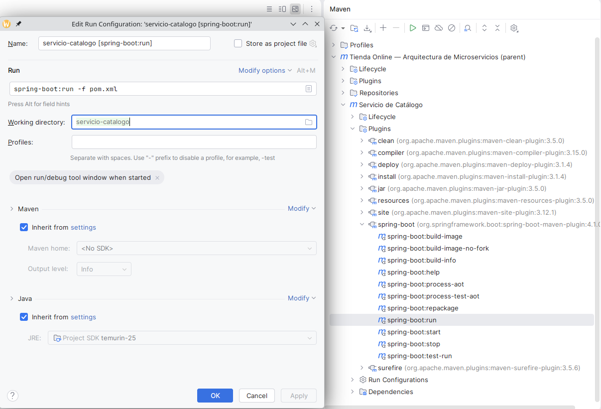
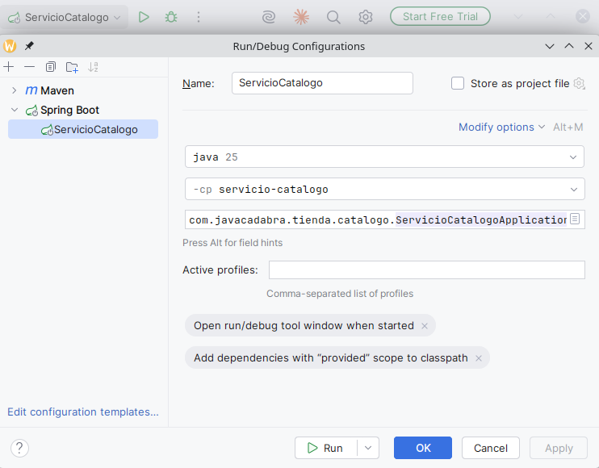

# Capítulo 04 — Eventos de dominio

Cuarto capítulo del tutorial "De cero a pro en arquitectura de microservicios con Spring Boot" (ver el índice completo de capítulos en la rama `main`). Parte directamente de `capitulo-03-openapi-swagger`: todo lo explicado allí (la documentación OpenAPI/Swagger de los endpoints de productos y categorías) sigue vigente y no se repite aquí. Este capítulo no introduce un microservicio nuevo — sigue trabajando sobre `servicio-catalogo`.

## Índice

1. [Introducción](#1-introducción)
2. [Qué es un Evento de Dominio](#2-qué-es-un-evento-de-dominio)
3. [Publicar el evento: `ApplicationEventPublisher`](#3-publicar-el-evento-applicationeventpublisher)
4. [Consumir el evento: `@EventListener`](#4-consumir-el-evento-eventlistener)
5. [Cómo probarlo: el flujo del capítulo 3, con logs nuevos](#5-cómo-probarlo-el-flujo-del-capítulo-3-con-logs-nuevos)
6. [Registro de archivos del capítulo](#6-registro-de-archivos-del-capítulo)
7. [Referencias](#7-referencias)

---

<!-- Contenido del capítulo: se desarrolla en conversación, sección a sección. -->

`CrearProductoServicio` y `RecomendarProductoServicio` (capítulo 1 y 2) hacen exactamente una cosa cada uno: guardar un producto, añadir una recomendación. Eso es correcto mientras nadie más necesite enterarse de que esas cosas ocurrieron. Pero en cuanto aparece un segundo interés — por ejemplo, registrar en el log cada alta de producto, o recalcular algo cuando se añade una recomendación — la forma obvia de resolverlo es meter esa lógica nueva dentro del propio servicio, que a partir de ahí ya no solo crea un producto: también sabe cómo loguearlo, o qué más recalcular. El servicio original crece con cada interés nuevo y termina conociendo detalles que no le corresponden.

Este capítulo introduce el Evento de Dominio (Domain Event): un objeto inmutable que representa algo que ya ha pasado en el dominio (`ProductoCreadoEvento`, `RecomendacionAñadidaEvento`) y que el servicio publica sin saber quién, si alguien, va a reaccionar. Quien esté interesado se suscribe por su cuenta; el servicio que publica el evento no cambia ni una línea cuando aparece un interesado nuevo. La mecánica de este capítulo es deliberadamente la más simple posible: `ApplicationEventPublisher`/`@EventListener` de Spring, eventos que se publican y se consumen dentro del mismo proceso y la misma transacción. El objetivo es separar el concepto — "esto es un evento de dominio, algo relevante que ocurrió" — de su transporte, antes de complicar la mecánica con un broker externo (Kafka, en un capítulo futuro, cuando el evento tenga que salir de este proceso para llegar a otro microservicio).

---

## 2. Qué es un Evento de Dominio

Un Evento de Dominio (Domain Event) es un objeto inmutable que representa un hecho que **ya ocurrió** en el dominio. Se nombra en pasado (`ProductoCreadoEvento`, no `CrearProductoEvento`) precisamente para dejar esa diferencia clara frente a otros conceptos con los que se podría confundir:

- Un **caso de uso** (`CrearProductoPuertoEntrada.crear(...)`) es una orden: "crea este producto". Puede fallar — de hecho, `CrearProductoServicio` lanza `CategoriaNoEncontradaException` si la categoría no existe.
- Un **evento de dominio** es un hecho consumado: "este producto ya se creó". Nadie puede rechazarlo ni deshacerlo — solo reaccionar a él. Si `Producto.crear(...)` tuvo éxito, `ProductoCreadoEvento` es simplemente cierto.

Esa asimetría es la que hace útil el patrón: quien publica el evento (`CrearProductoServicio`) no necesita saber si hay cero, uno o diez interesados reaccionando a él, ni qué hacen — solo publica el hecho. Añadir un interesado nuevo no toca el servicio que publica, al contrario que meter la lógica nueva directamente ahí (el problema descrito en la [introducción](#1-introducción)).

Siguiendo la convención de capas de este proyecto, los eventos de dominio viven en su propio paquete, `dominio.evento`, con sufijo `...Evento`:

```java
// dominio/evento/ProductoCreadoEvento.java
public record ProductoCreadoEvento(ProductoId productoId, Instant ocurridoEn) {
}
```

```java
// dominio/evento/RecomendacionAñadidaEvento.java
public record RecomendacionAñadidaEvento(ProductoId productoId, ProductoId productoRecomendadoId, Instant ocurridoEn) {
}
```

Son `record`, igual que los Objetos de Valor: inmutables por construcción, sin necesidad de ninguna anotación de Lombok. A propósito, ninguno de los dos extiende ninguna clase de Spring (`ApplicationEvent` o similar) — son POJOs del paquete `dominio`, que no conoce el framework. `ApplicationEventPublisher.publishEvent(Object)` (siguiente sección) acepta cualquier objeto desde Spring 4.2, así que no hace falta esa herencia; forzarla acoplaría el propio evento — un concepto de dominio — a la mecánica de transporte que este capítulo quiere mantener separada.

> **¿Por qué llevan solo el id, y no el `Producto` completo?**
>
> Sería más cómodo para quien escuche el evento recibir el agregado entero — se ahorraría una consulta al repositorio si necesita más datos. Pero eso acopla a cada oyente al estado exacto del agregado en el instante en que se publicó el evento, que puede quedar desactualizado si el oyente reacciona más tarde (por ejemplo, con un listener asíncrono, o cuando el evento viaje fuera de proceso en el capítulo de Kafka). Llevar solo el id obliga a quien lo necesite a volver a consultar el estado actual — más explícito, y ya es el mismo patrón que siguen los puertos de salida de este proyecto: `agregarRecomendacion(ProductoId, ProductoId)` tampoco recibe el `Producto` completo.

---

## 3. Publicar el evento: `ApplicationEventPublisher`

Publicar un evento de dominio requiere un único colaborador: `ApplicationEventPublisher`, la interfaz de Spring que desacopla a quien publica de quien escucha. `CrearProductoServicio` y `RecomendarProductoServicio` lo reciben como una dependencia más, inyectada igual que sus puertos de salida, y lo llaman justo después de que la operación haya tenido éxito — nunca antes, porque hasta que `guardar(...)`/`agregarRecomendacion(...)` no confirma el cambio, el hecho todavía no "ha ocurrido":

```java
// CrearProductoServicio
Producto guardado = productoRepositorioPuertoSalida.guardar(producto);
applicationEventPublisher.publishEvent(new ProductoCreadoEvento(guardado.id(), Instant.now()));
return productoMapper.aDTO(guardado);
```

```java
// RecomendarProductoServicio
productoRepositorioPuertoSalida.agregarRecomendacion(id, recomendadoId);
applicationEventPublisher.publishEvent(new RecomendacionAñadidaEvento(id, recomendadoId, Instant.now()));
```

`ApplicationEventPublisher` vive en `org.springframework.context`, no en `dominio` ni en `aplicacion.puerto.salida`: es infraestructura de Spring, pero una lo bastante ligera y transversal (viene incluida en cualquier `ApplicationContext`, sin dependencia añadida al `pom.xml`) como para inyectarla directamente en el servicio de aplicación, igual que ya se inyectan `ProductoMapper` o los puertos de salida. No hace falta envolverla en un puerto de salida propio del proyecto: a diferencia de la persistencia (que si cambia de Neo4j a otra base de datos exige un adaptador nuevo), la mecánica de publicar eventos en proceso no va a cambiar mientras siga siendo síncrona y en el mismo proceso — el día que salga del proceso (Kafka, capítulo 6), lo que cambia es la implementación de los *listeners*, no el punto de publicación.

---

## 4. Consumir el evento: `@EventListener`

Quien reacciona a un evento no necesita más que un método anotado con `@EventListener` en un bean gestionado por Spring — no implementa ninguna interfaz, no se registra en ningún sitio explícitamente. Spring descubre estos métodos por *classpath scanning* y los invoca automáticamente cuando alguien llama a `publishEvent(...)` con un objeto compatible con el tipo del parámetro:

```java
// infraestructura/adaptador/entrada/evento/ProductoCreadoListener.java
@Slf4j
@Component
public class ProductoCreadoListener {

	@EventListener
	public void alCrearProducto(ProductoCreadoEvento evento) {
		log.info("Producto creado: {}", evento.productoId().valor());
	}
}
```

Un listener casi idéntico, `RecomendacionAñadidaListener`, reacciona a `RecomendacionAñadidaEvento`. Los dos viven en `infraestructura.adaptador.entrada.evento`, siguiendo la misma convención de capas que ya agrupa los adaptadores de entrada REST bajo `infraestructura.adaptador.entrada.rest`: un `@EventListener` es, en este sentido, un adaptador de entrada más — algo externo (aquí, el propio framework de eventos) dispara comportamiento de la aplicación, igual que una petición HTTP dispara un `@RestController`.

Los dos listeners de este capítulo solo escriben un log, deliberadamente — son el ejemplo mínimo de la [introducción](#1-introducción) (loguear cada alta de producto), no una funcionalidad de negocio real. Lo relevante no es lo que hacen, sino que `CrearProductoServicio` y `RecomendarProductoServicio` no saben que existen: se podría añadir un tercer listener, o borrar los dos actuales, sin tocar una sola línea de los servicios que publican los eventos.

> **¿Y si el listener lanza una excepción?**
>
> Con `@EventListener` síncrono (el que usa este capítulo), una excepción en el listener se propaga al hilo que publicó el evento — si `ProductoCreadoListener` fallara, `CrearProductoServicio.crear(...)` fallaría con ella, y (al no haber `@Transactional` explícito de por medio en este capítulo) el producto ya guardado no se deshace automáticamente. Evitar ese acoplamiento entre publicador y oyente — que un listener roto tumbe el caso de uso que publicó el evento — es una de las razones por las que los eventos que cruzan a otro proceso (Kafka, capítulo 6) son la solución habitual: el fallo de un consumidor remoto no puede propagarse de vuelta a quien publicó.

---

## 5. Cómo probarlo: el flujo del capítulo 3, con logs nuevos

```bash
./mvnw -pl servicio-catalogo spring-boot:run
```

> **¿Cómo evito escribir ese comando cada vez, desde IntelliJ?**
>
> El panel **Maven** (lateral derecho) ya expone `spring-boot:run` como una entrada navegable, sin necesidad de terminal: **Servicio de Catálogo** → **Plugins** → **spring-boot** → clic derecho sobre `spring-boot:run` → **Modify Run Configuration…** → dale un nombre y guarda. Queda disponible en el desplegable de Run/Debug de la barra superior, listo para lanzar con un clic — y sigue siendo el mismo goal Maven que la línea de comandos, así que arranca también el contenedor de Neo4j vía Docker Compose.
>
> 
>
> *Panel Maven de IntelliJ con el goal `spring-boot:run` del módulo `servicio-catalogo` y la opción "Modify Run Configuration…" del menú contextual.*
>
> <br>
>
> Alternativa más rápida en el día a día, porque se salta el ciclo de vida completo de Maven y ejecuta directamente la clase ya compilada: **Run** → **Edit Configurations…** → **+** → **Spring Boot** → **Name** (un nombre descriptivo) y **SDK** (el JDK del proyecto) → **Main class**: `ServicioCatalogoApplication` → **Module**: `servicio-catalogo`. El autoarranque de Neo4j vía `compose.yaml` sigue funcionando igual, porque esa función de Spring Boot se activa por el directorio de trabajo del módulo, no por pasar por el plugin de Maven.
>
> 
>
> *Run Configuration de tipo Spring Boot con Name, SDK, Main class y Module ya rellenados.*

El comportamiento observable desde Swagger UI (`http://localhost:8080/swagger-ui.html`, capítulo 3) no cambia — sigue siendo el mismo flujo crear categoría → crear productos → recomendar del capítulo 2. Lo nuevo de este capítulo no se ve en la respuesta HTTP, sino en la consola donde corre el servicio:

1. **`POST /api/categorias`** → copia el `id` de la respuesta.
2. **`POST /api/productos`**, dos veces, con ese `categoriaId` → copia los dos `id` de producto. Cada `Execute` deja en el log una línea nueva:
   ```
   c.j.t.c.i.a.e.e.ProductoCreadoListener   : Producto creado: <id-del-producto>
   ```
3. **`POST /api/productos/{id}/recomendaciones`** → `id` de la ruta = primer producto, `productoRecomendadoId` del body = segundo producto → `204`, y en el log:
   ```
   t.c.i.a.e.e.RecomendacionAñadidaListener : Recomendación añadida: <id-recomendante> recomienda a <id-recomendado>
   ```

Cada línea aparece justo después de que la petición HTTP correspondiente ya ha respondido — `@EventListener` es síncrono por defecto, así que el listener se ejecuta dentro del mismo hilo y antes de que el servicio termine de procesar la petición, pero después de que el evento se publica (al final del método del servicio de aplicación).

> **¿Cómo confirmo en Neo4j Browser (`http://localhost:7474`) que los datos del flujo anterior se crearon como se espera?**
>
> Vista de grafo con todos los nodos y relaciones creados hasta ahora (`Producto`, `Categoria`, `PERTENECE_A`, `RELACIONADO_CON`) — más genérica que asumir de entrada la etiqueta `Producto`, así que también muestra la `Categoria` aunque no tuviera productos:
> ```cypher
> MATCH (n)-[r]-(m) RETURN n, r, m
> ```
>
> Si prefieres una tabla en vez de un grafo — por ejemplo, para comprobar de un vistazo que cada producto quedó en la categoría correcta y con la recomendación esperada, sin tener que interpretar el dibujo:
> ```cypher
> MATCH (p:Producto)-[:PERTENECE_A]->(c:Categoria)
> OPTIONAL MATCH (p)-[:RELACIONADO_CON]->(r:Producto)
> RETURN p.nombre AS producto, p.precio AS precio, c.nombre AS categoria, collect(r.nombre) AS recomendados
> ```
> El `OPTIONAL MATCH` evita que un producto sin recomendaciones desaparezca de la tabla — con un `MATCH` normal en su lugar, solo aparecerían los productos que ya recomiendan a otro.
>
> Si solo quieres un recuento — cuántos nodos de cada tipo y cuántas relaciones de cada tipo hay en total, sin listar cada uno:
> ```cypher
> MATCH (n) WITH labels(n) AS tipo, count(*) AS total
> RETURN tipo, total
> UNION ALL
> MATCH ()-[r]->() WITH type(r) AS tipo, count(*) AS total
> RETURN tipo, total
> ```
> `labels(n)`/`type(r)` devuelven la etiqueta del nodo y el tipo de la relación respectivamente; el `UNION ALL` combina ambos recuentos en una sola tabla en vez de tener que lanzar dos consultas por separado.

Los tests automatizados cubren esta misma publicación sin necesidad de arrancar el servicio ni leer logs — `CrearProductoServicioTest`/`RecomendarProductoServicioTest` verifican con Mockito que `ApplicationEventPublisher.publishEvent(...)` se invoca con el evento y los datos esperados:

```bash
./mvnw -pl servicio-catalogo test
```

---

## 6. Registro de archivos del capítulo

Tabla de control de los archivos que forman el contenido de este capítulo.

**Leyenda:** 🌱 Creado · ✏️ Actualizado · 🗑️ Eliminado

### Documentación e imágenes

| | Archivo | Descripción funcional | Descripción del cambio |
|:---:|---|---|:---:|
| 🌱 | [`docs/images/capitulo-04/intellij-maven-run-configuration.png`](docs/images/capitulo-04/intellij-maven-run-configuration.png) | Captura del panel Maven de IntelliJ, embebida en la [sección 5](#5-cómo-probarlo-el-flujo-del-capítulo-3-con-logs-nuevos). | --- |
| 🌱 | [`docs/images/capitulo-04/intellij-spring-boot-run-configuration.png`](docs/images/capitulo-04/intellij-spring-boot-run-configuration.png) | Captura de la Run Configuration de tipo Spring Boot, embebida en la [sección 5](#5-cómo-probarlo-el-flujo-del-capítulo-3-con-logs-nuevos). | --- |

### Dominio

| | Archivo | Descripción funcional | Descripción del cambio |
|:---:|---|---|:---:|
| 🌱 | [`ProductoCreadoEvento.java`](servicio-catalogo/src/main/java/com/javacadabra/tienda/catalogo/dominio/evento/ProductoCreadoEvento.java) | Evento de dominio: un producto ha sido creado. | --- |
| 🌱 | [`RecomendacionAñadidaEvento.java`](servicio-catalogo/src/main/java/com/javacadabra/tienda/catalogo/dominio/evento/RecomendacionAñadidaEvento.java) | Evento de dominio: se ha añadido una recomendación entre dos productos. | --- |

### Aplicación

| | Archivo | Descripción funcional | Descripción del cambio |
|:---:|---|---|:---:|
| ✏️ | [`CrearProductoServicio.java`](servicio-catalogo/src/main/java/com/javacadabra/tienda/catalogo/aplicacion/servicio/CrearProductoServicio.java) | Caso de uso: crear un producto en una categoría existente. | Inyecta `ApplicationEventPublisher` y publica `ProductoCreadoEvento` tras guardar el producto. |
| ✏️ | [`RecomendarProductoServicio.java`](servicio-catalogo/src/main/java/com/javacadabra/tienda/catalogo/aplicacion/servicio/RecomendarProductoServicio.java) | Caso de uso: añadir una recomendación entre dos productos. | Inyecta `ApplicationEventPublisher` y publica `RecomendacionAñadidaEvento` tras agregar la recomendación. |

### Infraestructura de entrada (eventos)

| | Archivo | Descripción funcional | Descripción del cambio |
|:---:|---|---|:---:|
| 🌱 | [`ProductoCreadoListener.java`](servicio-catalogo/src/main/java/com/javacadabra/tienda/catalogo/infraestructura/adaptador/entrada/evento/ProductoCreadoListener.java) | Escucha `ProductoCreadoEvento` y registra en el log cada alta de producto. | --- |
| 🌱 | [`RecomendacionAñadidaListener.java`](servicio-catalogo/src/main/java/com/javacadabra/tienda/catalogo/infraestructura/adaptador/entrada/evento/RecomendacionAñadidaListener.java) | Escucha `RecomendacionAñadidaEvento` y registra en el log cada recomendación añadida. | --- |

### Tests

| | Archivo | Descripción funcional | Descripción del cambio |
|:---:|---|---|:---:|
| ✏️ | [`CrearProductoServicioTest.java`](servicio-catalogo/src/test/java/com/javacadabra/tienda/catalogo/aplicacion/servicio/CrearProductoServicioTest.java) | Test unitario de `CrearProductoServicio`. | Añade el mock de `ApplicationEventPublisher` y verifica la publicación de `ProductoCreadoEvento` con el id correcto. |
| ✏️ | [`RecomendarProductoServicioTest.java`](servicio-catalogo/src/test/java/com/javacadabra/tienda/catalogo/aplicacion/servicio/RecomendarProductoServicioTest.java) | Test unitario de `RecomendarProductoServicio`. | Añade el mock de `ApplicationEventPublisher` y verifica la publicación de `RecomendacionAñadidaEvento` con los dos ids correctos. |

---

## 7. Referencias

- [Spring Framework — Application Events](https://docs.spring.io/spring-framework/reference/core/beans/context-introduction.html#context-functionality-events)
- [Domain Events (Martin Fowler)](https://martinfowler.com/eaaDev/DomainEvent.html)

Ver también el `README.md` de `capitulo-03-openapi-swagger` para el flujo completo de Swagger UI que este capítulo reutiliza en la [sección 5](#5-cómo-probarlo-el-flujo-del-capítulo-3-con-logs-nuevos).
