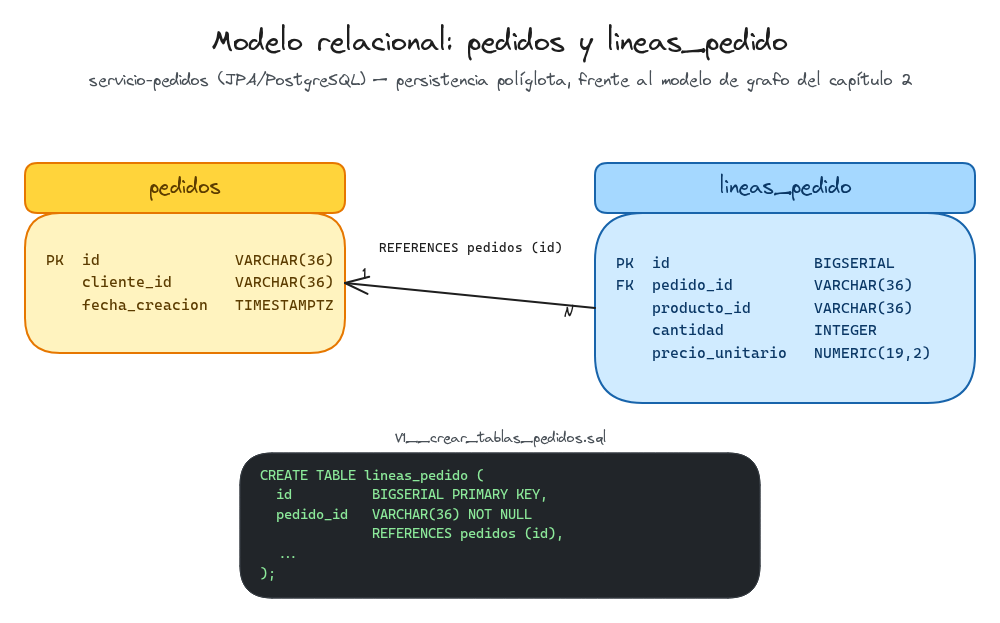
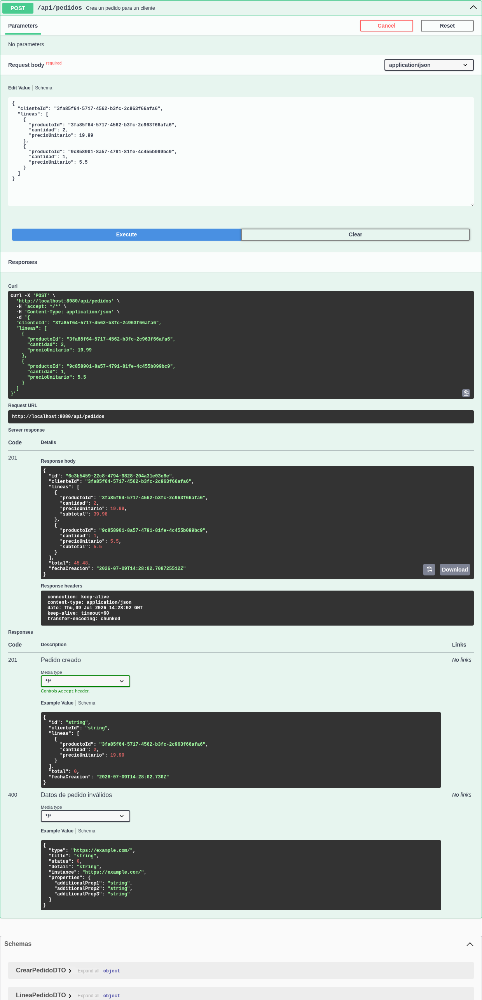

# Capítulo 06 — Segundo microservicio: Pedidos (JPA/PostgreSQL)

Sexto capítulo del tutorial "De cero a pro en arquitectura de microservicios con Spring Boot" (ver el índice completo de capítulos en la rama `main`). Parte directamente de `capitulo-05-problemdetail-rfc7807`. Introduce un microservicio nuevo, `servicio-pedidos`, con persistencia relacional (Spring Data JPA/PostgreSQL) en contraste con el grafo Neo4j de `servicio-catalogo`, incluyendo migraciones de esquema versionadas con Flyway.

## Índice

1. [Introducción](#1-introducción)
2. [El agregado `Pedido` y la entidad interna `LineaPedido`](#2-el-agregado-pedido-y-la-entidad-interna-lineapedido)
3. [Puertos y servicio de aplicación: `CrearPedido`](#3-puertos-y-servicio-de-aplicación-crearpedido)
4. [Persistencia políglota (Polyglot Persistence): por qué JPA/PostgreSQL frente al grafo de Neo4j](#4-persistencia-políglota-polyglot-persistence-por-qué-jpapostgresql-frente-al-grafo-de-neo4j)
5. [Migración de esquema (Schema Migration) con Flyway y mapeo JPA](#5-migración-de-esquema-schema-migration-con-flyway-y-mapeo-jpa)
6. [API REST: `PedidoController` y `ProblemDetail`](#6-api-rest-pedidocontroller-y-problemdetail)
7. [Cómo probarlo](#7-cómo-probarlo)
8. [Registro de archivos del capítulo](#8-registro-de-archivos-del-capítulo)
9. [Referencias](#9-referencias)

---

## 1. Introducción

Los cinco capítulos anteriores construyeron `servicio-catalogo` completo: Agregados con Objetos de Valor, relaciones de grafo en Neo4j, API REST documentada con OpenAPI, eventos de dominio y errores estructurados con `ProblemDetail`. Pero un catálogo de productos por sí solo no es una tienda — falta el otro lado de la transacción: alguien que compra. Este capítulo arranca `servicio-pedidos`, un segundo microservicio con su propio modelo de dominio, un Contexto Delimitado (Bounded Context) aislado del de Catálogo aunque hable del mismo negocio.

La decisión que atraviesa todo el capítulo es la persistencia: en vez de reutilizar Neo4j, Pedidos usa Spring Data JPA sobre PostgreSQL — la primera vez que el monorepo tiene persistencia políglota (Polyglot Persistence) real, cada microservicio con el motor que mejor encaja con la forma de su propio modelo, no uno impuesto de arriba abajo. La [sección 4](#4-persistencia-políglota-polyglot-persistence-por-qué-jpapostgresql-frente-al-grafo-de-neo4j) desarrolla por qué.

---

## 2. El agregado `Pedido` y la entidad interna `LineaPedido`

`Pedido` es el Agregado raíz de este Contexto Delimitado: agrupa a un cliente y a las líneas que componen su pedido, y es el único punto de entrada para modificarlas — nada fuera de `Pedido` puede añadir una línea directamente. Sigue la misma convención Lombok que `Producto`/`Categoria` en Catálogo (constructor privado, factories estáticas `crear`/`reconstruir`, `@Getter @Accessors(fluent = true)`, `@EqualsAndHashCode` solo por `id`):

```java
public static Pedido crear(ClienteId clienteId) {
	Objects.requireNonNull(clienteId, "El cliente del pedido no puede ser nulo");
	return new Pedido(PedidoId.generar(), clienteId, new ArrayList<>(), Instant.now());
}

public void agregarLinea(ProductoId productoId, Cantidad cantidad, Precio precioUnitario) {
	lineas.add(LineaPedido.crear(productoId, cantidad, precioUnitario));
}

public Precio total() {
	BigDecimal total = lineas.stream()
			.map(LineaPedido::subtotal)
			.reduce(BigDecimal.ZERO, BigDecimal::add);
	return Precio.de(total);
}
```

Cada línea es una Entidad (Entity) interna al agregado — vive dentro de `Pedido`, no tiene repositorio ni ciclo de vida propios, y solo se crea a través de `agregarLinea`:

```java
public static LineaPedido crear(ProductoId productoId, Cantidad cantidad, Precio precioUnitario) {
	Objects.requireNonNull(productoId, "El producto de la línea de pedido no puede ser nulo");
	Objects.requireNonNull(cantidad, "La cantidad de la línea de pedido no puede ser nula");
	Objects.requireNonNull(precioUnitario, "El precio unitario de la línea de pedido no puede ser nulo");
	return new LineaPedido(productoId, cantidad, precioUnitario);
}
```

El getter `lineas()` de `Pedido` no expone la lista mutable interna, sino una copia (`List.copyOf(lineas)`): si devolviera la referencia real, cualquier código externo podría añadir líneas saltándose `agregarLinea` — y con ella, sus validaciones — sin pasar por ningún método del agregado.

`ProductoId` y `Precio` existen también como Objetos de Valor propios de este microservicio, distintos de sus homónimos en `servicio-catalogo`: cada Contexto Delimitado modela sus propios conceptos, aunque el nombre y la forma coincidan. `precioUnitario` en concreto es una copia congelada del precio del producto en el momento de crear la línea, no una referencia viva al `Precio` actual del catálogo — si ese precio cambia después, el pedido ya confirmado no se ve afectado.

> **¿Por qué `Pedido` no tiene todavía `confirmar()`/`cancelar()`?**
>
> El agregado arranca directamente en un estado implícito equivalente a "pendiente", sin un campo `estado` explícito ni transiciones. Añadir esas transiciones ahora, sin un caso de uso real que las dispare, sería diseñar para un requisito hipotético en vez de para uno concreto — exactamente lo que este proyecto evita. El campo `estado` y sus transiciones se incorporan cuando aparezca la primera razón real para necesitarlos.

---

## 3. Puertos y servicio de aplicación: `CrearPedido`

Mismo patrón hexagonal que Catálogo: un puerto de entrada por caso de uso, un puerto de salida por necesidad de persistencia, y un servicio de aplicación que los conecta.

```java
public interface CrearPedidoPuertoEntrada {
	PedidoDTO crear(CrearPedidoDTO dto);
}

public interface PedidoRepositorioPuertoSalida {
	Pedido guardar(Pedido pedido);
}
```

`CrearPedidoServicio` reconstruye el agregado a partir del DTO de entrada (un `clienteId` y una lista de líneas) y lo guarda:

```java
@Override
public PedidoDTO crear(CrearPedidoDTO dto) {
	Pedido pedido = Pedido.crear(ClienteId.de(dto.clienteId()));
	dto.lineas().forEach(linea -> pedido.agregarLinea(
			ProductoId.de(linea.productoId()),
			Cantidad.de(linea.cantidad()),
			Precio.de(linea.precioUnitario())));

	Pedido guardado = pedidoRepositorioPuertoSalida.guardar(pedido);
	return pedidoMapper.aDTO(guardado);
}
```

`PedidoRepositorioPuertoSalida` declara únicamente `guardar` — a diferencia de `ProductoRepositorioPuertoSalida` en Catálogo, que ya acumula varios métodos de búsqueda porque varios capítulos fueron añadiendo casos de uso sobre el mismo puerto. Aquí, hasta que exista un caso de uso `BuscarPedido`, cualquier otro método sería un método sin llamador.

> **¿Por qué `CrearPedidoServicio` no comprueba que el producto existe en `servicio-catalogo`, ni que su precio es correcto?**
>
> El DTO de entrada trae ya el `productoId` y el `precioUnitario` como datos de confianza, sin verificarlos contra el catálogo real. Esa verificación exige una llamada saliente a otro microservicio — un problema distinto (comunicación entre servicios) del que resuelve este capítulo (persistencia políglota). Mezclarlos aquí obligaría a introducir un cliente HTTP a medio construir solo para poder validar un id.

---

## 4. Persistencia políglota (Polyglot Persistence): por qué JPA/PostgreSQL frente al grafo de Neo4j

`servicio-catalogo` usa Neo4j porque su dominio es, literalmente, un grafo: productos que pertenecen a categorías y se recomiendan entre sí, con las propias relaciones (`PERTENECE_A`, `RELACIONADO_CON`) como parte del modelo. `Pedido` no tiene esa forma — es un agregado con una lista de líneas, el caso de uso de manual de cualquier ORM relacional: una tabla `pedidos` y una tabla `lineas_pedido` con una clave foránea, sin ninguna relación de grafo que aprovechar.

Persistencia políglota es justamente esto: cada microservicio elige el motor de persistencia por la forma de sus datos, no por una decisión única para todo el monorepo. Spring Data JPA sobre PostgreSQL es la elección por defecto para este caso — modelo relacional maduro, y el mismo patrón de Puerto de salida + Adaptador que ya desacopla el dominio de Neo4j en Catálogo desacopla aquí el dominio de JPA.



*Modelo relacional de `servicio-pedidos`: una tabla `pedidos` y una tabla `lineas_pedido` unidas por clave foránea — el contraste directo con el modelo de grafo de Categoría/Producto del capítulo 2.*

<br>

---

## 5. Migración de esquema (Schema Migration) con Flyway y mapeo JPA

Con un esquema relacional entra por primera vez en el monorepo la pregunta de quién crea las tablas. La opción por defecto de Hibernate (`ddl-auto=update`/`create`) genera el esquema a partir de las entidades JPA en cada arranque — cómoda para prototipar, pero sin ningún registro versionado de cómo evolucionó ese esquema, y arriesgada en cuanto hay datos reales que no se pueden simplemente regenerar. Una Migración de esquema resuelve esto con scripts versionados que se aplican una sola vez, en orden, y quedan registrados en una tabla de control — el mismo espíritu que un historial de commits, pero para el esquema de la base de datos.

Este capítulo usa [Flyway](#9-referencias) en vez de Liquibase: las migraciones son SQL plano, así que lo que se lee en el repositorio es el DDL real que se ejecuta contra PostgreSQL, no una capa de abstracción XML/YAML intermedia. Spring Boot 4.1 le da soporte de primera clase con su propio starter modular (`spring-boot-starter-flyway`), separado del starter de PostgreSQL:

```sql
CREATE TABLE pedidos (
    id             VARCHAR(36) PRIMARY KEY,
    cliente_id     VARCHAR(36)              NOT NULL,
    fecha_creacion TIMESTAMP WITH TIME ZONE NOT NULL
);

CREATE TABLE lineas_pedido (
    id               BIGSERIAL PRIMARY KEY,
    pedido_id        VARCHAR(36)    NOT NULL REFERENCES pedidos (id),
    producto_id      VARCHAR(36)    NOT NULL,
    cantidad         INTEGER        NOT NULL,
    precio_unitario  NUMERIC(19, 2) NOT NULL
);

CREATE INDEX idx_lineas_pedido_pedido_id ON lineas_pedido (pedido_id);
```

El archivo vive en `src/main/resources/db/migration/V1__crear_tablas_pedidos.sql` — Flyway busca ahí por convención, y el nombre codifica el número de versión (`V1`) y una descripción legible separados por doble guion bajo. Con Flyway presente y una base de datos no embebida, Spring Boot fija `ddl-auto=none` por defecto: Hibernate deja de generar ni validar el esquema, y Flyway pasa a ser la única fuente de verdad sobre las tablas.

El mapeo JPA vive, como en Catálogo, en entidades de infraestructura propias — `PedidoEntidad`/`LineaPedidoEntidad` — distintas de `Pedido`/`LineaPedido` del dominio:

```java
@Entity
@Table(name = "pedidos")
public class PedidoEntidad {

	@Id
	private String id;
	private String clienteId;
	private Instant fechaCreacion;

	@OneToMany(mappedBy = "pedido", cascade = CascadeType.ALL, orphanRemoval = true)
	private List<LineaPedidoEntidad> lineas;
}
```

`cascade = CascadeType.ALL, orphanRemoval = true` traduce a JPA la misma invariante que ya imponía el dominio: una línea no existe sin su pedido. Guardar un `PedidoEntidad` guarda también sus líneas, y quitar una línea de la lista la borra de la tabla — no hace falta gestionarlas por separado.

> **¿Por qué `LineaPedidoEntidad` tiene un `id` (`Long`, autogenerado) si `LineaPedido` en el dominio no lo tiene?**
>
> Son identidades de naturaleza distinta. El dominio no necesita un id para `LineaPedido` porque nunca se referencia una línea suelta desde fuera de su `Pedido` — no hay ningún caso de uso que diga "la línea X". La tabla `lineas_pedido`, en cambio, sí necesita una clave primaria técnica: es un requisito del modelo relacional (toda fila la tiene), no una necesidad del dominio. `PedidoEntidadMapper` es quien resuelve esta diferencia, generando y descartando ese id técnico al traducir entre ambos mundos.

`PedidoRepositorioAdaptador` implementa el puerto de salida apoyándose en `PedidoRepositorioJpa` (una interfaz `JpaRepository<PedidoEntidad, String>` de Spring Data, sin necesidad de implementación manual) y en `PedidoEntidadMapper` (MapStruct, con métodos `default` escritos a mano para aplanar los Objetos de Valor anidados — mismo patrón que `ProductoEntidadMapper` en Catálogo):

```java
@Override
public Pedido guardar(Pedido pedido) {
	var entidadGuardada = pedidoRepositorioJpa.save(pedidoEntidadMapper.aEntidad(pedido));
	return pedidoEntidadMapper.aDominio(entidadGuardada);
}
```

---

## 6. API REST: `PedidoController` y `ProblemDetail`

Un único endpoint expone `CrearPedidoPuertoEntrada` por HTTP, con el mismo patrón que los controllers de Catálogo — Swagger documentado con `@Operation`/`@ApiResponses`, `201` con el recurso creado en el cuerpo:

```java
@PostMapping
@Operation(operationId = "crearPedido", summary = "Crea un pedido para un cliente")
@ApiResponses({
		@ApiResponse(responseCode = "201", description = "Pedido creado"),
		@ApiResponse(responseCode = "400", description = "Datos de pedido inválidos",
				content = @Content(schema = @Schema(implementation = ProblemDetail.class)))
})
public ResponseEntity<PedidoDTO> crear(@RequestBody CrearPedidoDTO dto) {
	PedidoDTO creado = crearPedidoPuertoEntrada.crear(dto);
	return ResponseEntity.status(HttpStatus.CREATED).body(creado);
}
```

A diferencia de `servicio-catalogo` — que empezó devolviendo texto plano y no migró a `ProblemDetail` hasta el capítulo 5 —, `servicio-pedidos` nace ya usando `ProblemDetail` desde su primer `ControladorErroresGlobal`: no hay motivo para repetir dentro del mismo monorepo una evolución que otro microservicio ya resolvió.

```java
@ExceptionHandler(IllegalArgumentException.class)
public ProblemDetail manejarArgumentoInvalido(IllegalArgumentException excepcion) {
	ProblemDetail problema = ProblemDetail.forStatusAndDetail(HttpStatus.BAD_REQUEST, excepcion.getMessage());
	problema.setType(TIPO_ARGUMENTO_INVALIDO);
	problema.setTitle("Argumento inválido");
	return problema;
}
```

Por ahora es el único `@ExceptionHandler`: las validaciones de `Pedido` / `LineaPedido` / sus Objetos de Valor son la única fuente de error de este microservicio — no hay todavía una excepción del estilo `ProductoNoEncontradoException`, porque no hay ningún caso de uso que busque un pedido por id.

---

## 7. Cómo probarlo

```bash
./mvnw -pl servicio-pedidos spring-boot:run
```

> **¿Por qué `servicio-pedidos` arranca en el puerto 8081 y no en el 8080 por defecto?**
>
> Ningún `application.yml` de este monorepo fijaba hasta ahora `server.port` — cada microservicio arrancaba en el 8080 por defecto de Spring Boot porque nunca se habían levantado dos a la vez. Con `servicio-pedidos` sumándose a `servicio-catalogo`, ambos en el mismo puerto chocarían en cuanto se arrancaran juntos, así que `servicio-pedidos` fija explícitamente `server.port: 8081` en su `application.yml`. `servicio-catalogo` se queda en el 8080 por defecto, sin cambios.

Con el servicio arrancado (y PostgreSQL levantado automáticamente vía `compose.yaml`, con Flyway aplicando la migración en el arranque):

```bash
curl -i http://localhost:8081/api/pedidos -X POST -H "Content-Type: application/json" -d '{
  "clienteId": "3fa85f64-5717-4562-b3fc-2c963f66afa6",
  "lineas": [
    {"productoId": "3fa85f64-5717-4562-b3fc-2c963f66afa6", "cantidad": 2, "precioUnitario": 19.99},
    {"productoId": "9c858901-8a57-4791-81fe-4c455b099bc9", "cantidad": 1, "precioUnitario": 5.50}
  ]
}'
```

```http
HTTP/1.1 201
Content-Type: application/json

{
  "id": "6c3b5459-22c8-4794-9828-204a31e03e8e",
  "clienteId": "3fa85f64-5717-4562-b3fc-2c963f66afa6",
  "lineas": [
    {"productoId": "3fa85f64-5717-4562-b3fc-2c963f66afa6", "cantidad": 2, "precioUnitario": 19.99, "subtotal": 39.98},
    {"productoId": "9c858901-8a57-4791-81fe-4c455b099bc9", "cantidad": 1, "precioUnitario": 5.50, "subtotal": 5.50}
  ],
  "total": 45.48,
  "fechaCreacion": "2026-07-09T14:28:02.708725512Z"
}
```

Un cliente vacío dispara la rama de `IllegalArgumentException`, con el mismo formato `ProblemDetail` que ya usa Catálogo desde el capítulo 5:

```bash
curl -i http://localhost:8081/api/pedidos -X POST -H "Content-Type: application/json" -d '{}'
```

```http
HTTP/1.1 400
Content-Type: application/problem+json

{
  "type": "https://tienda.javacadabra.com/problemas/argumento-invalido",
  "title": "Argumento inválido",
  "status": 400,
  "detail": "El id del cliente no puede estar vacío",
  "instance": "/api/pedidos"
}
```

Desde Swagger UI (`http://localhost:8081/swagger-ui/index.html`):



*Swagger UI ejecutando `POST /api/pedidos`: la respuesta `201` incluye el `id` generado, el `subtotal` de cada línea y el `total` del pedido.*

<br>

Los tests automatizados verifican dominio, aplicación y persistencia:

```bash
./mvnw -pl servicio-pedidos test
```

El test de integración `PedidoRepositorioAdaptadorIntegrationTest` levanta su propio PostgreSQL con Testcontainers, contra el que Flyway aplica `V1__crear_tablas_pedidos.sql` antes de que Hibernate lea o escriba nada — el mismo camino que seguiría el esquema en producción, no uno generado ad hoc para el test:

```
Migrating schema "public" to version "1 - crear tablas pedidos"
Successfully applied 1 migration to schema "public", now at version v1
Hibernate: insert into pedidos (cliente_id,fecha_creacion,id) values (?,?,?)
Hibernate: insert into lineas_pedido (cantidad,pedido_id,precio_unitario,producto_id) values (?,?,?,?)
```

---

## 8. Registro de archivos del capítulo

Tabla de control de los archivos que forman el contenido de este capítulo.

**Leyenda:** 🌱 Creado · ✏️ Actualizado · 🗑️ Eliminado

### Documentación e imágenes

| | Archivo | Descripción funcional | Descripción del cambio |
|:---:|---|---|:---:|
| 🌱 | [`docs/diagramas/capitulo-06-modelo-relacional-pedidos.excalidraw`](docs/diagramas/capitulo-06-modelo-relacional-pedidos.excalidraw) | Diagrama Excalidraw (fuente editable) del modelo relacional `pedidos`/`lineas_pedido`. | --- |
| 🌱 | [`docs/images/capitulo-06/modelo-relacional-pedidos.png`](docs/images/capitulo-06/modelo-relacional-pedidos.png) | Render del diagrama anterior, embebido en la [sección 4](#4-persistencia-políglota-polyglot-persistence-por-qué-jpapostgresql-frente-al-grafo-de-neo4j). | --- |
| 🌱 | [`docs/images/capitulo-06/swagger-ui-crear-pedido.png`](docs/images/capitulo-06/swagger-ui-crear-pedido.png) | Captura de Swagger UI ejecutando `POST /api/pedidos`, embebida en la [sección 7](#7-cómo-probarlo). | --- |

### Build y configuración

| | Archivo | Descripción funcional | Descripción del cambio |
|:---:|---|---|:---:|
| ✏️ | [`pom.xml`](pom.xml) | POM padre multi-módulo del monorepo. | Registra el módulo nuevo `servicio-pedidos`. |
| 🌱 | [`servicio-pedidos/pom.xml`](servicio-pedidos/pom.xml) | POM del microservicio de Pedidos: Spring MVC, springdoc-openapi, Spring Data JPA, Flyway, driver de PostgreSQL, MapStruct, Lombok y Testcontainers. | --- |
| 🌱 | [`servicio-pedidos/compose.yaml`](servicio-pedidos/compose.yaml) | Entorno de desarrollo local: contenedor PostgreSQL. | --- |
| 🌱 | [`servicio-pedidos/src/main/resources/application.yml`](servicio-pedidos/src/main/resources/application.yml) | Configuración del microservicio (nombre de la aplicación, puerto 8081 para no chocar con `servicio-catalogo`). | --- |
| 🌱 | [`V1__crear_tablas_pedidos.sql`](servicio-pedidos/src/main/resources/db/migration/V1__crear_tablas_pedidos.sql) | Migración Flyway: tablas `pedidos` y `lineas_pedido`. | --- |

### Dominio

| | Archivo | Descripción funcional | Descripción del cambio |
|:---:|---|---|:---:|
| 🌱 | [`ServicioPedidosApplication.java`](servicio-pedidos/src/main/java/com/javacadabra/tienda/pedidos/ServicioPedidosApplication.java) | Clase de arranque de Spring Boot del microservicio de Pedidos, con la definición base de OpenAPI. | --- |
| 🌱 | [`PedidoId.java`](servicio-pedidos/src/main/java/com/javacadabra/tienda/pedidos/dominio/modelo/objetovalor/PedidoId.java) | Objeto de Valor: identidad del agregado `Pedido`. | --- |
| 🌱 | [`ClienteId.java`](servicio-pedidos/src/main/java/com/javacadabra/tienda/pedidos/dominio/modelo/objetovalor/ClienteId.java) | Objeto de Valor: referencia al cliente propietario del pedido. | --- |
| 🌱 | [`ProductoId.java`](servicio-pedidos/src/main/java/com/javacadabra/tienda/pedidos/dominio/modelo/objetovalor/ProductoId.java) | Objeto de Valor: referencia a un producto del catálogo, propia de este Contexto Delimitado. | --- |
| 🌱 | [`Precio.java`](servicio-pedidos/src/main/java/com/javacadabra/tienda/pedidos/dominio/modelo/objetovalor/Precio.java) | Objeto de Valor: importe monetario no negativo. | --- |
| 🌱 | [`Cantidad.java`](servicio-pedidos/src/main/java/com/javacadabra/tienda/pedidos/dominio/modelo/objetovalor/Cantidad.java) | Objeto de Valor: cantidad de unidades de una línea de pedido, mayor que cero. | --- |
| 🌱 | [`LineaPedido.java`](servicio-pedidos/src/main/java/com/javacadabra/tienda/pedidos/dominio/modelo/entidad/LineaPedido.java) | Entidad interna al agregado `Pedido`: producto, cantidad y precio unitario congelado de una línea. | --- |
| 🌱 | [`Pedido.java`](servicio-pedidos/src/main/java/com/javacadabra/tienda/pedidos/dominio/modelo/agregado/Pedido.java) | Agregado raíz: cliente y líneas de un pedido, con el total calculado. | --- |

### Aplicación

| | Archivo | Descripción funcional | Descripción del cambio |
|:---:|---|---|:---:|
| 🌱 | [`CrearPedidoDTO.java`](servicio-pedidos/src/main/java/com/javacadabra/tienda/pedidos/aplicacion/dto/entrada/CrearPedidoDTO.java) | DTO de entrada: cliente y líneas para crear un pedido. | --- |
| 🌱 | [`LineaPedidoDTO.java`](servicio-pedidos/src/main/java/com/javacadabra/tienda/pedidos/aplicacion/dto/entrada/LineaPedidoDTO.java) | DTO de entrada: una línea del pedido a crear. | --- |
| 🌱 | [`PedidoDTO.java`](servicio-pedidos/src/main/java/com/javacadabra/tienda/pedidos/aplicacion/dto/salida/PedidoDTO.java) | DTO de salida: representación de un pedido ya creado, con su total. | --- |
| 🌱 | [`LineaPedidoDTO.java`](servicio-pedidos/src/main/java/com/javacadabra/tienda/pedidos/aplicacion/dto/salida/LineaPedidoDTO.java) | DTO de salida: una línea del pedido, con su subtotal calculado. | --- |
| 🌱 | [`PedidoMapper.java`](servicio-pedidos/src/main/java/com/javacadabra/tienda/pedidos/aplicacion/mapper/PedidoMapper.java) | Mapper (MapStruct): `Pedido` (dominio) ↔ `PedidoDTO`. | --- |
| 🌱 | [`CrearPedidoPuertoEntrada.java`](servicio-pedidos/src/main/java/com/javacadabra/tienda/pedidos/aplicacion/puerto/entrada/CrearPedidoPuertoEntrada.java) | Puerto de entrada: caso de uso de creación de un pedido. | --- |
| 🌱 | [`PedidoRepositorioPuertoSalida.java`](servicio-pedidos/src/main/java/com/javacadabra/tienda/pedidos/aplicacion/puerto/salida/PedidoRepositorioPuertoSalida.java) | Puerto de salida: persistencia del agregado `Pedido`. | --- |
| 🌱 | [`CrearPedidoServicio.java`](servicio-pedidos/src/main/java/com/javacadabra/tienda/pedidos/aplicacion/servicio/CrearPedidoServicio.java) | Servicio de aplicación: implementa `CrearPedidoPuertoEntrada`. | --- |

### Infraestructura de entrada

| | Archivo | Descripción funcional | Descripción del cambio |
|:---:|---|---|:---:|
| 🌱 | [`PedidoController.java`](servicio-pedidos/src/main/java/com/javacadabra/tienda/pedidos/infraestructura/adaptador/entrada/rest/PedidoController.java) | Adaptador de entrada REST: endpoint de creación de pedidos. | --- |
| 🌱 | [`ControladorErroresGlobal.java`](servicio-pedidos/src/main/java/com/javacadabra/tienda/pedidos/infraestructura/adaptador/entrada/rest/ControladorErroresGlobal.java) | `@RestControllerAdvice` centralizado que traduce las excepciones de dominio a `ProblemDetail`. | --- |

### Infraestructura de salida

| | Archivo | Descripción funcional | Descripción del cambio |
|:---:|---|---|:---:|
| 🌱 | [`PedidoEntidad.java`](servicio-pedidos/src/main/java/com/javacadabra/tienda/pedidos/infraestructura/adaptador/salida/persistencia/entidad/PedidoEntidad.java) | Entidad JPA: mapea la tabla `pedidos`. | --- |
| 🌱 | [`LineaPedidoEntidad.java`](servicio-pedidos/src/main/java/com/javacadabra/tienda/pedidos/infraestructura/adaptador/salida/persistencia/entidad/LineaPedidoEntidad.java) | Entidad JPA: mapea la tabla `lineas_pedido`. | --- |
| 🌱 | [`PedidoEntidadMapper.java`](servicio-pedidos/src/main/java/com/javacadabra/tienda/pedidos/infraestructura/adaptador/salida/persistencia/mapper/PedidoEntidadMapper.java) | Mapper (MapStruct): `Pedido` (dominio) ↔ `PedidoEntidad` (JPA). | --- |
| 🌱 | [`PedidoRepositorioJpa.java`](servicio-pedidos/src/main/java/com/javacadabra/tienda/pedidos/infraestructura/adaptador/salida/persistencia/repositorio/PedidoRepositorioJpa.java) | Repositorio Spring Data JPA sobre `PedidoEntidad`. | --- |
| 🌱 | [`PedidoRepositorioAdaptador.java`](servicio-pedidos/src/main/java/com/javacadabra/tienda/pedidos/infraestructura/adaptador/salida/persistencia/adaptador/PedidoRepositorioAdaptador.java) | Adaptador de salida: implementa `PedidoRepositorioPuertoSalida` sobre JPA. | --- |

### Tests

| | Archivo | Descripción funcional | Descripción del cambio |
|:---:|---|---|:---:|
| 🌱 | [`PedidoTest.java`](servicio-pedidos/src/test/java/com/javacadabra/tienda/pedidos/dominio/modelo/agregado/PedidoTest.java) | Test unitario del agregado `Pedido`. | --- |
| 🌱 | [`PrecioTest.java`](servicio-pedidos/src/test/java/com/javacadabra/tienda/pedidos/dominio/modelo/objetovalor/PrecioTest.java) | Test unitario del Objeto de Valor `Precio`. | --- |
| 🌱 | [`CantidadTest.java`](servicio-pedidos/src/test/java/com/javacadabra/tienda/pedidos/dominio/modelo/objetovalor/CantidadTest.java) | Test unitario del Objeto de Valor `Cantidad`. | --- |
| 🌱 | [`CrearPedidoServicioTest.java`](servicio-pedidos/src/test/java/com/javacadabra/tienda/pedidos/aplicacion/servicio/CrearPedidoServicioTest.java) | Test unitario del servicio de aplicación `CrearPedidoServicio` (Mockito). | --- |
| 🌱 | [`PedidoRepositorioAdaptadorIntegrationTest.java`](servicio-pedidos/src/test/java/com/javacadabra/tienda/pedidos/infraestructura/adaptador/salida/persistencia/PedidoRepositorioAdaptadorIntegrationTest.java) | Test de integración del adaptador de persistencia JPA (Testcontainers + PostgreSQL real). | --- |

---

## 9. Referencias

- [Spring Data JPA — Reference Documentation](https://docs.spring.io/spring-data/jpa/reference/)
- [Flyway — Documentation](https://documentation.red-gate.com/flyway)
- [Spring Boot — Testcontainers support](https://docs.spring.io/spring-boot/reference/testing/testcontainers.html)
