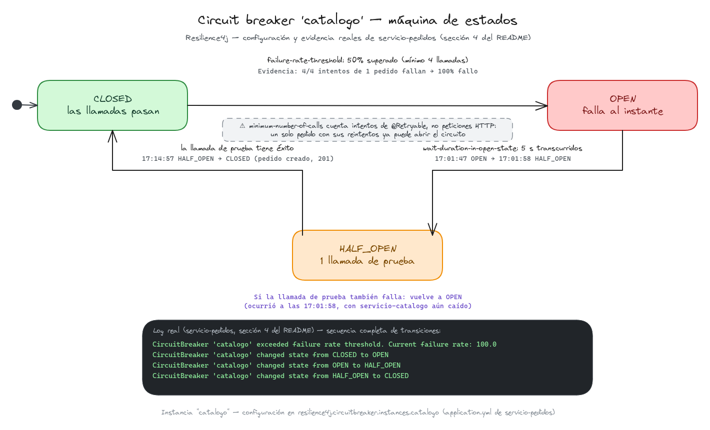

# Capítulo 08 — Resiliencia de la llamada síncrona

Octavo capítulo del tutorial "De cero a pro en arquitectura de microservicios con Spring Boot" (ver el índice completo de capítulos en la rama `main`). Parte directamente de `capitulo-07-http-service-client`.

## Índice

1. [Introducción](#1-introducción)
2. [Reintentos con `@Retryable`](#2-reintentos-con-retryable)
3. [Límite de concurrencia con `@ConcurrencyLimit`](#3-límite-de-concurrencia-con-concurrencylimit)
4. [Circuit breaker con Resilience4j](#4-circuit-breaker-con-resilience4j)
5. [Cómo probarlo](#5-cómo-probarlo)
   1. [Demostración manual](#51-demostración-manual)
   2. [Test de integración con `MockRestServiceServer`](#52-test-de-integración-con-mockrestserviceserver)
6. [Registro de archivos del capítulo](#6-registro-de-archivos-del-capítulo)
7. [Referencias](#7-referencias)

---

## 1. Introducción

Desde el capítulo 7, `servicio-pedidos` depende de una única llamada síncrona a `servicio-catalogo` para resolver el precio real de cada línea de un pedido. Esa llamada es, ahora mismo, un punto único de fallo (Single Point of Failure): si `servicio-catalogo` está caído, lento o responde con errores intermitentes, crear un pedido falla también — sin ningún mecanismo que lo amortigüe.

Este capítulo añade tres mecanismos de resiliencia sobre esa misma llamada, cada uno resolviendo un problema distinto:

| Mecanismo                  | Problema que resuelve |
|----------------------------|---|
| **Reintento** (Retry)      | Un fallo transitorio y puntual (un timeout suelto, un blip de red) se resuelve solo con volver a intentarlo |
| **Límite de concurrencia** | Un catálogo lento no debe agotar el pool de hilos de `servicio-pedidos` acumulando llamadas en curso |
| **Circuit breaker**        | Un fallo sostenido no se arregla insistiendo — hay que dejar de llamar y fallar rápido durante un tiempo |

Los dos primeros son nativos de Spring Framework 7, activados con una única anotación de configuración (`@EnableResilientMethods`) y aplicados método a método con `@Retryable`/`@ConcurrencyLimit`. El circuit breaker no tiene equivalente nativo en Spring Framework 7 — se cubre en una sección posterior con Resilience4j.

---

## 2. Reintentos con `@Retryable`

Antes de reintentar hace falta que el fallo se detecte en un tiempo acotado — sin eso, un `servicio-catalogo` que no está caído pero sí colgado (la conexión se establece pero nunca llega respuesta) podría dejar la llamada esperando indefinidamente, sin que `@Retryable` llegue siquiera a entrar en juego. `application.yml` fija explícitamente esos límites sobre el mismo grupo `catalogo` ya configurado en el capítulo 7:

```yaml
# servicio-pedidos/src/main/resources/application.yml
spring:
  http:
    serviceclient:
      catalogo:
        base-url: "http://localhost:8080"
        connect-timeout: 1s
        read-timeout: 2s
```

> **¿Por qué dos timeouts distintos?**
>
> `connect-timeout` acota cuánto se espera a establecer la conexión TCP — si `servicio-catalogo` está realmente caído (nadie escucha en el puerto), esto falla casi al instante, así que 1 s ya es generoso. `read-timeout` acota cuánto se espera una vez la conexión ya está establecida pero la respuesta no llega — el caso de un proceso colgado, no caído. Sin este segundo timeout explícito, esa espera no tendría un límite fijado por la aplicación.
>
> Ambos se traducen en la misma `ResourceAccessException` que ya dispara `@Retryable` (sección siguiente) y cuenta como fallo para el circuit breaker (sección 4) — son la primera línea de defensa que hace que el resto de mecanismos de este capítulo lleguen a activarse en un tiempo razonable, en vez de quedarse esperando una respuesta que nunca llega.

Spring Framework 7 incorpora un paquete propio de resiliencia (`org.springframework.resilience`), sin depender de Spring Retry ni de ninguna librería externa. Se activa declarando `@EnableResilientMethods` en una clase de configuración:

```java
// servicio-pedidos/.../infraestructura/configuracion/ResilienciaConfig.java
@Configuration
@EnableResilientMethods
public class ResilienciaConfig {
}
```

Esa anotación registra, por debajo, los *bean post-processors* que procesan tanto `@Retryable` como `@ConcurrencyLimit` (la anotación de la siguiente sección) — ambas comparten el mismo interruptor de activación, aunque se apliquen de forma independiente método a método.

Con eso activado, `@Retryable` se aplica directamente sobre el método que ya conocemos del capítulo 7, `CatalogoAdaptador.buscarProductoPorId`:

```java
// servicio-pedidos/.../infraestructura/adaptador/salida/http/adaptador/CatalogoAdaptador.java
@Retryable(
		includes = ResourceAccessException.class,
		maxRetries = 3,
		delay = 200,
		multiplier = 2,
		jitter = 50,
		maxDelay = 1500)
@Override
public ProductoCatalogoDTO buscarProductoPorId(ProductoId productoId) {
	try {
		ProductoCatalogoRespuesta respuesta = catalogoHttpExchange.buscarProductoPorId(productoId.valor());
		return new ProductoCatalogoDTO(respuesta.id(), respuesta.nombre(), respuesta.precio());
	} catch (HttpClientErrorException.NotFound excepcion) {
		throw new ProductoInexistenteException(productoId.valor());
	}
}
```

El atributo `includes` es la decisión más importante de este bloque: acota el reintento a `ResourceAccessException` — la excepción que Spring lanza ante un fallo de E/S (conexión rechazada, timeout, DNS que no resuelve), es decir, un fallo transitorio de red. Deliberadamente **no** incluye `HttpClientErrorException.NotFound` (el 404 que ya traducíamos a `ProductoInexistenteException` en el capítulo 7): reintentar un "el producto no existe" no cambia el resultado, solo retrasa una respuesta que ya es definitiva. Al no compartir jerarquía con `ResourceAccessException`, ni siquiera hace falta una exclusión explícita (`excludes`) — el `include` ya actúa como lista blanca.

> **¿Qué es exactamente `ResourceAccessException`?**
>
> Es la excepción que `RestClient` lanza cuando la llamada HTTP no llega a completarse por un problema de infraestructura de red, no de protocolo HTTP — por eso no lleva asociado ningún código de estado. Envuelve siempre una `IOException` de bajo nivel como causa: un `ConnectException` (el puerto no acepta conexiones, el proceso está caído), un `SocketTimeoutException` (la conexión se estableció pero no hubo respuesta a tiempo) o un `UnknownHostException` (el DNS no resuelve).
>
> La diferencia con `HttpClientErrorException`/`HttpServerErrorException` es la que importa aquí: esas sí implican que hubo una respuesta HTTP, aunque fuera un 404 o un 503 — el servidor contestó, solo que con un código de error. `ResourceAccessException` significa que la respuesta ni siquiera llegó a existir, que es justo el tipo de fallo transitorio que un reintento puede resolver.

El resto de atributos configura un **backoff** exponencial con **jitter**: `delay = 200` fija la espera tras el primer fallo, `multiplier = 2` la dobla en cada reintento sucesivo (200 → 400 → 800 ms), `jitter = 50` añade una variación aleatoria de ±50 ms a cada espera (evita que reintentos de peticiones distintas se sincronicen exactamente), y `maxDelay = 1500` limita cuánto puede crecer esa espera. Con `maxRetries = 3`, el total de intentos es 1 inicial + 3 reintentos = 4 — si los cuatro fallan, la excepción se propaga tal cual a quien llamó (por ahora sin traducir a un `ProblemDetail` propio; eso llega con el circuit breaker, más adelante en este mismo capítulo).

> **¿En qué unidad están `delay`, `jitter` y `maxDelay`?**
>
> En milisegundos. Los tres son un `long` plano, no un `Duration` — a diferencia de otras propiedades de configuración de Spring que sí aceptan sufijos como `500ms` o `2s`, aquí el número se interpreta directamente como milisegundos sin unidad explícita en el propio atributo.

> **¿Qué es un backoff?**
>
> Es la estrategia de ir espaciando cada reintento sucesivo con una espera mayor que la anterior, en vez de reintentar inmediatamente o siempre con la misma espera fija. La variante "exponencial" —la que usa `@Retryable` aquí— dobla esa espera en cada intento (`multiplier = 2`: 200 → 400 → 800 ms): cuanto más lleva fallando la llamada, más se espacian los intentos, dando más margen a que el problema transitorio se resuelva solo antes del siguiente intento. `maxDelay` evita que ese crecimiento sea indefinido, poniendo un techo a la espera máxima entre intentos.
>
> **¿Qué es el jitter?**
>
> Es la variación aleatoria que se añade a cada espera de un backoff, para que reintentos que fallaron a la vez no vuelvan a intentarlo también a la vez. Sin jitter, varias peticiones que fallan en el mismo instante (por ejemplo, porque `servicio-catalogo` acaba de caerse) reintentarían todas exactamente a los mismos 200 ms, luego a los mismos 400 ms... generando pequeñas oleadas sincronizadas de tráfico contra un servicio que ya está débil. Con `jitter = 50`, cada espera real fluctúa de forma aleatoria ±50 ms alrededor del valor calculado por el backoff, dispersando esos reintentos en el tiempo en vez de agruparlos.

Se puede comprobar el efecto real deteniendo `servicio-catalogo` y creando un pedido: en los logs (con `logging.level.org.springframework.resilience=TRACE`) aparecen los cuatro intentos con el backoff exacto configurado:

```
16:32:36.804  MethodRetryEvent: ...buscarProductoPorId [ResourceAccessException: I/O error on GET request...]
16:32:37.013  MethodRetryEvent: ...                                                          (+209 ms)
16:32:37.452  MethodRetryEvent: ...                                                          (+439 ms)
16:32:38.261  MethodRetryEvent: ...                                                          (+809 ms)
16:32:38.267  ERROR ... tras agotar los reintentos, se propaga ResourceAccessException
```

> **¿Por qué hay que invocar el método a través de la interfaz `CatalogoPuertoSalida` para que `@Retryable` funcione?**
>
> `@Retryable` funciona como el resto de anotaciones AOP de Spring (`@Transactional`, `@Async`): Spring envuelve el bean `CatalogoAdaptador` en un proxy que intercepta la llamada al método anotado antes de delegar en la implementación real. Ese proxy solo se interpone cuando la llamada llega desde fuera del bean — que es justo lo que ya hace `CrearPedidoServicio`, invocando `catalogoPuertoSalida.buscarProductoPorId(...)` a través de la interfaz.
>
> Si en cambio `buscarProductoPorId` se llamara desde dentro de la propia clase `CatalogoAdaptador` (`this.buscarProductoPorId(...)`, una auto-invocación), el proxy quedaría rodeado por completo: la llamada iría directa al método real sin pasar por la lógica de reintento. En este capítulo no ocurre, pero es la razón por la que llamar siempre a través del puerto de salida no es solo una cuestión de estilo hexagonal, sino un requisito técnico para que `@Retryable`/`@ConcurrencyLimit` lleguen a activarse.

---

## 3. Límite de concurrencia con `@ConcurrencyLimit`

El reintento de la sección anterior protege frente a un fallo puntual, pero no frente a otro escenario distinto: `servicio-catalogo` respondiendo *lento* en vez de fallando. Si llegan muchas creaciones de pedido a la vez y cada una se queda esperando esa respuesta lenta, las llamadas concurrentes hacia el catálogo se acumulan sin límite — y con ellas, los hilos de `servicio-pedidos` que las esperan. El **Límite de concurrencia** (Concurrency Limit) — una variante del patrón clásico Bulkhead (mamparo/compartimento estanco) — acota cuántas invocaciones de un método pueden estar en curso a la vez, para que un catálogo lento agote su propia capacidad, no la de quien lo llama.

Se aplica con `@ConcurrencyLimit`, apilada junto a `@Retryable` sobre el mismo método:

```java
// servicio-pedidos/.../infraestructura/adaptador/salida/http/adaptador/CatalogoAdaptador.java
@ConcurrencyLimit(limit = 2, policy = ConcurrencyLimit.ThrottlePolicy.REJECT)
@Retryable(
		includes = ResourceAccessException.class,
		maxRetries = 3,
		delay = 200,
		multiplier = 2,
		jitter = 50,
		maxDelay = 1500)
@Override
public ProductoCatalogoDTO buscarProductoPorId(ProductoId productoId) {
	// ... sin cambios
}
```

`limit = 2` es deliberadamente bajo para que la demostración de este capítulo (sección de pruebas) no necesite lanzar decenas de peticiones simultáneas; en un servicio real se calibraría según la capacidad conocida de `servicio-catalogo`. El atributo `policy` decide qué pasa con la invocación número 3 en adelante mientras las 2 primeras siguen en curso:

- `BLOCK` (el valor por defecto de `@ConcurrencyLimit`): la invocación de más se queda esperando a que se libere una plaza — sigue ocupando un hilo de `servicio-pedidos`, solo que esperando en el semáforo interno en vez de esperando la respuesta de red. No resuelve el problema de fondo si la carga siguiera creciendo.
- `REJECT`: la invocación de más falla inmediatamente con `InvocationRejectedException`, sin esperar nada. Es la opción elegida aquí — en una ruta síncrona de petición HTTP, fallar rápido y que quien llama decida si reintentar más tarde es preferible a acumular hilos bloqueados esperando turno.

`InvocationRejectedException` (del propio paquete `org.springframework.resilience`, no una excepción de dominio) se traduce en `ControladorErroresGlobal` al mismo `ProblemDetail` que ya conocemos, con un nuevo código `503`:

```java
// servicio-pedidos/.../infraestructura/adaptador/entrada/rest/ControladorErroresGlobal.java
@ExceptionHandler(InvocationRejectedException.class)
public ProblemDetail manejarCatalogoSaturado(InvocationRejectedException excepcion) {
	ProblemDetail problema = ProblemDetail.forStatusAndDetail(HttpStatus.SERVICE_UNAVAILABLE,
			"El catálogo tiene demasiadas peticiones en curso ahora mismo; inténtalo de nuevo en unos segundos");
	problema.setType(TIPO_CATALOGO_SATURADO);
	problema.setTitle("Catálogo saturado");
	return problema;
}
```

Este manejador traduce directamente una excepción de framework, no una excepción de dominio propia — igual que ya hace el `@ExceptionHandler(IllegalArgumentException.class)` de este mismo controlador desde el capítulo 6. No hace falta envolverla en un tipo de dominio: `InvocationRejectedException` no representa una regla de negocio violada, sino un límite de infraestructura, y `ControladorErroresGlobal` ya es la capa que traduce ese tipo de fallos a una respuesta HTTP.

Disparando 3 peticiones concurrentes con `servicio-catalogo` parado (para que las 2 primeras agoten su ciclo completo de reintentos) se observa el comportamiento real:

```
req1: status=503  tiempo=1.37s   (agotó los 4 intentos de @Retryable, ocupando su plaza todo ese tiempo)
req2: status=503  tiempo=1.46s   (igual que req1 — la 2ª plaza disponible)
req3: status=503  tiempo=0.12s   (rechazada al instante — sin plaza libre, ni siquiera lo intenta)
```

`req1` y `req2` devuelven `503` porque, tras agotar sus reintentos, la sección 4 añade un manejador para esa excepción — sin el circuit breaker de esa sección, hoy devolverían un `500` genérico sin `ProblemDetail`. `req3` ya devuelve `503` desde esta misma sección, con un `type` distinto (`catalogo-saturado` en vez de `catalogo-no-disponible`): una cosa es que el catálogo esté agotando reintentos, y otra distinta que sea `servicio-pedidos` quien se autolimite.

> **¿La plaza de concurrencia se libera entre reintentos, o se mantiene ocupada durante todo el ciclo?**
>
> Se mantiene ocupada durante todo el ciclo — la prueba anterior lo confirma: `req1` y `req2` tardan lo mismo que un ciclo completo de reintentos (~1,4 s, igual que en la sección 2), no lo que tardaría un único intento. Eso significa que `@ConcurrencyLimit` envuelve a `@Retryable`, no al revés: una plaza cubre la llamada externa completa — incluidos sus reintentos — y no se libera hasta que esa llamada, con todos sus intentos, termina. Se retoma con más detalle en la sección 5, al combinar los tres mecanismos del capítulo.

---

## 4. Circuit breaker con Resilience4j

Los reintentos ayudan con un fallo puntual, pero no con uno sostenido: si `servicio-catalogo` lleva caído varios minutos, seguir reintentando cada petición de creación de pedido no lo arregla — solo añade ~1,4 s de latencia inútil a cada intento, sin cambiar el resultado. El **Circuit Breaker** resuelve esto con una máquina de estados de tres posiciones:

- `CLOSED` (cerrado): estado normal — las llamadas pasan y se contabiliza su resultado.
- `OPEN` (abierto): tras detectar demasiados fallos recientes, deja de intentar la llamada real — falla al instante durante una ventana de tiempo configurada.
- `HALF_OPEN` (semiabierto): pasada esa ventana, deja pasar unas pocas llamadas de prueba para comprobar si el servicio se ha recuperado — si tienen éxito, vuelve a `CLOSED`; si no, vuelve a `OPEN`.



*Máquina de estados del circuit breaker `catalogo` — cada transición anotada con su disparador de configuración real (`failure-rate-threshold`, `wait-duration-in-open-state`, resultado de la llamada de prueba) y con los timestamps observados en la prueba encadenada de la sección 5.*

<br>

Spring Framework 7 no incluye esta máquina de estados de forma nativa — `@Retryable`/`@ConcurrencyLimit` no la necesitan porque resuelven problemas distintos. Aquí entra **Resilience4j**, una librería de resiliencia específica para esto, en vez de Spring Cloud Circuit Breaker: ese proyecto se declara oficialmente *superseded* por las nuevas capacidades nativas de Spring Framework 7 y sin más desarrollo previsto — el mismo caso que ya llevó a descartar OpenFeign en el capítulo 7.

Se añade con el BOM de Resilience4j en el `pom.xml` raíz (mismo patrón que `spring-cloud-dependencies`/`testcontainers-bom`):

```xml
<!-- pom.xml (raíz) -->
<dependency>
	<groupId>io.github.resilience4j</groupId>
	<artifactId>resilience4j-bom</artifactId>
	<version>${resilience4j.version}</version>
	<type>pom</type>
	<scope>import</scope>
</dependency>
```

Y en `servicio-pedidos/pom.xml`:

```xml
<dependency>
	<groupId>org.springframework.boot</groupId>
	<artifactId>spring-boot-starter-aspectj</artifactId>
</dependency>
<dependency>
	<groupId>io.github.resilience4j</groupId>
	<artifactId>resilience4j-spring-boot3</artifactId>
</dependency>
```

> **¿Por qué `spring-boot-starter-aspectj` y no `spring-boot-starter-aop`, que es como se llama en la documentación de Resilience4j?**
>
> `@CircuitBreaker` se procesa con un `@Aspect` de Spring AOP (no con `@Retryable`/`@ConcurrencyLimit`, que son proxies gestionados directamente por Spring, sin pasar por `@EnableAspectJAutoProxy`) — necesita el starter que trae `spring-aop` + `aspectjweaver`. Spring Boot 4 renombró ese starter de `spring-boot-starter-aop` a `spring-boot-starter-aspectj`; la documentación oficial de Resilience4j, escrita para Spring Boot 3, todavía referencia el nombre antiguo. Es el mismo tipo de cambio de nombre que ya vimos en el capítulo 7 con `-webmvc`/`-restclient`.

La anotación se aplica sobre el mismo método, junto a las dos ya vistas:

```java
// servicio-pedidos/.../infraestructura/adaptador/salida/http/adaptador/CatalogoAdaptador.java
@CircuitBreaker(name = "catalogo", fallbackMethod = "catalogoNoDisponible")
@ConcurrencyLimit(limit = 2, policy = ConcurrencyLimit.ThrottlePolicy.REJECT)
@Retryable(
		includes = ResourceAccessException.class,
		maxRetries = 3,
		delay = 200,
		multiplier = 2,
		jitter = 50,
		maxDelay = 1500)
@Override
public ProductoCatalogoDTO buscarProductoPorId(ProductoId productoId) {
	// ... sin cambios
}

private ProductoCatalogoDTO catalogoNoDisponible(ProductoId productoId, CallNotPermittedException excepcion) {
	throw new CatalogoNoDisponibleException(productoId.valor());
}
```

`fallbackMethod` señala, por nombre, un **método de reserva** (Fallback Method) en la misma clase: cuando el circuito está abierto, Resilience4j lanza `CallNotPermittedException` en vez de intentar la llamada real, y esa excepción se dirige automáticamente a `catalogoNoDisponible` en vez de propagarse tal cual. Aquí se traduce a una nueva excepción de dominio, `CatalogoNoDisponibleException`, con su propio manejador en `ControladorErroresGlobal` (`503`, distinto del `catalogo-saturado` de la sección 3 — un circuito abierto y una autolimitación de concurrencia son cosas distintas, aunque ambas acaben en `503`).

La configuración vive en `application.yml`, igual que ya hicimos con la URL base del cliente HTTP en el capítulo 7:

```yaml
# servicio-pedidos/src/main/resources/application.yml
resilience4j:
  circuitbreaker:
    instances:
      catalogo:
        sliding-window-size: 4
        minimum-number-of-calls: 4
        failure-rate-threshold: 50
        wait-duration-in-open-state: 5s
        permitted-number-of-calls-in-half-open-state: 1
        ignore-exceptions:
          - com.javacadabra.tienda.pedidos.dominio.excepcion.ProductoInexistenteException
          - org.springframework.resilience.InvocationRejectedException
```

`ignore-exceptions` es la decisión más importante de este bloque, con el mismo espíritu que el `includes` de `@Retryable` en la sección 2: un `404` legítimo (`ProductoInexistenteException` — el producto de verdad no existe) no es una señal de que el catálogo esté fallando, y un rechazo por saturación propia (`InvocationRejectedException` — nuestra propia sección 3 autolimitándose) tampoco lo es. Sin excluirlas, ambas contarían como "fallos" en la ventana de Resilience4j y podrían abrir el circuito por motivos que nada tienen que ver con la salud real de `servicio-catalogo`.

### Un descubrimiento al combinar los tres: el circuit breaker envuelve cada intento, no la llamada completa

Al escribir esta sección apareció un primer diseño que parecía razonable pero resultó estar mal: un segundo método de `fallback` para `ResourceAccessException` (además del de `CallNotPermittedException`), pensado para traducir también el fallo de "reintentos agotados con el circuito aún cerrado" a un `ProblemDetail` propio. Al probarlo, los reintentos de la sección 2 dejaron de funcionar — cada llamada fallaba en 1 ms, sin ningún backoff.

La causa: Resilience4j envuelve cada **intento individual** de `@Retryable`, no la llamada externa completa. Con ese segundo `fallback` registrado, en cuanto el primer intento fallaba con `ResourceAccessException`, Resilience4j lo interceptaba y lo convertía en `CatalogoNoDisponibleException` antes de que `@Retryable` pudiera verlo — y como esa excepción no está en su `includes`, `@Retryable` abortaba sin reintentar. El `fallback` de la circuitbreaker "se comía" la excepción que los reintentos necesitaban ver.

La solución fue quitar ese segundo `fallback` y dejar que `ResourceAccessException` se propague sin traducir cuando el circuito está cerrado — así `@Retryable` la ve tal cual y reintenta con normalidad. Si los 4 intentos se agotan sin que el circuito llegue a abrirse, la excepción llega intacta hasta `ControladorErroresGlobal`, que la traduce directamente (sin pasar por Resilience4j):

```java
// servicio-pedidos/.../infraestructura/adaptador/entrada/rest/ControladorErroresGlobal.java
@ExceptionHandler(ResourceAccessException.class)
public ProblemDetail manejarCatalogoNoDisponiblePorFallosRepetidos(ResourceAccessException excepcion) {
	ProblemDetail problema = ProblemDetail.forStatusAndDetail(HttpStatus.SERVICE_UNAVAILABLE,
			"El catálogo no responde tras agotar los reintentos");
	problema.setType(TIPO_CATALOGO_NO_DISPONIBLE);
	problema.setTitle("Catálogo no disponible");
	return problema;
}
```

Esto también explica por qué el circuito puede abrirse **dentro de una sola petición** del cliente: con `minimum-number-of-calls: 4`, los 4 intentos internos de una única llamada de `servicio-pedidos` ya bastan para llenar la ventana de Resilience4j y, si los 4 fallan, abrir el circuito antes de que esa misma petición termine de responder. `sliding-window-size`/`minimum-number-of-calls` cuentan intentos de bajo nivel, no peticiones HTTP de quien llama a la API.

Prueba real, encadenada:

```
Petición 1 (circuito CLOSED): 4 intentos con backoff real (~1,55 s) → los 4 fallan → CLOSED pasa a OPEN
                               → responde 503 "Catálogo no disponible" (vía ResourceAccessException)
Petición 2 (circuito OPEN):   falla al instante (0,24 s) → CallNotPermittedException → fallback
                               → responde 503 "Catálogo no disponible" (vía CatalogoNoDisponibleException, con productoId)
[...servicio-catalogo se levanta...]
Petición 3 (pasada la ventana de 5 s, circuito en HALF_OPEN): la llamada de prueba llega de verdad al catálogo,
                               tiene éxito → HALF_OPEN pasa a CLOSED → responde 201 (pedido creado con normalidad)
```

Y en los logs, la secuencia completa de transiciones de estado:

```
CircuitBreaker 'catalogo' exceeded failure rate threshold. Current failure rate: 100.0
CircuitBreaker 'catalogo' changed state from CLOSED to OPEN
CircuitBreaker 'catalogo' changed state from OPEN to HALF_OPEN
CircuitBreaker 'catalogo' changed state from HALF_OPEN to CLOSED
```

---

## 5. Cómo probarlo

Hay dos formas de comprobar todo lo anterior: una demostración manual (parando y levantando `servicio-catalogo` a mano, como en el resto del capítulo) y un test de integración que fija ese comportamiento de forma determinista, sin depender de parar procesos reales.

### 5.1. Demostración manual

Con `servicio-catalogo` **parado** y `servicio-pedidos` arrancado con el log de resiliencia en `TRACE` para ver reintentos y transiciones del circuito en los logs (`./mvnw -pl servicio-pedidos spring-boot:run -Dspring-boot.run.arguments=--logging.level.org.springframework.resilience=TRACE`), cada creación de pedido reintenta y acaba fallando:

```bash
curl -s -o /dev/null -w "%{http_code}\n" -X POST http://localhost:8081/api/pedidos \
  -H "Content-Type: application/json" \
  -d '{"clienteId":"3fa85f64-5717-4562-b3fc-2c963f66afa6","lineas":[{"productoId":"3fa85f64-5717-4562-b3fc-2c963f66afaa","cantidad":1}]}'
# La primera petición tarda ~1,5 s (4 intentos con backoff) y devuelve 503 "Catálogo no disponible";
# con minimum-number-of-calls=4, esos mismos 4 intentos ya bastan para abrir el circuito.
```

Repitiendo la misma petición justo después, el circuito ya está abierto — la respuesta llega en un instante (sin reintentar):

```bash
curl -s -o /dev/null -w "%{http_code} (%{time_total}s)\n" -X POST http://localhost:8081/api/pedidos \
  -H "Content-Type: application/json" \
  -d '{"clienteId":"3fa85f64-5717-4562-b3fc-2c963f66afa6","lineas":[{"productoId":"3fa85f64-5717-4562-b3fc-2c963f66afaa","cantidad":1}]}'
# 503 (0.24s) — CallNotPermittedException -> catalogoNoDisponible, sin tocar la red
```

Lanzando 3 peticiones concurrentes (`limit = 2` en `@ConcurrencyLimit`) se ve el rechazo por saturación, distinto del anterior:

```bash
for i in 1 2 3; do
  curl -s -o /dev/null -w "req$i: %{http_code}\n" -X POST http://localhost:8081/api/pedidos \
    -H "Content-Type: application/json" \
    -d '{"clienteId":"3fa85f64-5717-4562-b3fc-2c963f66afa6","lineas":[{"productoId":"3fa85f64-5717-4562-b3fc-2c963f66afaa","cantidad":1}]}' &
done
wait
# req1/req2: 503 "Catálogo no disponible" — req3: 503 "Catálogo saturado" (InvocationRejectedException)
```

Y levantando `servicio-catalogo` (con al menos un producto creado) y esperando los `wait-duration-in-open-state: 5s` configurados, la siguiente petición ya se sirve con normalidad — la llamada de prueba en `HALF_OPEN` tiene éxito y cierra el circuito:

```bash
curl -s -X POST http://localhost:8081/api/pedidos \
  -H "Content-Type: application/json" \
  -d '{"clienteId":"3fa85f64-5717-4562-b3fc-2c963f66afa6","lineas":[{"productoId":"<productoId-real>","cantidad":2}]}'
# 201 Created — el pedido se crea con normalidad
```

### 5.2. Test de integración con `MockRestServiceServer`

La demostración manual depende de parar procesos y de la sincronización entre ventanas de tiempo — útil para verlo una vez, pero no para repetirlo en cada build. `CatalogoAdaptadorResilienciaTest` fija el mismo comportamiento con `MockRestServiceServer` (de `spring-test`, ya presente en el proyecto — sin dependencias nuevas), simulando fallos de red deterministas en vez de depender de que `servicio-catalogo` esté realmente caído.

El reto técnico es interceptar el `RestClient` real que usa `CatalogoHttpExchange` — el mismo que construye `@ImportHttpServices` a partir de `spring.http.serviceclient.catalogo.base-url`, no uno nuevo creado a mano. `RestClientHttpServiceGroupConfigurer` (Spring Framework 7) da acceso exactamente a ese `RestClient.Builder` por nombre de grupo, antes de que se construya el cliente final:

```java
// servicio-pedidos/.../infraestructura/adaptador/salida/http/adaptador/CatalogoAdaptadorResilienciaTest.java
@TestConfiguration
static class ConfiguracionMockCatalogo {

	private MockRestServiceServer mockServer;

	@Bean
	RestClientHttpServiceGroupConfigurer interceptarGrupoCatalogo() {
		return groups -> groups.filterByName("catalogo")
				.forEachClient((group, builder) -> mockServer = MockRestServiceServer.bindTo(builder).build());
	}

	MockRestServiceServer mockServer() {
		return mockServer;
	}
}
```

Con eso, cada test simula el fallo que necesita devolviendo (o lanzando) lo que corresponda desde el propio `ResponseCreator` — incluida una `IOException` real, que `RestClient` traduce a `ResourceAccessException` exactamente igual que ante un fallo de red de verdad:

```java
@Test
void reintentaTrasFallosDeRedYFinalmentePropagaElFalloSiElCatalogoNoResponde() {
	ProductoId productoId = ProductoId.de(UUID.randomUUID().toString());
	mockServer.expect(ExpectedCount.times(4), requestTo("http://localhost:8080/api/productos/" + productoId.valor()))
			.andRespond(request -> {
				throw new IOException("Fallo de red simulado");
			});

	assertThatThrownBy(() -> catalogoPuertoSalida.buscarProductoPorId(productoId))
			.isInstanceOf(ResourceAccessException.class);

	mockServer.verify();
}
```

`ExpectedCount.times(4)` fija exactamente el número de intentos que la sección 2 prometía (1 inicial + 3 reintentos) — si `@Retryable` reintentara de más o de menos, `mockServer.verify()` fallaría. El resto de tests de la clase cubren, con la misma técnica: que tras esos 4 fallos el circuito pasa a `OPEN` y una segunda llamada falla al instante con `CatalogoNoDisponibleException` (sin llegar a pedir un quinto intento al mock — prueba de que no llama de más), y que una respuesta `200` normal se traduce igual que antes de este capítulo. Antes de cada test, `circuitBreakerRegistry.circuitBreaker("catalogo").reset()` devuelve el circuito a `CLOSED`, porque el contexto de Spring (y con él, el estado del circuito) se reutiliza entre los métodos de test de la misma clase.

## 6. Registro de archivos del capítulo

🌱 Creado · ✏️ Actualizado · 🗑️ Eliminado

### Documentación e imágenes

| | Archivo | Descripción funcional | Descripción del cambio |
|:---:|---|---|:---:|
| 🌱 | [`docs/diagramas/capitulo-08-circuit-breaker-estados.excalidraw`](docs/diagramas/capitulo-08-circuit-breaker-estados.excalidraw) | Diagrama Excalidraw (fuente editable) de la máquina de estados del circuit breaker | --- |
| 🌱 | [`docs/images/capitulo-08/circuit-breaker-estados.png`](docs/images/capitulo-08/circuit-breaker-estados.png) | Render del diagrama anterior, embebido en la [sección 4](#4-circuit-breaker-con-resilience4j) | --- |

### Build y configuración

| | Archivo | Descripción funcional | Descripción del cambio |
|:---:|---|---|:---:|
| ✏️ | [`pom.xml`](pom.xml) | POM padre del monorepo | Añadido `resilience4j-bom` a `dependencyManagement`, con la versión centralizada en la propiedad `resilience4j.version` |
| ✏️ | [`servicio-pedidos/pom.xml`](servicio-pedidos/pom.xml) | Dependencias Maven de `servicio-pedidos` | Añadidas `spring-boot-starter-aspectj` (necesaria para el `@Aspect` de Resilience4j) y `resilience4j-spring-boot3` |
| ✏️ | [`servicio-pedidos/src/main/resources/application.yml`](servicio-pedidos/src/main/resources/application.yml) | Configuración de `servicio-pedidos` | Añadidos `connect-timeout`/`read-timeout` al grupo `catalogo` del capítulo 7, y la instancia `resilience4j.circuitbreaker.instances.catalogo` (ventana, umbral de fallos, tiempo en abierto, excepciones ignoradas) |

### Dominio

| | Archivo | Descripción funcional | Descripción del cambio |
|:---:|---|---|:---:|
| 🌱 | [`.../dominio/excepcion/CatalogoNoDisponibleException.java`](servicio-pedidos/src/main/java/com/javacadabra/tienda/pedidos/dominio/excepcion/CatalogoNoDisponibleException.java) | Excepción de dominio cuando el catálogo no responde (reintentos agotados o circuito abierto) | --- |

### Infraestructura de entrada

| | Archivo | Descripción funcional | Descripción del cambio |
|:---:|---|---|:---:|
| ✏️ | [`.../infraestructura/adaptador/entrada/rest/ControladorErroresGlobal.java`](servicio-pedidos/src/main/java/com/javacadabra/tienda/pedidos/infraestructura/adaptador/entrada/rest/ControladorErroresGlobal.java) | Manejador global de excepciones de `servicio-pedidos` | Tres nuevos `@ExceptionHandler`: `InvocationRejectedException` → `503` "Catálogo saturado", `CatalogoNoDisponibleException` → `503` "Catálogo no disponible" (circuito abierto), `ResourceAccessException` → `503` "Catálogo no disponible" (reintentos agotados, circuito aún cerrado) |

### Infraestructura de salida

| | Archivo | Descripción funcional | Descripción del cambio |
|:---:|---|---|:---:|
| 🌱 | [`.../infraestructura/configuracion/ResilienciaConfig.java`](servicio-pedidos/src/main/java/com/javacadabra/tienda/pedidos/infraestructura/configuracion/ResilienciaConfig.java) | Activa `@Retryable`/`@ConcurrencyLimit` vía `@EnableResilientMethods` | --- |
| ✏️ | [`.../infraestructura/adaptador/salida/http/adaptador/CatalogoAdaptador.java`](servicio-pedidos/src/main/java/com/javacadabra/tienda/pedidos/infraestructura/adaptador/salida/http/adaptador/CatalogoAdaptador.java) | Adaptador que implementa `CatalogoPuertoSalida` sobre `CatalogoHttpExchange` | Añadidas `@Retryable`, `@ConcurrencyLimit` y `@CircuitBreaker` (con `fallbackMethod`) sobre `buscarProductoPorId` |

### Tests

| | Archivo | Descripción funcional | Descripción del cambio |
|:---:|---|---|:---:|
| 🌱 | [`.../infraestructura/adaptador/salida/http/adaptador/CatalogoAdaptadorResilienciaTest.java`](servicio-pedidos/src/test/java/com/javacadabra/tienda/pedidos/infraestructura/adaptador/salida/http/adaptador/CatalogoAdaptadorResilienciaTest.java) | Test de integración: reintentos, apertura del circuito y recuperación, con `MockRestServiceServer` | --- |

## 7. Referencias

- [Resilience (Spring Framework Reference)](https://docs.spring.io/spring-framework/reference/core/resilience.html)
- [Getting Started — Resilience4j Spring Boot 3](https://resilience4j.readme.io/docs/getting-started-3)
- [HTTP Service Groups — Customizing clients (Spring Framework Reference)](https://docs.spring.io/spring-framework/reference/integration/rest-clients.html)
- [Testing Client Applications — `MockRestServiceServer` (Spring Framework Reference)](https://docs.spring.io/spring-framework/reference/testing/spring-mvc-test-client.html)
