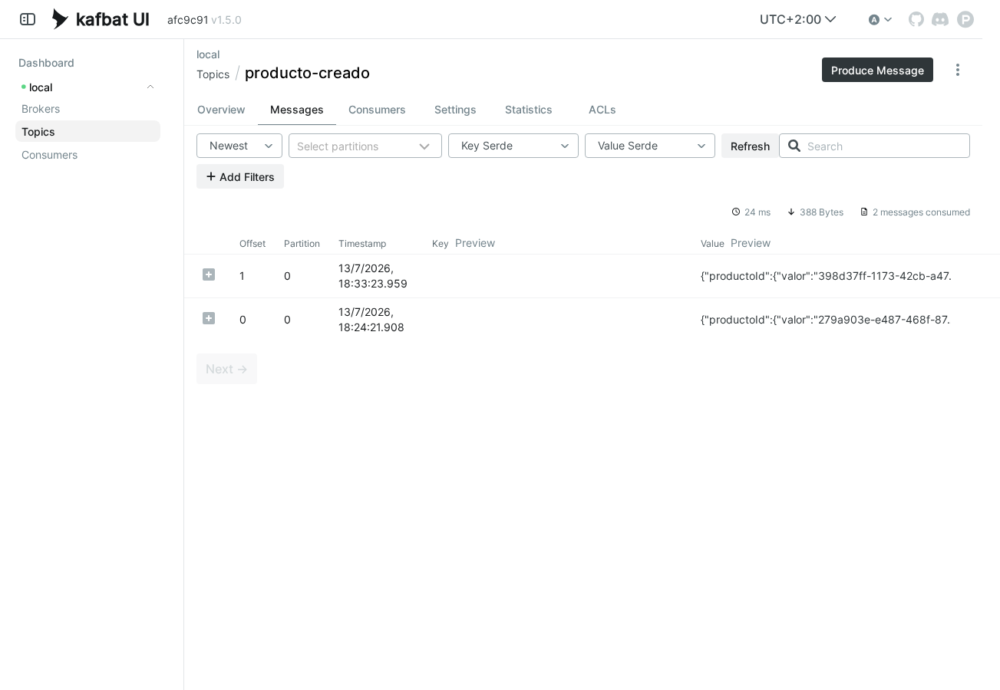

# Capítulo 11 — Mensajería asíncrona: Spring Cloud Stream con Kafka y RabbitMQ

Undécimo capítulo del tutorial "De cero a pro en arquitectura de microservicios con Spring Boot" (ver el índice completo de capítulos en la rama `main`). Parte directamente de `capitulo-10-archunit-jmolecules`.

## Índice

1. [Motivación y arquitectura general del capítulo](#1-motivación-y-arquitectura-general-del-capítulo)
2. [Spring Cloud Stream: el productor y el consumidor de `ProductoCreadoEvento`](#2-spring-cloud-stream-el-productor-y-el-consumidor-de-productocreadoevento)
3. [Verificado con un test de integración real: Testcontainers + RabbitMQ](#3-verificado-con-un-test-de-integración-real-testcontainers--rabbitmq)
4. [Cómo probarlo](#4-cómo-probarlo)
5. [Registro de archivos del capítulo](#5-registro-de-archivos-del-capítulo)
6. [Referencias](#6-referencias)

---

## 1. Motivación y arquitectura general del capítulo

El capítulo 4 introdujo el **Evento de Dominio** (Domain Event) con la mecánica más simple posible: `ApplicationEventPublisher`/`@EventListener` de Spring, publicando y consumiendo `ProductoCreadoEvento`/`RecomendacionAñadidaEvento` dentro del mismo proceso y la misma transacción. Aquel README ya dejaba dicho que el día que esos eventos "salieran del proceso" sería con Kafka, y que lo único que cambiaría sería la implementación de los *listeners*, no el punto de publicación. Este es ese capítulo.

Sacar un evento del proceso no es solo un cambio de transporte. Con `@EventListener` síncrono, una excepción en el listener se propaga al hilo que publicó el evento — un oyente roto podía tumbar el caso de uso que lo generó. Con un broker de por medio, el fallo de un consumidor remoto ya no puede propagarse de vuelta: publicador y consumidor quedan desacoplados tanto en el tiempo (el consumidor no tiene por qué estar levantado en el instante en que se publica) como en el fallo (un consumidor caído no bloquea al publicador).

### Spring Cloud Stream y el Binder

Kafka y RabbitMQ son tecnologías distintas, con APIs distintas. **Spring Cloud Stream** resuelve eso con el concepto de **Binder** (adaptador entre el modelo de programación de Spring — `Supplier`/`Function`/`Consumer` como `@Bean` — y la API concreta de cada broker): el código de negocio, qué se publica y qué hace un consumidor al recibirlo, no cambia; solo cambia qué binder está en el classpath y su configuración (`spring.cloud.stream.bindings.*`). Este capítulo lo demuestra literalmente: el mismo productor y el mismo consumidor, primero sobre Kafka, después sobre RabbitMQ, sin tocar una línea de código de negocio.

Este capítulo se queda deliberadamente en la mecánica: mismo microservicio (`servicio-catalogo`) publicando y consumiendo su propio evento, para demostrar cómo se declara un productor/consumidor con Spring Cloud Stream y cómo se cambia de binder sin tocar código — el consumidor, de momento, sigue siendo un simple log. El [capítulo 12](../../tree/capitulo-12-outbox-transaccional) lleva esta misma pieza al caso con consistencia real entre microservicios: `servicio-pedidos` publicando un evento nuevo, `PedidoCreadoEvento`, consumido por un `servicio-inventario` que nace en ese capítulo para reservar/decrementar stock — con los dos problemas que aparecen en cuanto el mensaje cruza a otro proceso con una consecuencia de negocio real detrás (vender más unidades de las que hay): **Outbox transaccional** (Transactional Outbox) e **Idempotencia** (Idempotency).


*`servicio-catalogo` publica `ProductoCreadoEvento` con `StreamBridge` y lo consume con un `Consumer<T>` — el mismo microservicio a ambos lados del topic, la prueba de que la mecánica funciona antes de cruzarla a otro proceso en el capítulo 12.*
<br>

## 2. Spring Cloud Stream: el productor y el consumidor de `ProductoCreadoEvento`

### Dependencia y broker local

Solo hace falta el binder de Kafka; Spring Cloud Stream y Spring Cloud Function llegan como dependencias transitivas suyas:

```xml
<!-- servicio-catalogo/pom.xml -->
<dependency>
	<groupId>org.springframework.cloud</groupId>
	<artifactId>spring-cloud-stream-binder-kafka</artifactId>
</dependency>
```

`servicio-catalogo/compose.yaml` gana tres servicios nuevos junto al `neo4j` que ya tenía: `kafka` (imagen oficial `apache/kafka`, en modo KRaft — un único nodo hace de *broker* y de *controller* a la vez, sin Zookeeper, tal como el propio proyecto Kafka lo simplificó desde la 3.x), `kafka-ui` (**Kafbat UI**, ver más abajo) y `rabbitmq` (ver la sección de cambio de binder). Los tres son, por ahora, infraestructura exclusiva de este microservicio — nadie más los usa todavía — así que viven en el `compose.yaml` del propio módulo, igual que Neo4j: `spring-boot-docker-compose` los detecta automáticamente al arrancar la aplicación (`docker compose up -d` desde `servicio-catalogo/`, una vez, antes de arrancar el microservicio), sin necesidad de fijar `spring.kafka.bootstrap-servers` a mano — el binder de Kafka de Spring Cloud Stream ya asume `localhost:9092` por defecto, que es exactamente donde el `compose.yaml` del módulo publica el puerto.

> **¿Por qué mencionar esto explícitamente, si "el binder detecta el broker" ya se sobreentiende de Neo4j/RabbitMQ?**
>
> Porque no siempre va a ser así. El día que Kafka deje de ser exclusivo de `servicio-catalogo` — en el capítulo 12, en cuanto `servicio-pedidos` y `servicio-inventario` también necesiten hablar con él — tendrá que mudarse a un `compose.yaml` compartido en la raíz del repo, y en ese momento `spring-boot-docker-compose` ya no lo detecta automáticamente (solo escanea el `compose.yaml` del propio módulo). Ese capítulo explica esa mudanza y por qué entonces sí hace falta la propiedad explícita — aquí, con un solo microservicio usándolo, no compensa anticiparla.

Ese mismo `compose.yaml` local añade **Kafka UI** (interfaz web para explorar topics y mensajes) — concretamente **Kafbat UI**, no la imagen original de Provectus: el proyecto de Provectus está discontinuado, y los mismos contribuidores originales lo continúan como Kafbat UI, con desarrollo activo.

| Parámetro | Valor |
|---|---|
| URL | `http://localhost:8090` |
| Cluster | `local` |



*Pestaña "Messages" de Kafbat UI sobre el topic `producto-creado`, con el payload JSON real de `ProductoCreadoEvento` publicado por `StreamBridge`.*
<br>

### El consumidor: una función `Consumer<T>` como `@Bean`

Spring Cloud Stream trabaja sobre `java.util.function.Supplier`/`Function`/`Consumer` estándar de Java — nada específico del framework en la firma. Consumir `ProductoCreadoEvento` es declarar un `Consumer<ProductoCreadoEvento>` como bean:

```java
// infraestructura/adaptador/entrada/mensajeria/ProductoCreadoConsumidorConfiguracion.java
@Configuration
public class ProductoCreadoConsumidorConfiguracion {

	@Bean
	public Consumer<ProductoCreadoEvento> productoCreadoConsumidor() {
		return evento -> log.info("Producto creado (vía mensajería asíncrona): {}", evento.productoId().valor());
	}
}
```

Spring Cloud Stream deriva de este bean un *binding* de entrada llamado `productoCreadoConsumidor-in-0` (nombre del bean + `-in-` + índice del parámetro, `0` porque solo hay uno). La configuración conecta ese binding con un topic de Kafka concreto:

```yaml
# application.yml
spring:
  cloud:
    function:
      definition: productoCreadoConsumidor
    stream:
      bindings:
        productoCreadoConsumidor-in-0:
          destination: producto-creado
          group: servicio-catalogo
```

`destination` es el nombre del topic; `group` es el *consumer group* de Kafka — sin él, cada instancia del microservicio se suscribiría con un grupo anónimo distinto y todas recibirían una copia de cada mensaje, en vez de repartírselos como réplicas de un mismo consumidor. `spring.cloud.function.definition` le dice explícitamente a Spring Cloud Stream qué beans funcionales activar como *bindings* — necesario aquí porque, al convivir con `StreamBridge` (ver más abajo), la detección automática deja de ser inequívoca.

### El productor: `StreamBridge`, no una `Function`

El evento no se produce a demanda de un *poll* externo, sino de forma reactiva cuando `CrearProductoServicio` ya guardó el producto — eso descarta un `Supplier<T>` como bean (pensado para que el binder pida el siguiente valor). En su lugar, `StreamBridge` envía un mensaje bajo demanda desde cualquier punto del código:

```java
// infraestructura/adaptador/entrada/evento/ProductoCreadoListener.java
@Component
@RequiredArgsConstructor
public class ProductoCreadoListener {

	private final StreamBridge streamBridge;

	@EventListener
	public void alCrearProducto(ProductoCreadoEvento evento) {
		streamBridge.send("productoCreado-out-0", evento);
	}
}
```

Esta es literalmente la misma clase del capítulo 4, en el mismo paquete — solo cambió el cuerpo del método, tal como allí se prometía: `CrearProductoServicio` sigue llamando a `ApplicationEventPublisher.publishEvent(...)` exactamente igual, sin saber que el evento ahora sale del proceso. El binding de salida (`productoCreado-out-0`) se configura igual que el de entrada:

```yaml
# application.yml
spring:
  cloud:
    stream:
      bindings:
        productoCreado-out-0:
          destination: producto-creado
```

Mismo `destination` (`producto-creado`) en ambos bindings: el productor y el consumidor son, en este capítulo, el mismo microservicio hablando consigo mismo a través del topic — la prueba de que la mecánica funciona antes de cruzarla a otro proceso en el capítulo 12.

> **¿Por qué el `@Bean` del consumidor vive en una clase `@Configuration` con un nombre distinto al del método?**
>
> El primer intento nombró la clase igual que el método (`ProductoCreadoConsumidor`, con el bean `productoCreadoConsumidor()`). Spring registra toda clase `@Configuration` como un bean más, con el nombre de la clase en *camelCase* (`productoCreadoConsumidor`) — idéntico al nombre que el método `@Bean` intentaba registrar. El arranque falló con `BeanDefinitionOverrideException` en vez de silenciarlo. La clase se renombró a `ProductoCreadoConsumidorConfiguracion` para que ambos nombres no choquen.

Con esto, el flujo completo — `POST /api/productos` → `ApplicationEventPublisher` (en proceso) → `StreamBridge` → topic `producto-creado` en Kafka → `Consumer<ProductoCreadoEvento>` → log — se verificó arrancando `servicio-catalogo` real contra el Kafka del `compose.yaml` del módulo y creando un producto por REST; el log del lado consumidor confirma la vuelta completa:

```
Producto creado (vía mensajería asíncrona): 9fca8f33-4cef-4bc2-a38a-400089fab879
```

### Cambiar de binder: RabbitMQ, sin tocar código

Con `spring-cloud-stream-binder-rabbit` añadido junto al de Kafka, Spring Cloud Stream ya no puede elegir binder por sí solo — dos binders en el *classpath* son una elección ambigua, y arranca con un error hasta que se resuelve explícitamente. `spring.cloud.stream.defaultBinder` decide cuál usar por defecto:

```yaml
# application.yml (perfil por defecto)
spring:
  cloud:
    stream:
      defaultBinder: kafka
```

```yaml
# application-rabbit.yml
spring:
  cloud:
    stream:
      defaultBinder: rabbit
```

Ni `ProductoCreadoListener` ni `ProductoCreadoConsumidorConfiguracion` cambian una línea. Arrancar con `--spring.profiles.active=rabbit` (o `-Dspring-boot.run.profiles=rabbit` con el plugin de Maven) mueve el mismo productor y el mismo consumidor a RabbitMQ: el binder crea un *exchange* `producto-creado` (incluido en `destination`) y una cola `producto-creado.servicio-catalogo` (`destination.group`), visibles en el Management UI de RabbitMQ (`rabbitmq:4-management` en el `compose.yaml`, puerto `15672`, usuario/contraseña `guest`/`guest`):


*Pestaña "Queues and Streams" del Management UI de RabbitMQ, tras crear un producto por REST: la cola `producto-creado.servicio-catalogo` existe, sin mensajes pendientes porque `servicio-catalogo` ya la consumió.*
<br>

Repitiendo el mismo `POST /api/productos` con el perfil `rabbit` activo, el log del consumidor es idéntico al de Kafka — la mecánica (`Consumer<ProductoCreadoEvento>`, `StreamBridge`, `destination`/`group`) es la misma; solo cambió qué broker hay detrás.

## 3. Verificado con un test de integración real: Testcontainers + RabbitMQ

Todo lo anterior —que `StreamBridge` publica de verdad, que el `Consumer<T>` real lo recibe— se había verificado solo a mano: arrancar el microservicio, hacer un `POST`, mirar el log. Útil para entender el flujo, pero nada impide que un cambio futuro rompa esa cadena sin que ningún test lo note. **Testcontainers** (librería Java que levanta un contenedor Docker real — aquí, un broker de mensajería — solo durante la ejecución de un test, y lo destruye al terminar) cierra ese hueco: el test habla con un broker de verdad, no con un simulacro.

```java
// infraestructura/adaptador/entrada/mensajeria/ProductoCreadoMensajeriaIntegrationTest.java
@SpringBootTest
@ActiveProfiles("rabbit")
@Testcontainers
@ExtendWith(OutputCaptureExtension.class)
class ProductoCreadoMensajeriaIntegrationTest {

	@Container
	@ServiceConnection
	static final RabbitMQContainer rabbitmq = new RabbitMQContainer(DockerImageName.parse("rabbitmq:4-management"));

	@Autowired
	private ApplicationEventPublisher applicationEventPublisher;

	@Test
	void productoCreadoViajaPorRabbitMqHastaElConsumidorReal(CapturedOutput output) {
		ProductoId productoId = ProductoId.generar();

		applicationEventPublisher.publishEvent(new ProductoCreadoEvento(productoId, Instant.now()));

		await().atMost(Duration.ofSeconds(10))
				.untilAsserted(() -> assertThat(output)
						.contains("Producto creado (vía mensajería asíncrona): " + productoId.valor()));
	}
}
```

Pieza por pieza:

- **`@Container`** (Testcontainers) marca `rabbitmq` como un contenedor gestionado por el test: se arranca antes de la clase y se destruye al terminar — nada que instalar ni dejar corriendo de fondo, igual que ya hace `StockRepositorioAdaptadorIntegrationTest` en capítulos posteriores con PostgreSQL.
- **`@ServiceConnection`** (Spring Boot) rellena automáticamente la configuración de conexión (`spring.rabbitmq.*`) apuntando al contenedor recién levantado, con el puerto aleatorio real que Docker le asignó — sin escribir esa propiedad a mano.
- **`@ActiveProfiles("rabbit")`** activa `application-rabbit.yml`, el mismo perfil de la sección anterior, para que Spring Cloud Stream elija el binder de RabbitMQ en vez del de Kafka (el binder por defecto) durante este test.
- **`CapturedOutput`/`OutputCaptureExtension`** (Spring Boot) capturan todo lo que se escribe por log durante el test. Como `ProductoCreadoConsumidorConfiguracion` ya logueaba la línea que se ve más arriba como verificación manual, el test reutiliza ese mismo log como prueba de que el consumidor real la recibió, sin tocar código de producción.
- **`await().untilAsserted(...)`** (Awaitility, incluida en las dependencias de test de Spring Boot) es necesaria porque esto es asíncrono de verdad: publicar el evento no bloquea hasta que el broker lo entrega. Un `assertThat` normal fallaría casi siempre por pura carrera; `await()` reintenta la comprobación hasta que se cumple o pasa el tiempo máximo.

> **¿Por qué RabbitMQ para este test, y no Kafka, si el binder por defecto del capítulo es Kafka?**
>
> Porque `@ServiceConnection` con RabbitMQ es todo lo que hace falta: el binder de RabbitMQ de Spring Cloud Stream reutiliza el `ConnectionFactory` estándar de Spring Boot, el mismo que `@ServiceConnection` ya configura. Con Kafka no es tan directo — el binder de Kafka tiene su propia propiedad de broker (`spring.cloud.stream.kafka.binder.brokers`), independiente de la que `@ServiceConnection` rellena para Spring Boot, y hace falta un paso extra para conectarlas. El capítulo 12 retoma este mismo patrón de test con Kafka y explica ese matiz con detalle, precisamente porque ahí es donde se nota.

## 4. Cómo probarlo

```bash
# Todos los tests del módulo, incluido el de Testcontainers + RabbitMQ
./mvnw -pl servicio-catalogo test
```

```bash
cd servicio-catalogo
docker compose up -d
```

```bash
./mvnw -pl servicio-catalogo spring-boot:run
```

Crear una categoría y un producto — el alta del producto dispara, de fondo, el productor y el consumidor sobre Kafka (binder por defecto):

```bash
curl -X POST http://localhost:8080/api/categorias \
  -H "Content-Type: application/json" \
  -d '{"nombre":"Deportes"}'
# => {"id":"<categoriaId>","nombre":"Deportes"}
```

```bash
curl -X POST http://localhost:8080/api/productos \
  -H "Content-Type: application/json" \
  -d '{"nombre":"Balón","descripcion":"Balón de fútbol","precio":25.0,"categoriaId":"<categoriaId>"}'
# => {"id":"<productoId>","nombre":"Balón", ...}
```

El log del propio proceso (terminal donde corre `spring-boot:run`) muestra la línea `Producto creado (vía mensajería asíncrona): <productoId>` en cuanto el consumidor recibe el evento. También puede comprobarse en **Kafbat UI** (`http://localhost:8090`, ver [sección 2](#2-spring-cloud-stream-el-productor-y-el-consumidor-de-productocreadoevento)): pestaña *Messages* del topic `producto-creado`, con el payload JSON real del evento.

Para repetir la prueba sobre RabbitMQ en vez de Kafka, parar el proceso y volver a arrancarlo con el perfil `rabbit` activo:

```bash
./mvnw -pl servicio-catalogo spring-boot:run -Dspring-boot.run.profiles=rabbit
```

El mismo `POST /api/productos` de antes produce el mismo log — y la cola `producto-creado.servicio-catalogo` puede inspeccionarse en el Management UI de RabbitMQ (`http://localhost:15672`, usuario/contraseña `guest`/`guest`).

Para parar todo:

```bash
cd servicio-catalogo
docker compose down
```

## 5. Registro de archivos del capítulo

🌱 Creado · ✏️ Actualizado · 🗑️ Eliminado

### Build y configuración

|  | Archivo | Descripción funcional | Descripción del cambio |
|:---:|---|---|---|
| ✏️ | [`pom.xml`](servicio-catalogo/pom.xml) | Configuración Maven del módulo | Añade los binders de Kafka y RabbitMQ de Spring Cloud Stream (`spring-cloud-stream-binder-kafka`, `spring-cloud-stream-binder-rabbit`) y el módulo de Testcontainers para RabbitMQ (`org.testcontainers:rabbitmq`) |
| ✏️ | [`compose.yaml`](servicio-catalogo/compose.yaml) | Infraestructura local exclusiva del microservicio | Añade Kafka (`apache/kafka`, KRaft), Kafbat UI y RabbitMQ (`rabbitmq:4-management`) junto al Neo4j ya existente |
| ✏️ | [`application.yml`](servicio-catalogo/src/main/resources/application.yml) | Configuración de Spring Boot del microservicio | Añade la función activa y los *bindings* de entrada/salida de Spring Cloud Stream para el topic `producto-creado`, y `defaultBinder: kafka` |
| 🌱 | [`application-rabbit.yml`](servicio-catalogo/src/main/resources/application-rabbit.yml) | Perfil que cambia el binder por defecto a RabbitMQ (`defaultBinder: rabbit`), sin tocar código | --- |

### Infraestructura de entrada

|  | Archivo | Descripción funcional | Descripción del cambio |
|:---:|---|---|---|
| ✏️ | [`ProductoCreadoListener.java`](servicio-catalogo/src/main/java/com/javacadabra/tienda/catalogo/infraestructura/adaptador/entrada/evento/ProductoCreadoListener.java) | Reacciona en proceso a `ProductoCreadoEvento` | Su implementación pasa de solo loguear a reenviar el evento al broker vía `StreamBridge` |
| 🌱 | [`ProductoCreadoConsumidorConfiguracion.java`](servicio-catalogo/src/main/java/com/javacadabra/tienda/catalogo/infraestructura/adaptador/entrada/mensajeria/ProductoCreadoConsumidorConfiguracion.java) | Consumidor del topic `producto-creado` (`Consumer<ProductoCreadoEvento>`), agnóstico del binder | --- |

### Documentación/diagramas

|  | Archivo | Descripción funcional | Descripción del cambio |
|:---:|---|---|---|
| 🌱 | [`rabbitmq-management-colas.png`](docs/images/capitulo-11/rabbitmq-management-colas.png) | Captura del Management UI de RabbitMQ, pestaña "Queues and Streams" | --- |
| 🌱 | [`kafka-ui-mensajes.png`](docs/images/capitulo-11/kafka-ui-mensajes.png) | Captura de Kafbat UI, mensajes del topic `producto-creado` | --- |
| 🌱 | [`capitulo-11-mensajeria-arquitectura.excalidraw`](docs/diagramas/capitulo-11-mensajeria-arquitectura.excalidraw) | Diagrama de arquitectura del capítulo | --- |
| 🌱 | [`arquitectura-mensajeria.png`](docs/images/capitulo-11/arquitectura-mensajeria.png) | Render PNG del diagrama anterior | --- |

### Tests

|  | Archivo | Descripción funcional | Descripción del cambio |
|:---:|---|---|---|
| 🌱 | [`ProductoCreadoMensajeriaIntegrationTest.java`](servicio-catalogo/src/test/java/com/javacadabra/tienda/catalogo/infraestructura/adaptador/entrada/mensajeria/ProductoCreadoMensajeriaIntegrationTest.java) | Test de integración: verifica con un `RabbitMQContainer` real (Testcontainers) que el productor y el consumidor se comunican de verdad a través del broker | --- |

## 6. Referencias

- [Spring Cloud Stream — Reference Documentation](https://docs.spring.io/spring-cloud-stream/reference/)
- [Spring Cloud Stream — Kafka Binder](https://docs.spring.io/spring-cloud-stream/reference/kafka/spring-cloud-stream-binder-kafka.html)
- [Spring Cloud Stream — RabbitMQ Binder](https://docs.spring.io/spring-cloud-stream/reference/rabbit/spring-cloud-stream-binder-rabbit.html)
- [Apache Kafka — Docker documentation (imagen `apache/kafka`)](https://github.com/apache/kafka/blob/trunk/docker/examples/README.md)
- [Kafbat UI — GitHub](https://github.com/kafbat/kafka-ui)
- [Testcontainers — RabbitMQ Module](https://java.testcontainers.org/modules/rabbitmq/)
- [Spring Boot — Testcontainers (Service Connections)](https://docs.spring.io/spring-boot/reference/testing/testcontainers.html)
