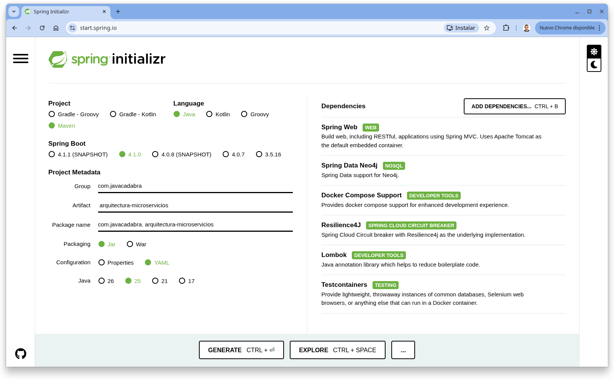

# Capítulo 0 — Configuración inicial: Spring Initializr, Lombok, MapStruct

Capítulo de introducción del tutorial "De cero a pro en arquitectura de microservicios con Spring Boot" (ver el índice completo de capítulos en la rama `main`).

## Índice

1. [Introducción](#1-introducción)
2. [Spring Initializr: qué genera y qué se eligió](#2-spring-initializr-qué-genera-y-qué-se-eligió)
3. [Las dependencias elegidas — y cuáles sobraban](#3-las-dependencias-elegidas--y-cuáles-sobraban)
4. [Lombok, en general](#4-lombok-en-general)
5. [MapStruct, en general](#5-mapstruct-en-general)
6. [Por qué hace falta `lombok-mapstruct-binding`](#6-por-qué-hace-falta-lombok-mapstruct-binding)
7. [`pluginManagement` del `pom.xml` raíz](#7-pluginmanagement-del-pomxml-raíz)
8. [Cómo reproducirlo](#8-cómo-reproducirlo)
9. [Registro de archivos del capítulo](#9-registro-de-archivos-del-capítulo)
10. [Referencias](#10-referencias)

---

## 1. Introducción

Este capítulo no añade código ni un microservicio nuevo: documenta, con retraso, la génesis del proyecto. El capítulo 1 arrancó ya con el `pom.xml` y el esqueleto de `servicio-catalogo` en su forma final — nunca se comiteó por separado lo que [Spring Initializr](https://start.spring.io/) genera antes de tocar nada. Este capítulo llena ese hueco: qué se seleccionó en la web, qué genera exactamente esa selección, y explica con más detalle (de forma genérica, sin ejemplos de dominio) tres piezas del `pom.xml` que el capítulo 1 usa pero solo documenta de pasada: Lombok, MapStruct y el `pluginManagement` que los conecta.

De paso, revisando en retrospectiva qué se marcó en Initializr, salieron dos dependencias redundantes que ya se han eliminado del `pom.xml` de `servicio-catalogo` (rama del capítulo 1) — se explica cuáles y por qué en la sección 3.

## 2. Spring Initializr: qué genera y qué se eligió

[start.spring.io](https://start.spring.io/) es un generador de proyectos Spring Boot: rellenas un formulario (metadatos + dependencias) y descargas un `.zip` con un proyecto Maven o Gradle ya compilable, con la estructura de carpetas estándar (`src/main/java`, `src/main/resources`, `src/test/java`) y un `pom.xml`/`build.gradle` con las dependencias elegidas ya declaradas.

Metadatos usados para este proyecto:

| Campo | Valor |
|---|---|
| Project | Maven |
| Language | Java |
| Spring Boot | 4.1.0 |
| Group | `com.javacadabra` |
| Artifact | `arquitectura-microservicios` |
| Java | 25 |
| Packaging | Jar |
| Config format | **YAML** (no Properties) |



*(Captura pendiente)*

Importante: Initializr genera un proyecto de **un solo módulo**. La estructura multi-módulo actual (`pom.xml` raíz como parent `packaging=pom` + `servicio-catalogo` como módulo hijo) **no** la genera Initializr — es un refactor manual posterior, hecho ya como parte del capítulo 1 al convertir el repositorio en el monorepo del tutorial.

**YAML en vez de Properties**: Initializr deja elegir el formato del fichero de configuración que genera (`application.yml` o `application.properties`); este proyecto usa YAML en todos los microservicios, presentes y futuros (documentado como convención en `CLAUDE.md`). La razón práctica: las propiedades de Spring Boot están muy anidadas por prefijo (`spring.neo4j.authentication.username`, `spring.datasource.hikari.maximum-pool-size`...), y YAML expresa esa jerarquía sin repetir el prefijo en cada línea:

```yaml
# application.yml
spring:
  neo4j:
    authentication:
      username: neo4j
      password: secret
```

```properties
# el mismo contenido en application.properties
spring.neo4j.authentication.username=neo4j
spring.neo4j.authentication.password=secret
```

Con pocas propiedades la diferencia es cosmética, pero en cuanto un microservicio necesita varios bloques anidados (perfiles, múltiples fuentes de datos, `management.endpoints...`) YAML evita repetir el mismo prefijo larguísimo en cada línea. La desventaja habitual de YAML —la indentación es significativa, un espacio de más o de menos rompe el fichero— se acepta como coste asumible frente a la legibilidad ganada.

## 3. Las dependencias elegidas — y cuáles sobraban

Estas son las dependencias que terminaron en el `pom.xml`, agrupadas por si vinieron marcadas en Initializr o se añadieron a mano después:

| Dependencia | Origen | Para qué sirve |
|---|---|---|
| `spring-boot-starter-webmvc` | Initializr ("Spring Web") | Spring MVC — controladores REST, `DispatcherServlet` |
| `spring-boot-starter-data-neo4j` | Initializr ("Spring Data Neo4j") | Repositorios Spring Data + driver Neo4j (Bolt) |
| `spring-boot-docker-compose` | Initializr ("Docker Compose Support") | Detecta `compose.yaml` y levanta/para contenedores en desarrollo (sección 8.1 del capítulo 1) |
| `spring-cloud-starter-circuitbreaker-resilience4j` | Initializr ("Resilience4J") | Circuit breaker — **sin usar todavía** (ver más abajo) |
| `lombok` | Initializr ("Lombok") | Generación de código en compilación (sección 4) |
| `mapstruct` | Añadida a mano | Generación de mappers en compilación (sección 5) — **no** está en el catálogo de dependencias de Initializr, hay que añadirla después de descargar el proyecto |
| `lombok-mapstruct-binding` | Añadida a mano | Coordina el orden Lombok↔MapStruct (sección 6) — tampoco está en Initializr |
| `spring-boot-starter-data-neo4j-test`, `spring-boot-starter-webmvc-test`, `spring-boot-testcontainers`, `testcontainers` (`junit-jupiter`, `neo4j`) | Initializr ("Testcontainers") | Dependencias de test — ver capítulo 1, sección 9 |

Dos cosas que valen la pena señalar:

- **`spring-boot-starter-neo4j` y `spring-boot-starter-neo4j-test` se han eliminado** (commit en la rama del capítulo 1): Initializr los añadió junto a `spring-boot-starter-data-neo4j`/`-test`, pero son redundantes — `spring-boot-starter-data-neo4j` ya incluye transitivamente el driver Neo4j. Es un ejemplo típico de marcar en el formulario más casillas relacionadas de las que hacían falta.
- **`spring-cloud-starter-circuitbreaker-resilience4j` se queda, aunque no se usa todavía** — no es un descuido: el capítulo 1 (sección 12, "Qué se deja para el capítulo 2") ya documenta que tiene sentido activarlo cuando haya más de un microservicio llamándose entre sí.

## 4. Lombok, en general

[Lombok](https://projectlombok.org/) es un *annotation processor*: durante la compilación, sustituye ciertas anotaciones por código Java generado (getters, setters, constructores, `equals`/`hashCode`...), evitando escribirlo a mano. Las anotaciones más comunes:

| Anotación | Genera |
|---|---|
| `@Getter` / `@Setter` | Getters/setters de todos los campos (o de uno solo, si se pone a nivel de campo) |
| `@NoArgsConstructor` / `@AllArgsConstructor` / `@RequiredArgsConstructor` | Constructores sin argumentos, con todos los campos, o solo con los `final`/`@NonNull` |
| `@ToString` / `@EqualsAndHashCode` | `toString()` / `equals()`+`hashCode()` sobre los campos de la clase |
| `@Data` | Atajo que combina `@Getter` + `@Setter` + `@ToString` + `@EqualsAndHashCode` + `@RequiredArgsConstructor` |
| `@Value` | Variante inmutable de `@Data`: campos `final`, sin setters, constructor con todos los campos |
| `@Builder` | Un patrón *builder* fluido para construir instancias |
| `@Slf4j` | Un campo `log` de SLF4J ya inicializado |

`@Data`/`@Value` son un atajo cómodo para clases simples (DTOs, entidades de persistencia sin invariantes) — pero no siempre son seguras: el capítulo 1 (sección 5) explica en detalle por qué el agregado `Producto` evita concretamente `@Data`/`@Value` y usa una combinación más selectiva de anotaciones.

## 5. MapStruct, en general

[MapStruct](https://mapstruct.org/) también es un *annotation processor*: a partir de una interfaz con métodos abstractos de mapeo (`Producto → ProductoDTO`, por ejemplo), genera en compilación una clase que implementa esos métodos copiando propiedades por nombre.

La alternativa habitual es mapear con reflexión en tiempo de ejecución (p. ej. ModelMapper) o escribir el mapeo a mano. MapStruct evita ambos extremos:

- Frente a la reflexión: el mapeo generado es código Java plano (llamadas a getters/setters), sin coste de reflexión en cada petición, y los errores de mapeo (un campo que no coincide, un tipo incompatible) aparecen como **error de compilación**, no como un `null` silencioso en producción.
- Frente al mapeo manual: no hay que escribir ni mantener a mano el mismo código repetitivo para cada par de clases — solo se declara la interfaz, y para los casos que no se pueden inferir automáticamente (ver capítulo 1, sección 6, sobre accesores sin prefijo `get`), se añade un método `default` puntual.

## 6. Por qué hace falta `lombok-mapstruct-binding`

Cuando `Producto` (o cualquier clase) tiene sus getters generados por Lombok en vez de escritos a mano, y una interfaz `Mapper` de MapStruct necesita leer esos getters para generar su implementación, aparece un problema de **orden**: la compilación con anotaciones ocurre en "rondas", y por defecto no hay ninguna garantía de que el procesador de Lombok termine de generar sus getters *antes* de que el procesador de MapStruct intente leerlos — pueden ejecutarse en el orden equivocado, y MapStruct generaría un mapper incompleto o con errores.

`lombok-mapstruct-binding` es un artefacto publicado por el propio equipo de MapStruct que resuelve exactamente esto: al declararlo junto a `lombok` y `mapstruct-processor` en `annotationProcessorPaths` (sección 7), fuerza que Lombok se ejecute antes y que MapStruct vea ya los getters/setters generados.

## 7. `pluginManagement` del `pom.xml` raíz

`pluginManagement` es a los plugins de Maven lo que `dependencyManagement` es a las dependencias: **declara** versión y configuración de un plugin en el parent, sin **activarlo** todavía en ningún módulo. Un módulo hijo "activa" un plugin gestionado declarándolo en su propio `<build><plugins>` sin repetir versión ni configuración — las hereda del parent.

```xml
<!-- pom.xml raíz -->
<build>
    <pluginManagement>
        <plugins>
            <plugin>
                <groupId>org.apache.maven.plugins</groupId>
                <artifactId>maven-compiler-plugin</artifactId>
                <configuration>
                    <annotationProcessorPaths>
                        <path> <!-- 1º: MapStruct necesita procesar antes de que Lombok "borre" los getters -->
                            <groupId>org.mapstruct</groupId>
                            <artifactId>mapstruct-processor</artifactId>
                        </path>
                        <path> <!-- 2º: Lombok genera los getters/setters -->
                            <groupId>org.projectlombok</groupId>
                            <artifactId>lombok</artifactId>
                        </path>
                        <path> <!-- 3º: fuerza el orden correcto entre los dos anteriores -->
                            <groupId>org.projectlombok</groupId>
                            <artifactId>lombok-mapstruct-binding</artifactId>
                        </path>
                    </annotationProcessorPaths>
                </configuration>
            </plugin>
        </plugins>
    </pluginManagement>
</build>
```

Por qué centralizarlo en el parent en vez de repetirlo en cada `pom.xml` de módulo: con un monorepo multi-módulo donde cada microservicio futuro va a necesitar la misma combinación Lombok+MapStruct, declarar `annotationProcessorPaths` una sola vez evita que una actualización de versión (o un cambio de configuración) tenga que replicarse módulo a módulo — cada `servicio-*/pom.xml` solo declara `<plugin>maven-compiler-plugin</plugin>` sin más, y hereda toda la configuración.

Un segundo ejemplo en el mismo bloque, más sutil: `spring-boot-maven-plugin` se configura con un `<excludes>` que saca `lombok` del jar final que empaqueta la aplicación. Tiene sentido porque Lombok solo actúa en tiempo de compilación (genera código fuente/bytecode) — incluir el `.jar` de Lombok en el artefacto que se despliega sería peso muerto, nunca se usa en tiempo de ejecución.

## 8. Cómo reproducirlo

Para generar un esqueleto equivalente al que dio origen a este proyecto:

1. Abre [start.spring.io](https://start.spring.io/).
2. Rellena el formulario con los valores de la sección 2 (Project: Maven, Language: Java, Spring Boot: 4.1.0, Group: `com.javacadabra`, Artifact: `arquitectura-microservicios`, Java: 25, Packaging: Jar, Config format: YAML).
3. Añade las dependencias marcadas como "Initializr" en la tabla de la sección 3: Spring Web, Spring Data Neo4j, Docker Compose Support, Resilience4J, Lombok, Testcontainers.
4. Pulsa "Generate", descarga el `.zip` y descomprímelo.
5. Añade a mano en el `pom.xml` generado: la dependencia `mapstruct` (con su versión), `mapstruct-processor` y `lombok-mapstruct-binding` en `annotationProcessorPaths` del `maven-compiler-plugin` (sección 7) — ninguna de las tres viene en el catálogo de Initializr.
6. (Fuera ya del alcance de Initializr) refactoriza a la estructura multi-módulo: mueve el código a un módulo `servicio-catalogo`, convierte el `pom.xml` raíz en `packaging=pom` con `<modules>`, y traslada `dependencyManagement`/`pluginManagement` compartidos al parent — es el punto de partida real del capítulo 1.

## 9. Registro de archivos del capítulo

Este capítulo es puramente documental: no añade código ni diagramas todavía, solo este `README.md` (autorreferencial, no se lista) y una captura de pantalla pendiente de añadir (sección 2). No hay tabla de archivos hasta que se incorpore esa captura.

## 10. Referencias

- [Spring Initializr](https://start.spring.io/)
- [Project Lombok — Features](https://projectlombok.org/features/)
- [MapStruct — Reference Guide](https://mapstruct.org/documentation/stable/reference/html/)
- [MapStruct — Using Lombok with MapStruct](https://mapstruct.org/documentation/stable/reference/html/#lombok)
- [Apache Maven — Guide to using Annotation Processors](https://maven.apache.org/plugins/maven-compiler-plugin/examples/annotation-processing.html)
- [Apache Maven — Introduction to the Reactor (`pluginManagement`)](https://maven.apache.org/guides/introduction/introduction-to-the-reactor.html)
