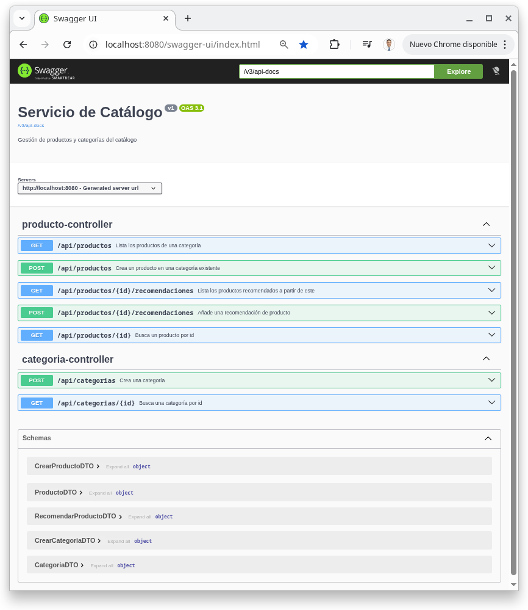

# Capítulo 03 — Documentación de la API con OpenAPI3/Swagger

Tercer capítulo del tutorial "De cero a pro en arquitectura de microservicios con Spring Boot" (ver el índice completo de capítulos en la rama `main`). Parte directamente de `capitulo-02-relaciones-de-grafo-categoria`: todo lo explicado allí (el agregado `Categoria`, las relaciones de grafo, las dos lecciones de Spring Data Neo4j) sigue vigente y no se repite aquí. Este capítulo no introduce un microservicio nuevo — completa `servicio-catalogo` documentando con [springdoc-openapi](https://springdoc.org/) los endpoints REST ya existentes de productos y categorías.

## Índice

1. [Introducción](#1-introducción)
2. [Dependencia: `springdoc-openapi-starter-webmvc-ui`](#2-dependencia-springdoc-openapi-starter-webmvc-ui)
3. [Lo que ya se documenta solo con la dependencia](#3-lo-que-ya-se-documenta-solo-con-la-dependencia)
4. [Anotaciones mínimas: corrigiendo los códigos de estado reales](#4-anotaciones-mínimas-corrigiendo-los-códigos-de-estado-reales)
5. [Ejemplos y descripciones en los DTOs: `@Schema`](#5-ejemplos-y-descripciones-en-los-dtos-schema)
6. [Metadatos globales de la API: `@OpenAPIDefinition`](#6-metadatos-globales-de-la-api-openapidefinition)
7. [Endpoints documentados](#7-endpoints-documentados)
8. [Cómo probarlo: Swagger UI de extremo a extremo](#8-cómo-probarlo-swagger-ui-de-extremo-a-extremo)
9. [Qué se deja para el capítulo 4](#9-qué-se-deja-para-el-capítulo-4)
10. [Registro de archivos del capítulo](#10-registro-de-archivos-del-capítulo)
11. [Referencias](#11-referencias)

---

## 1. Introducción

`servicio-catalogo` ya tiene, desde el capítulo 1, siete endpoints REST funcionando (productos y categorías). Probarlos a mano con `curl`, como en el capítulo 2, funciona pero se vuelve tedioso en cuanto el flujo encadena varias peticiones (crear categoría → crear productos → recomendar → listar): hay que recordar rutas, formar el JSON del body a mano y copiar ids de una respuesta a la siguiente petición.

Este capítulo añade una especificación OpenAPI generada automáticamente en tiempo de ejecución (springdoc-openapi lee los `@RestController` existentes, no un fichero YAML/JSON escrito a mano) y una interfaz web interactiva, Swagger UI, para explorar y ejecutar cada endpoint desde el navegador. El foco no es solo "añadir la dependencia" — es entender qué se documenta gratis por convención de Spring MVC y qué necesita una anotación explícita porque no se puede inferir del código.

---

## 2. Dependencia: `springdoc-openapi-starter-webmvc-ui`

```xml
<!-- pom.xml (raíz) -->
<properties>
	<springdoc-openapi.version>3.0.3</springdoc-openapi.version>
</properties>

<dependencyManagement>
	<dependencies>
		<dependency>
			<groupId>org.springdoc</groupId>
			<artifactId>springdoc-openapi-starter-webmvc-ui</artifactId>
			<version>${springdoc-openapi.version}</version>
		</dependency>
	</dependencies>
</dependencyManagement>
```

```xml
<!-- servicio-catalogo/pom.xml -->
<dependency>
	<groupId>org.springdoc</groupId>
	<artifactId>springdoc-openapi-starter-webmvc-ui</artifactId>
</dependency>
```

Versión gestionada centralmente en el `pom.xml` raíz, igual que MapStruct o Testcontainers — la versión concreta se elige una vez y cada módulo hijo solo declara la dependencia sin repetirla.

> **¿Por qué 3.0.3 y no una versión 2.x?**
>
> La matriz de compatibilidad de springdoc-openapi liga cada rama de versión a una rama de Spring Boot: `2.8.x` es la última compatible con Spring Boot 3.5.x, mientras que `3.x.x` es la que soporta Spring Boot 4.x — la versión del `spring-boot-starter-parent` de este monorepo desde el capítulo 0.

`springdoc-openapi-starter-webmvc-ui` empaqueta tres cosas en una sola dependencia: el módulo que inspecciona los `@RestController` (`springdoc-openapi-starter-webmvc-api`), el núcleo común de generación de la especificación (`springdoc-openapi-starter-common`, basado en `swagger-core`) y el propio recurso estático de Swagger UI (`webjars:swagger-ui`). No hace falta declarar ninguno de los tres por separado.

---

## 3. Lo que ya se documenta solo con la dependencia

Con la dependencia añadida y **cero anotaciones nuevas**, arrancar el servicio ya expone dos endpoints nuevos por convención de springdoc-openapi:

- `GET /v3/api-docs` — la especificación OpenAPI completa en JSON.
- `GET /swagger-ui.html` — la interfaz web, servida a partir de esa misma especificación.

> **Dos endpoints activados por defecto — un aviso a tener en cuenta**
>
> Al arrancar, springdoc-openapi registra un `WARN` en el log recordando que ambos endpoints están habilitados por defecto y cómo desactivarlos en producción: `springdoc.api-docs.enabled=false` / `springdoc.swagger-ui.enabled=false`. En un microservicio interno de aprendizaje no hay nada que ocultar, pero es la primera decisión de seguridad real que introduce este capítulo — no forma parte del alcance documentarla más allá de la mención.

Así se ve la especificación generada para `POST /api/productos` sin ninguna anotación en el código (solo la dependencia añadida):

```json
{
  "post": {
    "tags": ["producto-controller"],
    "operationId": "crear",
    "requestBody": {
      "content": { "application/json": { "schema": { "$ref": "#/components/schemas/CrearProductoDTO" } } },
      "required": true
    },
    "responses": {
      "200": {
        "description": "OK",
        "content": { "*/*": { "schema": { "$ref": "#/components/schemas/ProductoDTO" } } }
      }
    }
  }
}
```

Lo que springdoc-openapi infirió correctamente, sin que nadie se lo dijera:

- **Ruta y verbo HTTP**: de `@RequestMapping("/api/productos")` + `@PostMapping`.
- **Esquema del body de entrada y salida**: de los tipos `CrearProductoDTO`/`ProductoDTO` del método del controller — cada `record` se convierte en un `schema` con una propiedad por componente.
- **Parámetros de ruta y de query**: `@PathVariable`/`@RequestParam` se traducen directamente a `parameters` con su `name` y si son `required`.
- **`tags`**: agrupa los endpoints por controller (`producto-controller`, `categoria-controller`), derivado del nombre de la clase.

Lo que **no** puede inferir, y por eso está mal en este ejemplo: el código real responde `201 Created` (`ResponseEntity.status(HttpStatus.CREATED)`), pero la especificación documenta `200`. springdoc-openapi no ejecuta el método para ver qué `HttpStatus` construye en tiempo de ejecución — solo ve que el método devuelve un `ResponseEntity<ProductoDTO>`, y `200` es el valor por defecto cuando no hay ninguna anotación que diga lo contrario. Tampoco aparece el `404` que devuelve `ControladorErroresGlobal` cuando la categoría no existe: esa rama vive en una clase distinta (`@RestControllerAdvice`) que springdoc-openapi no asocia automáticamente con el endpoint que la dispara.

Un segundo síntoma del mismo problema, más sutil: `CategoriaController` también tiene un método `crear`, y su `operationId` generado automáticamente sale como `crear_1` — sufijo añadido porque OpenAPI exige `operationId` únicos en toda la especificación y springdoc-openapi solo tiene el nombre del método Java para derivarlo, sin contexto de a qué agregado pertenece.

---

## 4. Anotaciones mínimas: corrigiendo los códigos de estado reales

`@ApiResponses`/`@ApiResponse` (paquete `io.swagger.v3.oas.annotations.responses`) documentan explícitamente qué códigos de estado puede devolver un endpoint — la única forma de decírselo a springdoc-openapi, porque esa información vive en la lógica del método (y, en las 404, en `ControladorErroresGlobal`), no en su firma:

```java
// infraestructura/adaptador/entrada/rest/ProductoController.java
@PostMapping
@Operation(operationId = "crearProducto", summary = "Crea un producto en una categoría existente")
@ApiResponses({
		@ApiResponse(responseCode = "201", description = "Producto creado"),
		@ApiResponse(responseCode = "404", description = "La categoría indicada no existe",
				content = @Content(schema = @Schema(implementation = String.class)))
})
public ResponseEntity<ProductoDTO> crear(@RequestBody CrearProductoDTO dto) {
	// ...
}
```

`@Operation(operationId = "crearProducto", ...)` resuelve también la colisión de la [sección 3](#3-lo-que-ya-se-documenta-solo-con-la-dependencia): un `operationId` explícito por endpoint elimina el sufijo `_1` y, de paso, sirve como resumen legible en Swagger UI. La misma pareja de anotaciones se repite en cada endpoint cuyo código real devuelve más de un resultado posible o un código distinto del `200`/`OK` que springdoc-openapi asume por defecto — `POST /api/categorias` (`201`), `GET .../{id}` de ambos controllers (`200`/`404`) y `POST .../recomendaciones` (`204`/`400`/`404`, el caso con más ramas):

```java
// infraestructura/adaptador/entrada/rest/ProductoController.java
@PostMapping("/{id}/recomendaciones")
@Operation(summary = "Añade una recomendación de producto")
@ApiResponses({
		@ApiResponse(responseCode = "204", description = "Recomendación añadida", content = @Content),
		@ApiResponse(responseCode = "400", description = "Un producto no puede recomendarse a sí mismo",
				content = @Content(schema = @Schema(implementation = String.class))),
		@ApiResponse(responseCode = "404", description = "El producto o el producto recomendado no existen",
				content = @Content(schema = @Schema(implementation = String.class)))
})
public ResponseEntity<Void> recomendar(@PathVariable String id, @RequestBody RecomendarProductoDTO dto) {
	// ...
}
```

`content = @Content(schema = @Schema(implementation = String.class))` documenta que los errores de `ControladorErroresGlobal` devuelven texto plano (`ResponseEntity<String>`), no un objeto estructurado — refleja el código tal cual es hoy, sin inventar un formato de error que todavía no existe. `content = @Content` a secas (sin `schema`) en el `204` documenta explícitamente que esa respuesta no tiene body, en vez de dejar que springdoc-openapi intente inferir uno del tipo `Void` del método.

En cambio, `GET /api/productos?categoriaId=` y `GET .../{id}/recomendaciones` se quedan **sin ninguna anotación nueva**: ambos solo devuelven `200` en cualquier circunstancia (una lista, vacía si no hay resultados, nunca un error propio) — exactamente lo que springdoc-openapi ya documenta por defecto. Añadir `@ApiResponses` ahí sería anotar por costumbre, no porque el código lo necesite.

---

## 5. Ejemplos y descripciones en los DTOs: `@Schema`

`@Schema(example = "...")` en los DTOs de entrada rellena el campo con un valor de ejemplo ya listo en el formulario de Swagger UI, para que probar un endpoint sea editar solo lo que hace falta en vez de escribir el JSON completo a mano:

```java
// aplicacion/dto/entrada/CrearProductoDTO.java
public record CrearProductoDTO(
		@Schema(example = "Camiseta") String nombre,
		@Schema(example = "100% algodón") String descripcion,
		@Schema(example = "19.99") BigDecimal precio,
		@Schema(description = "Id de una categoría ya existente", example = "3fa85f64-5717-4562-b3fc-2c963f66afa6") String categoriaId) {
}
```

La anotación va sobre el parámetro del constructor canónico del `record`, no sobre un getter — Java propaga las anotaciones de un parámetro del constructor canónico de un `record` a su componente de acceso implícito, así que springdoc-openapi (a través de `swagger-core`) la ve igual que vería un getter anotado a mano en una clase convencional.

`categoriaId` y `productoRecomendadoId` (en `RecomendarProductoDTO`) usan un UUID de ejemplo con formato válido pero inventado — no apunta a ninguna categoría o producto real, porque esos ids se generan dinámicamente en cada ejecución. El `description` que los acompaña dice explícitamente que hay que sustituirlo por un id ya existente, para que quede claro en Swagger UI que ese campo concreto sí necesita un valor real (ver [sección 8](#8-cómo-probarlo-swagger-ui-de-extremo-a-extremo)).

`CrearCategoriaDTO`, al no tener ninguna referencia a otro agregado, es más simple:

```java
// aplicacion/dto/entrada/CrearCategoriaDTO.java
public record CrearCategoriaDTO(@Schema(example = "Ropa") String nombre) {
}
```

Los DTOs de **salida** (`ProductoDTO`, `CategoriaDTO`) no llevan `@Schema`: sus valores de ejemplo los pone Swagger UI generándolos a partir del tipo (una cadena vacía, un número en cero), y no hay ningún campo ahí que el estudiante vaya a rellenar a mano — se reciben, no se envían.

---

## 6. Metadatos globales de la API: `@OpenAPIDefinition`

Sin configurar nada, `info.title`/`info.version` de la especificación salen como `"OpenAPI definition"` / `"v0"` — un placeholder genérico que springdoc-openapi usa cuando no encuentra una fuente mejor. Una única anotación en la clase de arranque, ya existente, lo sustituye:

```java
// ServicioCatalogoApplication.java
@SpringBootApplication
@OpenAPIDefinition(info = @Info(
		title = "Servicio de Catálogo",
		description = "Gestión de productos y categorías del catálogo",
		version = "v1"))
public class ServicioCatalogoApplication {
	// ...
}
```

No hace falta una clase de configuración nueva: `@OpenAPIDefinition` funciona sobre cualquier bean gestionado por Spring, y la clase anotada con `@SpringBootApplication` ya lo es. Es la única anotación de este capítulo que no vive en un controller ni en un DTO — describe la API como un todo, no un endpoint concreto.

---

## 7. Endpoints documentados

| Endpoint | `operationId` | Respuestas documentadas |
|---|---|---|
| `POST /api/categorias` | `crearCategoria` | `201` |
| `GET /api/categorias/{id}` | `buscarCategoriaPorId` | `200`/`404` |
| `POST /api/productos` | `crearProducto` | `201`/`404` (categoría inexistente) |
| `GET /api/productos/{id}` | `buscarProductoPorId` | `200`/`404` |
| `GET /api/productos?categoriaId=` | `buscarPorCategoria` | `200` (sin anotar — ya era correcto) |
| `POST /api/productos/{id}/recomendaciones` | `recomendar` | `204`/`400`/`404` |
| `GET /api/productos/{id}/recomendaciones` | `buscarRecomendados` | `200` (sin anotar — ya era correcto) |

Mismos siete endpoints del capítulo 2 (sección 7 de su `README.md`) — este capítulo no añade ni cambia comportamiento, solo lo documenta.

---

## 8. Cómo probarlo: Swagger UI de extremo a extremo

```bash
./mvnw -pl servicio-catalogo spring-boot:run
```

Con el servicio arrancado, abre `http://localhost:8080/swagger-ui.html`:



*Swagger UI mostrando los endpoints de `producto-controller` y `categoria-controller`, agrupados por tag.*

<br>

El flujo completo del capítulo 2 (crear categoría → crear productos → recomendar → listar), ahora desde el navegador en vez de con `curl`. Si vienes de haber seguido el capítulo 2 y todavía tienes categorías/productos en Neo4j, no hace falta borrar nada antes de empezar: cada id nuevo es un UUID recién generado y las consultas de este flujo van siempre acotadas por id, así que los datos antiguos ni interfieren ni aparecen mezclados en las respuestas.

1. **`POST /api/categorias`** → *Try it out* → el body ya trae `{"nombre": "Ropa"}` de ejemplo → *Execute*. Copia el `id` de la respuesta.
2. **`POST /api/productos`** → pega ese `id` en `categoriaId` (es el único campo que hay que tocar además del que se quiera cambiar de `nombre`/`descripcion`/`precio`) → *Execute*, dos veces, para tener dos productos en la misma categoría. Copia sus dos `id`.
3. **`POST /api/productos/{id}/recomendaciones`** → `id` de la ruta = primer producto, `productoRecomendadoId` del body = segundo producto → *Execute* → `204`.
4. **`GET /api/productos/{id}/recomendaciones`** → `id` = primer producto → *Execute* → la lista trae el segundo producto.
5. Repite el paso 3 con el mismo `id` en la ruta y en el body → `400`, "Un producto no puede recomendarse a sí mismo" — la validación de dominio del capítulo 2 (sección 6 de su `README.md`) sigue intacta, ahora visible directamente en la respuesta de Swagger UI.

> **¿Cómo se vacía la base de datos entre una prueba y la siguiente?**
>
> No hay un endpoint para ello — añadir uno solo para testing manual sería exponer una operación destructiva en la API pública sin ningún caso de uso real detrás. Más simple: abrir Neo4j Browser (`http://localhost:7474`, ver capítulo 1) y ejecutar `MATCH (n) DETACH DELETE n`. Borra todos los nodos y relaciones del grafo, dejando la base vacía para repetir el flujo completo desde el paso 1.

Los tests automatizados (dominio, servicio, integración) no cambian en este capítulo — ninguna anotación de OpenAPI afecta a la lógica que verifican:

```bash
./mvnw -pl servicio-catalogo test
```

---

## 9. Qué se deja para el capítulo 4

A propósito, este capítulo **no** cubre:

- Un formato de error estructurado (p. ej. `ProblemDetail`/RFC 7807) para las respuestas `4xx` — `ControladorErroresGlobal` sigue devolviendo texto plano; documentarlo con `@Schema(implementation = String.class)` refleja el código tal cual es hoy, no lo mejora.
- Seguridad de la API (autenticación en los endpoints, ni en Swagger UI) — sin fecha concreta todavía, candidato natural cuando se aborde OAuth2/Keycloak/JWT.
- Persistencia políglota, patrón Saga, Vaadin, Prometheus/Grafana — igual que en el capítulo 2, sin fecha concreta.

---

## 10. Registro de archivos del capítulo

Tabla de control de los archivos que forman el contenido de este capítulo: código del microservicio y configuración de build. No incluye archivos internos de desarrollo (`CLAUDE.md`, `CHECKLIST.md`) ni scaffolding de herramientas (skills de Claude Code, Maven wrapper, `.gitignore`/`.gitattributes`), que no aportan valor al lector del tutorial.

**Leyenda:** 🌱 Creado · ✏️ Actualizado · 🗑️ Eliminado

### Documentación e imágenes

| | Archivo | Descripción funcional | Descripción del cambio |
|:---:|---|---|:---:|
| 🌱 | [`docs/images/capitulo-03/swagger-ui.png`](docs/images/capitulo-03/swagger-ui.png) | Captura de Swagger UI con los endpoints documentados, embebida en la [sección 8](#8-cómo-probarlo-swagger-ui-de-extremo-a-extremo). | --- |

### Build y configuración

| | Archivo | Descripción funcional | Descripción del cambio |
|:---:|---|---|:---:|
| ✏️ | [`pom.xml`](pom.xml) | POM padre del reactor multi-módulo. | Añade la propiedad `springdoc-openapi.version` y gestiona `springdoc-openapi-starter-webmvc-ui` en `dependencyManagement`. |
| ✏️ | [`servicio-catalogo/pom.xml`](servicio-catalogo/pom.xml) | POM del microservicio de catálogo. | Añade la dependencia `springdoc-openapi-starter-webmvc-ui` (sin versión explícita, heredada del padre). |

### Aplicación

| | Archivo | Descripción funcional | Descripción del cambio |
|:---:|---|---|:---:|
| ✏️ | [`CrearProductoDTO.java`](servicio-catalogo/src/main/java/com/javacadabra/tienda/catalogo/aplicacion/dto/entrada/CrearProductoDTO.java) | DTO de entrada para crear un producto. | Añade `@Schema(example = ...)` en sus cuatro componentes. |
| ✏️ | [`CrearCategoriaDTO.java`](servicio-catalogo/src/main/java/com/javacadabra/tienda/catalogo/aplicacion/dto/entrada/CrearCategoriaDTO.java) | DTO de entrada para crear una categoría. | Añade `@Schema(example = "Ropa")` en `nombre`. |
| ✏️ | [`RecomendarProductoDTO.java`](servicio-catalogo/src/main/java/com/javacadabra/tienda/catalogo/aplicacion/dto/entrada/RecomendarProductoDTO.java) | DTO de entrada con el id del producto recomendado. | Añade `@Schema(description = ..., example = ...)` en `productoRecomendadoId`. |

### Infraestructura de entrada (REST)

| | Archivo | Descripción funcional | Descripción del cambio |
|:---:|---|---|:---:|
| ✏️ | [`ProductoController.java`](servicio-catalogo/src/main/java/com/javacadabra/tienda/catalogo/infraestructura/adaptador/entrada/rest/ProductoController.java) | Adaptador REST de productos. | Añade `@Operation`/`@ApiResponses` en sus cinco endpoints, documentando los códigos de estado reales (ver [sección 4](#4-anotaciones-mínimas-corrigiendo-los-códigos-de-estado-reales)). |
| ✏️ | [`CategoriaController.java`](servicio-catalogo/src/main/java/com/javacadabra/tienda/catalogo/infraestructura/adaptador/entrada/rest/CategoriaController.java) | Adaptador REST de categorías. | Añade `@Operation`/`@ApiResponses` en sus dos endpoints. |

### Arranque de la aplicación

| | Archivo | Descripción funcional | Descripción del cambio |
|:---:|---|---|:---:|
| ✏️ | [`ServicioCatalogoApplication.java`](servicio-catalogo/src/main/java/com/javacadabra/tienda/catalogo/ServicioCatalogoApplication.java) | Clase de arranque de Spring Boot. | Añade `@OpenAPIDefinition(info = ...)` con el título, la descripción y la versión de la API. |

---

## 11. Referencias

- [springdoc-openapi — Getting Started](https://springdoc.org/getting-started.html)
- [springdoc-openapi — FAQ (respuestas vacías, ocultar esquemas, compatibilidad con Spring Boot)](https://springdoc.org/faq.html)
- [OpenAPI Specification 3.1](https://spec.openapis.org/oas/v3.1.1)

Ver también el `README.md` de `capitulo-02-relaciones-de-grafo-categoria` para el modelo de grafo y los casos de uso que este capítulo documenta.
