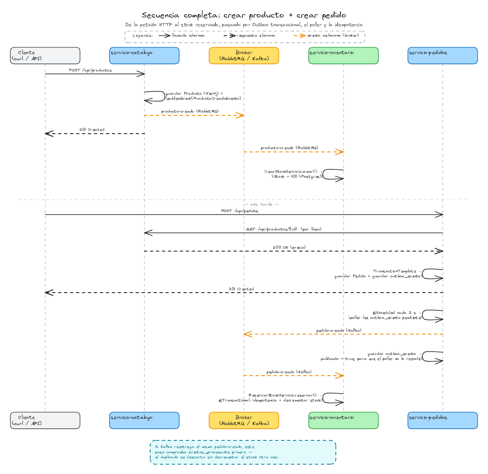
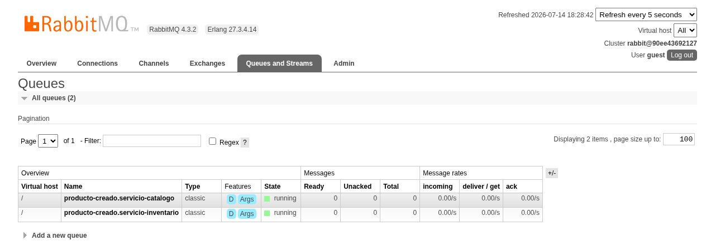
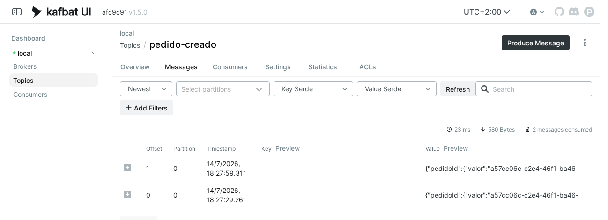

# Capítulo 12 — Kafka, Outbox transaccional e Inventario

Duodécimo capítulo del tutorial "De cero a pro en arquitectura de microservicios con Spring Boot" (ver el índice completo de capítulos en la rama `main`). Parte directamente de `capitulo-11-mensajeria-asincrona`.

## Índice

1. [Motivación y arquitectura general del capítulo](#1-motivación-y-arquitectura-general-del-capítulo)
2. [Kafka como segundo binder](#2-kafka-como-segundo-binder)
3. [`PedidoCreadoEvento`, Outbox transaccional y `servicio-inventario`](#3-pedidocreadoevento-outbox-transaccional-y-servicio-inventario)
4. [Cómo probarlo](#4-cómo-probarlo)
5. [Registro de archivos del capítulo](#5-registro-de-archivos-del-capítulo)
6. [Referencias](#6-referencias)

---

## 1. Motivación y arquitectura general del capítulo

El capítulo 11 demostró la mecánica de Spring Cloud Stream — Binder, `StreamBridge`, `Consumer<T>` — sobre un único binder, RabbitMQ, dentro de un mismo microservicio: `servicio-catalogo` publicando y consumiendo su propio `ProductoCreadoEvento`. Quedaron dos preguntas abiertas a propósito: si ese mismo código funciona igual sobre otro broker sin tocar una línea, y qué cambia cuando el evento cruza de verdad a otro proceso, con una consecuencia de negocio real detrás en vez de una simple recomendación. Este capítulo responde a las dos.

### Kafka como segundo binder

Antes de aplicar nada nuevo, este capítulo repite el ejercicio del binder sobre lo que ya existe: se añade el binder de Kafka junto al de RabbitMQ en `servicio-catalogo`, y se comprueba que el mismo `StreamBridge`/`Consumer<ProductoCreadoEvento>` del capítulo 11 sigue funcionando sin tocar una línea de código de negocio — solo cambia `spring.cloud.stream.defaultBinder`. Es la prueba de que el Binder cumple lo que promete, aislada del resto del capítulo: `producto-creado` sigue publicándose y consumiéndose sobre RabbitMQ tal y como quedó cerrado en el capítulo 11, y `servicio-inventario` (que nace en este mismo capítulo) se engancha a ese mismo *exchange* como su propio grupo consumidor — el escenario de reparto entre varios grupos que ya se apuntaba al cierre del capítulo anterior, ahora real.

### El caso real: `servicio-pedidos` → `servicio-inventario`

Kafka entra de verdad en juego con un evento nuevo: `PedidoCreadoEvento`, publicado por `servicio-pedidos` al crear un pedido. A diferencia de `ProductoCreadoEvento` — que nació en el capítulo 4 como un evento síncrono intra-proceso (`ApplicationEventPublisher`) y no cruzó a otro proceso hasta el capítulo 11 —, `PedidoCreadoEvento` nace directamente pensado para salir del proceso: dentro de `servicio-pedidos` no hay ningún oyente propio que lo consuma, así que no tendría sentido darle antes una versión síncrona que nadie escucharía. Su único consumidor es `servicio-inventario`, un microservicio nuevo que nace en este capítulo con un objetivo único — mantener el stock al día a partir de los eventos que llegan de los otros dos —, sin API REST, sin OpenAPI ni resiliencia propias: no expone nada, solo escucha `producto-creado` (para dar de alta el stock de cada producto nuevo) y `pedido-creado` (para decrementarlo con cada pedido).

### Dos problemas nuevos: Outbox transaccional e Idempotencia

Mientras `producto-creado` no cruzaba de proceso (capítulos 4 a 10) o, al cruzar, su único consumidor era el propio publicador (capítulo 11), dos problemas quedaban ocultos porque no tenían ninguna consecuencia real. Con `PedidoCreadoEvento` aparecen los dos a la vez, porque ahora sí hay algo real en juego: vender más unidades de las que quedan en stock.

- **Outbox transaccional** (Transactional Outbox): publicar en un broker externo ya no es atómico con el commit en base de datos, como sí lo era `ApplicationEventPublisher` síncrono (capítulo 4) al ejecutarse dentro de la misma transacción. Si el pedido se guarda pero el proceso cae antes de publicar el evento, `servicio-inventario` nunca se entera y el stock queda desincronizado sin que nada lo delate. La solución: guardar el evento en la misma transacción que el pedido, en una tabla outbox propia, y publicarlo aparte, con un proceso que sondea esa tabla (poller).
- **Idempotencia** (Idempotency): un broker de mensajería no garantiza entrega exactamente una vez — un mensaje puede reentregarse (p. ej. tras un fallo de red al confirmar la recepción) y `servicio-inventario` recibirlo dos veces. Sin ninguna protección, decrementaría el stock dos veces por el mismo pedido. La solución: que el consumidor pueda procesar el mismo evento más de una vez sin duplicar su efecto — normalmente, deduplicando por el id del propio evento.


*Arquitectura del capítulo: `servicio-catalogo` sigue en RabbitMQ (con Kafka disponible como segundo binder, [sección 2](#2-kafka-como-segundo-binder)) y `servicio-pedidos` estrena Kafka para `PedidoCreadoEvento`, vía Outbox transaccional, consumido por `servicio-inventario` con idempotencia.*
<br>

## 2. Kafka como segundo binder

### Dependencia y broker compartido

Solo hace falta añadir el binder de Kafka junto al de RabbitMQ que ya tenía `servicio-catalogo`:

```xml
<!-- servicio-catalogo/pom.xml -->
<dependency>
	<groupId>org.springframework.cloud</groupId>
	<artifactId>spring-cloud-stream-binder-kafka</artifactId>
</dependency>
```

A diferencia de Neo4j o RabbitMQ, este capítulo comparte Kafka también con `servicio-pedidos` y `servicio-inventario` (ver [sección 3](#3-pedidocreadoevento-outbox-transaccional-y-servicio-inventario)), así que no es infraestructura exclusiva de `servicio-catalogo`. Su contenedor vive en un `compose.yaml` en la **raíz del repo** — imagen oficial `apache/kafka`, en modo KRaft (un único nodo hace de broker y de *controller* a la vez, sin Zookeeper — el propio proyecto Kafka lo simplificó así desde la 3.x). Al no ser el `compose.yaml` propio de ningún módulo, `spring-boot-docker-compose` no lo detecta automáticamente — cada `application.yml` que lo necesita fija `spring.kafka.bootstrap-servers: localhost:9092` explícito, y el broker se arranca a mano una vez, con `docker compose up -d` desde la raíz del repo, antes de levantar cualquiera de los microservicios que lo usan.

```yaml
# compose.yaml
services:
  kafka:
    image: 'apache/kafka:latest'
    hostname: kafka
    ports:
      - '9092:9092'
    environment:
      - 'KAFKA_NODE_ID=1'
      - 'KAFKA_LISTENER_SECURITY_PROTOCOL_MAP=CONTROLLER:PLAINTEXT,PLAINTEXT:PLAINTEXT,PLAINTEXT_HOST:PLAINTEXT'
      - 'KAFKA_ADVERTISED_LISTENERS=PLAINTEXT_HOST://localhost:9092,PLAINTEXT://kafka:19092'
      - 'KAFKA_PROCESS_ROLES=broker,controller'
      - 'KAFKA_CONTROLLER_QUORUM_VOTERS=1@kafka:29093'
      - 'KAFKA_LISTENERS=CONTROLLER://:29093,PLAINTEXT_HOST://:9092,PLAINTEXT://:19092'
      - 'KAFKA_INTER_BROKER_LISTENER_NAME=PLAINTEXT'
      - 'KAFKA_CONTROLLER_LISTENER_NAMES=CONTROLLER'
      - 'CLUSTER_ID=4L6g3nShT-eMCtK--X86sw'
      - 'KAFKA_OFFSETS_TOPIC_REPLICATION_FACTOR=1'
      - 'KAFKA_GROUP_INITIAL_REBALANCE_DELAY_MS=0'
      - 'KAFKA_TRANSACTION_STATE_LOG_MIN_ISR=1'
      - 'KAFKA_TRANSACTION_STATE_LOG_REPLICATION_FACTOR=1'
  kafka-ui:
    image: 'ghcr.io/kafbat/kafka-ui:latest'
    ports:
      - '8090:8080'
    environment:
      - 'KAFKA_CLUSTERS_0_NAME=local'
      - 'KAFKA_CLUSTERS_0_BOOTSTRAPSERVERS=kafka:19092'
    depends_on:
      - kafka
```

Ese mismo `compose.yaml` raíz añade **Kafka UI** (interfaz web para explorar *topics* y mensajes) — concretamente **Kafbat UI**, no la imagen original de Provectus: el proyecto de Provectus está discontinuado, y los mismos contribuidores originales lo continúan como Kafbat UI, con desarrollo activo.

| Parámetro | Valor |
|---|---|
| URL | `http://localhost:8090` |
| Cluster | `local` |

> **¿Por qué dos *listeners* con puertos distintos (`9092` y `19092`)?**
>
> Porque "localhost" significa una IP distinta según quién lo resuelva. Los tres microservicios corren fuera de Docker (`./mvnw spring-boot:run` en la máquina anfitriona), así que hablan con Kafka por el *listener* `PLAINTEXT_HOST`, anunciado como `localhost:9092` en `KAFKA_ADVERTISED_LISTENERS` — la dirección que Kafka le dice al cliente que use en cuanto establece el primer contacto.
>
> Kafbat UI, en cambio, corre **dentro** del mismo `compose.yaml` — para él, `localhost` sería su propio contenedor, no el de Kafka —, así que se conecta por la red interna de Docker con el nombre del servicio: el *listener* `PLAINTEXT`, anunciado como `kafka:19092` (`KAFKA_CLUSTERS_0_BOOTSTRAPSERVERS=kafka:19092` en su propia configuración).
>
> Sin este segundo *listener* fallaría uno de los dos lados: con solo `localhost:9092`, Kafbat UI no podría resolverlo desde dentro de Docker; con solo `kafka:19092`, los microservicios de fuera no podrían resolver el nombre `kafka` sin añadirlo a mano a su `/etc/hosts`.

### Cambiar de binder: RabbitMQ → Kafka, sin tocar código

Con dos binders en el *classpath*, Spring Cloud Stream ya no puede elegir uno por sí solo — arranca con un error hasta que se resuelve explícitamente con `spring.cloud.stream.defaultBinder`, tal como ya anticipaba la nota de la [sección 2 del capítulo 11](../../tree/capitulo-11-mensajeria-asincrona). El comportamiento por defecto no cambia — sigue siendo RabbitMQ:

```yaml
# servicio-catalogo/application.yml
spring:
  cloud:
    stream:
      defaultBinder: rabbit
```

Un perfil nuevo lo mueve a Kafka sin tocar ni `ProductoCreadoListener` ni `ProductoCreadoConsumidorConfiguracion`:

```yaml
# servicio-catalogo/application-kafka.yml
spring:
  kafka:
    bootstrap-servers: localhost:9092
  cloud:
    stream:
      defaultBinder: kafka
```

Arrancar con el perfil `kafka` activo (`-Dspring-boot.run.profiles=kafka` con el plugin de Maven, equivalente a `--spring.profiles.active=kafka` como argumento del JAR) mueve el mismo productor y el mismo consumidor de `producto-creado` al *topic* homónimo de Kafka — mismo `destination`, mismo `group`, ningún cambio de código:

```bash
docker compose up -d
```

```bash
./mvnw -pl servicio-catalogo spring-boot:run -Dspring-boot.run.profiles=kafka
```

```bash
curl -X POST http://localhost:8080/api/categorias \
  -H "Content-Type: application/json" \
  -d '{"nombre":"Deportes"}'
# => {"id":"<categoriaId>","nombre":"Deportes"}
```

```bash
curl -X POST http://localhost:8080/api/productos \
  -H "Content-Type: application/json" \
  -d '{"nombre":"Balón","descripcion":"Balón de fútbol","precio":25.0,"categoriaId":"<categoriaId>"}'
# => {"id":"<productoId>","nombre":"Balón", ...}
```

El log del propio proceso (terminal donde corre `spring-boot:run`) confirma la vuelta completa en cuanto el consumidor recibe el evento:

```
Producto creado (vía mensajería asíncrona): f95a7610-85df-4182-b8b0-bf9456a4c9db
```

Verificado igual que en el capítulo 11, además, con un test de integración real (`Testcontainers` + `KafkaContainer`, `@ServiceConnection`), no solo a mano.

Antes de seguir, para el proceso de `servicio-catalogo` (`Ctrl+C` en su terminal — a diferencia de la demostración completa de la [sección 4](#4-cómo-probarlo), aquí se arrancó en primer plano, sin `&`) y el Kafka compartido, para no chocar con el arranque de esa sección:

```bash
docker compose down
```

Esta demostración queda aislada del resto del capítulo: el perfil `kafka` existe solo para probar que el Binder cumple lo que promete. En todo lo que sigue, `producto-creado` sigue publicándose y consumiéndose sobre RabbitMQ tal y como quedó cerrado en el capítulo 11 — es Kafka quien va a hacer falta para el evento nuevo de la [siguiente sección](#3-pedidocreadoevento-outbox-transaccional-y-servicio-inventario).

> **Si `producto-creado` viaja igual por los dos, ¿en qué se diferencian realmente un *exchange* de RabbitMQ y un *topic* de Kafka?**
>
> No son el mismo concepto con dos nombres distintos, aunque `destination`/`group` los traten de forma parecida. El *exchange* de RabbitMQ enruta pero no almacena — es la cola la que guarda el mensaje hasta que se consume (ver la [sección 2 del capítulo 11](../../tree/capitulo-11-mensajeria-asincrona)). Kafka no tiene esa capa de enrutado intermedia: un productor escribe directamente a un *topic* con nombre, y es el propio *topic* el que almacena — no una pieza aparte.
>
> Tampoco almacenan igual. La cola clásica de RabbitMQ (la del capítulo 11) borra el mensaje en cuanto se consume y confirma; el *topic* de Kafka es un log de solo-anexar que **no** lo borra — cada consumidor lee a su propio ritmo llevando la cuenta de por dónde va (su *offset*), y el mensaje sigue ahí para quien vuelva a leerlo o para un consumidor nuevo que empiece desde el principio. Lo más parecido a un *topic* de Kafka dentro de RabbitMQ no es la cola clásica ni el *exchange* — es **RabbitMQ Streams**, una función aparte que este tutorial no usa.
>
> `group` cumple un papel equivalente en los dos — que varias instancias se repartan el trabajo en vez de duplicarlo —, pero por mecanismos distintos: en RabbitMQ es parte del nombre físico de la cola (`destination.group`); en Kafka determina cómo se reparten entre las instancias activas las particiones del *topic* (cada partición la procesa una única instancia del grupo a la vez — el motivo, de hecho, de que este capítulo pueda dar por hecho que dos mensajes del mismo *topic* nunca se procesan en paralelo, ver la [sección 3](#3-pedidocreadoevento-outbox-transaccional-y-servicio-inventario)).

## 3. `PedidoCreadoEvento`, Outbox transaccional y `servicio-inventario`

### El evento nuevo

`servicio-pedidos` no tenía eventos de dominio hasta ahora. `PedidoCreadoEvento` sigue la misma forma que `ProductoCreadoEvento` — un `record`, con una lista propia de líneas (solo `productoId`/`cantidad`, sin `precioUnitario`: el precio no le importa a quien reserva stock):

```java
// dominio/evento/PedidoCreadoEvento.java
public record PedidoCreadoEvento(PedidoId pedidoId, List<LineaPedidoCreada> lineas, Instant ocurridoEn) {
	public record LineaPedidoCreada(ProductoId productoId, Cantidad cantidad) {
	}
}
```

### Outbox transaccional: `CrearPedidoServicio`

A diferencia de la [sección 2](#2-kafka-como-segundo-binder) (donde `ApplicationEventPublisher`/`StreamBridge` no necesitaban puerto de salida propio porque no tocaban persistencia), el Outbox **sí** es persistencia real — una tabla más, `outbox_evento` — así que tiene su propio puerto de salida, `OutboxPuertoSalida`, con un adaptador (`OutboxRepositorioAdaptador`) que serializa el evento a JSON y lo guarda como una fila más, `publicado = false`:

```java
// infraestructura/adaptador/salida/persistencia/adaptador/OutboxRepositorioAdaptador.java
@Override
public void guardar(PedidoCreadoEvento evento) {
	String payload = jsonMapper.writeValueAsString(evento);
	outboxEventoRepositorioJpa.save(new OutboxEventoEntidad(
			null, PedidoCreadoEvento.class.getSimpleName(), payload, evento.ocurridoEn(), false));
}
```

`jsonMapper` es el `JsonMapper` de Jackson 3 (el auto-configurado por Spring Boot 4.1 — `ObjectMapper` de Jackson 2 ya no tiene bean propio), y serializa el evento completo — líneas incluidas — a una única columna de texto, `payload`. `tipoEvento` (aquí siempre `PedidoCreadoEvento.class.getSimpleName()`) se guarda aparte como metadato: hoy no hace falta para nada — solo hay un tipo de evento en esta tabla —, pero es lo que permitiría en el futuro, si la tabla llegara a guardar más de un tipo, saber sin ambigüedad a qué clase deserializar cada `payload`.

`CrearPedidoServicio` es donde se ve el porqué de todo esto:

```java
// aplicacion/servicio/CrearPedidoServicio.java
@Override
public PedidoDTO crear(CrearPedidoDTO dto) {
	Pedido pedido = Pedido.crear(ClienteId.de(dto.clienteId()));
	dto.lineas().forEach(linea -> {
		ProductoId productoId = ProductoId.de(linea.productoId());
		ProductoCatalogoDTO producto = catalogoPuertoSalida.buscarProductoPorId(productoId);
		pedido.agregarLinea(productoId, Cantidad.de(linea.cantidad()), Precio.de(producto.precio()));
	});

	// Solo esta parte necesita transacción: las llamadas HTTP a catálogo ya han terminado.
	Pedido guardado = transactionTemplate.execute(status -> {
		Pedido resultado = pedidoRepositorioPuertoSalida.guardar(pedido);
		outboxPuertoSalida.guardar(aEvento(resultado));
		return resultado;
	});
	return pedidoMapper.aDTO(guardado);
}
```

El método no lleva `@Transactional` a nivel de clase o método completo a propósito: las llamadas HTTP a `servicio-catalogo` (una por línea) ya han terminado antes de abrir la transacción — envolverlas también habría mantenido una conexión a base de datos abierta mientras se espera red — el mismo antipatrón para el que está pensado el Outbox, aquí aplicado a la llamada HTTP en vez de a la publicación en el broker. `TransactionTemplate` (autoconfigurado por Spring Boot junto al `PlatformTransactionManager` de JPA) acota la transacción explícitamente a las dos escrituras: guardar el `Pedido` y guardar la fila outbox son atómicas — o las dos, o ninguna.

### El poller: `OutboxPollerScheduler`

Nada publica en Kafka todavía — la fila outbox solo está guardada. Un `@Scheduled` cada 2 segundos busca filas `publicado = false`, las envía con `StreamBridge` y las marca:

```java
// infraestructura/adaptador/salida/mensajeria/OutboxPollerScheduler.java
@Scheduled(fixedDelay = 2000)
@Transactional
public void publicarEventosPendientes() {
	for (OutboxEventoEntidad evento : outboxEventoRepositorioJpa.findByPublicadoFalseOrderByIdAsc()) {
		streamBridge.send("pedidoCreado-out-0", MessageBuilder.withPayload(evento.getPayload())
				.setHeader(MessageHeaders.CONTENT_TYPE, MimeTypeUtils.APPLICATION_JSON)
				.build());
		evento.marcarPublicado();
		log.info("Evento outbox {} publicado en pedido-creado", evento.getId());
	}
}
```

`evento` no se vuelve a guardar explícitamente porque no hace falta. Al venir de una consulta de un repositorio Spring Data JPA dentro de un método `@Transactional`, ya es una entidad *gestionada* (*managed*) por el `EntityManager` de esa transacción, y Hibernate hace *dirty checking* al llegar al `COMMIT` — compara el estado actual de cada entidad gestionada con el que tenía al cargarla, y genera un `UPDATE` solo para las que cambiaron. Llamar a `evento.marcarPublicado()` es suficiente; un `outboxEventoRepositorioJpa.save(evento)` explícito después sería redundante, no incorrecto — Spring Data JPA lo detectaría como una entidad ya gestionada y no haría nada distinto.

`@Transactional` aquí cubre únicamente el trabajo contra Postgres — leer las filas pendientes y marcarlas publicadas. Kafka queda completamente fuera de esa transacción: el `PlatformTransactionManager` de JPA no sabe nada del broker, así que un `ROLLBACK` no puede deshacer un mensaje que ya salió hacia Kafka.

> **¿Espera el poller a que Kafka confirme la entrega antes de marcar la fila como publicada?**
>
> No, y conviene saberlo: `StreamBridge.send(...)` con el binder de Kafka es asíncrono por defecto — entrega el mensaje al productor interno y devuelve el control casi de inmediato, sin esperar el ACK del broker (la confirmación de que el mensaje quedó escrito). Se podría forzar lo contrario con `spring.cloud.stream.kafka.bindings.pedidoCreado-out-0.producer.sync=true` — este capítulo no lo activa. Que `send(...)` no lance una excepción no garantiza que el mensaje haya llegado — solo que se encoló correctamente para enviarse.
>
> Esto es precisamente lo que hace seguro mantener el envío *dentro* de la misma transacción que la escritura en base de datos, a diferencia de las llamadas HTTP de `CrearPedidoServicio` ([sección anterior](#outbox-transaccional-crearpedidoservicio)): una llamada HTTP bloquea el hilo — y la conexión a base de datos que mantiene abierta — hasta que llega la respuesta completa; un `send()` asíncrono no bloquea esperando red, así que no reproduce el antipatrón de mantener una conexión reservada mientras se espera una respuesta remota — mientras Kafka esté disponible (ver la nota siguiente para cuando no lo está).

> **¿Y si Kafka no está lento, sino caído del todo?**
>
> Ahí la nota anterior deja de valer: el problema deja de ser "no espera confirmación" para pasar a ser "no consigue ni encolar el mensaje". Antes de enviar nada, el productor de Kafka necesita *metadata* del *topic* — qué particiones existen, en qué *broker* vive cada una — y, si no hay ningún *broker* alcanzable para pedirla, `send(...)` bloquea el hilo llamante hasta `max.block.ms` (60 segundos por defecto) y entonces sí lanza una excepción (`TimeoutException`). Esa excepción sale de `streamBridge.send(...)` hacia `publicarEventosPendientes()` y es la que dispara el rollback del párrafo siguiente — al contrario que la falta de confirmación de la nota anterior, un *broker* inalcanzable no se pierde en silencio: revienta la transacción de forma ruidosa.
>
> Esto reabre, mientras dura la caída, el antipatrón que la nota anterior decía evitar: esos ~60 segundos de bloqueo ocurren **dentro** de la transacción, así que la conexión a Postgres que `@Transactional` mantiene reservada para `publicarEventosPendientes()` queda retenida todo ese tiempo esperando una respuesta de red — igual que si `send(...)` fuera, a efectos prácticos, una llamada HTTP síncrona. La diferencia con `CrearPedidoServicio` es de frecuencia, no de naturaleza: aquí solo ocurre si Kafka está caído (no en cada pedido, como sí pasaría con una llamada HTTP en cada creación), y ni siquiera entonces se pierde el evento — solo se retrasa —, pero con varias pasadas fallidas seguidas y un *pool* de conexiones pequeño, esta espera sí podría llegar a agotarlo.
>
> Dos efectos prácticos más mientras dura la caída: cada pasada del poller tarda esos ~60 segundos en fallar en vez de resolverse al instante, y como `fixedDelay` cuenta desde que termina una pasada hasta que empieza la siguiente, los reintentos quedan más espaciados de lo habitual — no cada 2 segundos, sino cada ~62. Y la tarea programada no se detiene por ello: por defecto, `@Scheduled` registra un manejador de errores que se limita a dejar constancia en el log y sigue reprogramando la siguiente ejecución — si no fuera así, el primer fallo pararía el *poller* para siempre, y con él toda entrega futura de eventos, con Kafka caído o ya recuperado.

Como Hibernate no vuelca (*flush*) los `UPDATE` a Postgres hasta el `COMMIT` final del método — no hay ninguna consulta intermedia en el bucle que fuerce un *flush* antes —, todos los `publicado = true` de una misma pasada quedan pendientes en memoria hasta el final. Si en algún punto del bucle salta una excepción — la del *broker* inalcanzable de la nota anterior, u otra cualquiera —, Spring hace rollback de **toda** la transacción. Se descartan también los `publicado = true` de eventos que sí llegaron a enviarse en iteraciones anteriores de esa misma pasada. Esos eventos quedan como `publicado = false` y se reintentan en la siguiente pasada — un duplicado en Kafka, inofensivo gracias a la idempotencia del consumidor (ver más abajo).

> **¿Importa el orden entre `send` y `marcarPublicado()`?**
>
> Sí, aunque en este código concreto invertirlo (`marcarPublicado()` antes que `send`) no rompería nada por ahora. Como nada se vuelca a disco hasta el `COMMIT` final (el mismo *dirty checking* de arriba), un fallo en cualquier punto del bucle sigue deshaciendo el lote completo sin importar en qué orden se mutara la entidad o se enviara el mensaje. Pero el orden actual no es casual — es la regla general del patrón Outbox transaccional, aplicada aquí como buena práctica aunque el código actual no dependa estrictamente de ella: nunca marcar un evento como publicado antes de tener cierta confianza en que salió.
>
> En cuanto el código cambie — una consulta nueva en el bucle que dispare un *auto-flush* antes de tiempo (Hibernate lo hace automáticamente ante cualquier consulta si detecta cambios pendientes), o un `entityManager.flush()` explícito — y ese `UPDATE` empiece a llegar a Postgres antes de confirmarse el envío, invertir el orden abriría la puerta al peor fallo posible del patrón. La base de datos diría "publicado", el poller nunca volvería a mirar esa fila (solo busca `publicado = false`), y el evento se habría perdido en silencio si el envío fallaba justo después. Preferir el duplicado — barato, ya cubierto por la idempotencia del consumidor — a la pérdida silenciosa — no recuperable — es la razón de que el orden correcto sea enviar primero y marcar después.

El *payload* ya viene serializado desde `OutboxRepositorioAdaptador`, así que el poller solo reenvía la cadena JSON tal cual — no necesita reconstruir `PedidoCreadoEvento` en memoria para volver a serializarlo.

### `servicio-inventario`: un microservicio mínimo, dos binders

Módulo nuevo, sin API REST, sin OpenAPI, sin resiliencia propia — su único trabajo es reaccionar a eventos. El agregado `Stock` (identidad = `productoId`, sin `StockId` propio) tiene un único método de negocio con invariante real:

```java
// dominio/modelo/agregado/Stock.java
public void decrementar(int cantidadADecrementar) {
	if (cantidadADecrementar > cantidad.valor()) {
		throw new StockInsuficienteException(productoId, cantidad.valor(), cantidadADecrementar);
	}
	this.cantidad = Cantidad.de(cantidad.valor() - cantidadADecrementar);
}
```

Consume **dos** eventos, cada uno con su propio DTO de deserialización (`ProductoCreadoEventoDTO` y `PedidoCreadoEventoDTO` — Capa Anticorrupción, la misma idea que `ProductoCatalogoDTO` en el capítulo 7 aplicada aquí a mensajería en vez de HTTP: `servicio-inventario` nunca importa una clase de dominio de otro Contexto Delimitado) — y, a propósito, cada uno sobre un broker distinto:

- `producto-creado`, sobre **RabbitMQ** (el mismo *exchange* del capítulo 11, ahora con un segundo grupo consumidor, `servicio-inventario`): dar de alta el `Stock` de cada producto nuevo con una cantidad inicial fija (100 unidades) — resuelve "de dónde sale el stock" sin inventar un endpoint REST solo para sembrarlo a mano.
- `pedido-creado`, sobre **Kafka** (el *topic* nuevo de este capítulo): reservar stock, decrementando una línea por producto.

```yaml
# servicio-inventario/application.yml
spring:
  kafka:
    bootstrap-servers: localhost:9092
  cloud:
    function:
      definition: productoCreadoConsumidor;pedidoCreadoConsumidor
    stream:
      defaultBinder: rabbit
      bindings:
        productoCreadoConsumidor-in-0:
          destination: producto-creado
          group: servicio-inventario
        pedidoCreadoConsumidor-in-0:
          destination: pedido-creado
          group: servicio-inventario
          binder: kafka
```

```java
// infraestructura/adaptador/entrada/mensajeria/ProductoCreadoConsumidorConfiguracion.java
@Bean
public Consumer<ProductoCreadoEventoDTO> productoCreadoConsumidor() {
	return evento -> crearStockPuertoEntrada.crear(evento.productoId().valor());
}
```

El segundo consumidor sí necesita traducir de verdad: `pedido-creado` trae varias líneas, cada una con su propio `ProductoIdDTO`/`CantidadDTO` anidados, y `ReservarStockPuertoEntrada` espera `LineaReservaDTO` — el tipo propio de la aplicación, no el DTO de mensajería:

```java
// infraestructura/adaptador/entrada/mensajeria/PedidoCreadoConsumidorConfiguracion.java
@Bean
public Consumer<PedidoCreadoEventoDTO> pedidoCreadoConsumidor() {
	return evento -> {
		var lineas = evento.lineas().stream()
				.map(linea -> new LineaReservaDTO(linea.productoId().valor(), linea.cantidad().valor()))
				.toList();
		reservarStockPuertoEntrada.reservar(evento.pedidoId().valor(), lineas);
	};
}
```

> **¿Por qué no activar el perfil `kafka` aquí también, como en `servicio-catalogo`?**
>
> Porque `servicio-catalogo` no cambió de sitio: sigue publicando `producto-creado` sobre RabbitMQ, tal como quedó en el capítulo 11 (ver [sección 2](#2-kafka-como-segundo-binder)). Si `servicio-inventario` moviera *todos* sus consumidores a Kafka, dejaría de escuchar donde `servicio-catalogo` realmente publica. `defaultBinder: rabbit` mantiene ese binding en RabbitMQ; el `binder: kafka` explícito en `pedidoCreadoConsumidor-in-0` es lo único que cambia — una anulación puntual, no un cambio global. Es la misma idea que la [sección 2](#2-kafka-como-segundo-binder) demostró con `defaultBinder`, aplicada aquí a una sola *binding* en vez de a todo el microservicio: Spring Cloud Stream permite mezclar *brokers* dentro del mismo proceso, no solo elegir uno para toda la aplicación.

### Idempotencia: `pedidos_procesados`

`ReservarStockServicio` comprueba y marca el `pedidoId` como procesado dentro de la misma transacción que decrementa el stock:

```java
// aplicacion/servicio/ReservarStockServicio.java
@Override
@Transactional
public void reservar(String pedidoId, List<LineaReservaDTO> lineas) {
	if (pedidoProcesadoPuertoSalida.yaProcesado(pedidoId)) {
		log.info("Pedido {} ya procesado, se descarta el duplicado", pedidoId);
		return;
	}
	lineas.forEach(linea -> {
		ProductoId productoId = ProductoId.de(linea.productoId());
		Stock stock = stockRepositorioPuertoSalida.buscarPorProductoId(productoId)
				.orElseThrow(() -> new StockNoEncontradoException(productoId));
		stock.decrementar(linea.cantidad());
		stockRepositorioPuertoSalida.guardar(stock);
	});
	pedidoProcesadoPuertoSalida.marcarProcesado(pedidoId);
}
```

Una tabla de una sola columna útil (`pedido_id`, clave primaria) es toda la deduplicación que hace falta: si el `pedidoId` ya está, se descarta el duplicado sin tocar el stock.

### `@Transactional` frente a `TransactionTemplate`: dos formas de decir "esto es una transacción"

El capítulo usa las dos formas de delimitar una transacción en Spring, y no por variar el estilo: cada una resuelve un problema distinto, y mezclarlas sin criterio es una fuente de bugs sutiles. Merece la pena pararse en el porqué, porque a primera vista `@Transactional` parece "la forma normal" y `TransactionTemplate` un añadido innecesario — no lo es.

**`@Transactional` es una anotación que activa una transacción *por fuera* del método, no dentro de él.** Cuando Spring ve `@Transactional` en un bean gestionado, no modifica el bytecode del método: crea un **proxy** alrededor del bean (una clase generada en tiempo de ejecución que implementa la misma interfaz, o extiende la misma clase) y registra ese proxy en el contenedor en vez del objeto real. Cuando otro componente llama a `reservarStockPuertoEntrada.reservar(...)`, en realidad está llamando al proxy — que abre la transacción, invoca al método real, y hace commit o rollback al terminar. El propio objeto `ReservarStockServicio` no sabe nada de transacciones; toda la magia vive en ese envoltorio externo.

> **¿Por qué importa que sea un proxy externo, y no algo "dentro" del método?**
>
> Porque un proxy solo puede interceptar llamadas que le lleguen **desde fuera**. Si un método `A()` de una clase llama a otro método `B()` de esa misma clase (`this.B()`), esa llamada nunca pasa por el proxy — va directa al objeto real, sin pasar por el envoltorio que abre la transacción. Es la famosa limitación de **auto-invocación** (self-invocation) de Spring AOP: anotar `B()` con `@Transactional` no sirve de nada si quien lo llama es `A()` de la misma clase. Esto no es un caso raro — es la razón por la que `CrearPedidoServicio` **no puede** resolver su problema poniendo `@Transactional` en un método privado nuevo que solo contenga las dos escrituras: ese método privado, llamado desde `crear(...)` en la misma clase, jamás pasaría por el proxy.

**`TransactionTemplate` es la alternativa programática**: en vez de una anotación que Spring interpreta por fuera, es un objeto (`org.springframework.transaction.support.TransactionTemplate`, autoconfigurado por Spring Boot junto al `PlatformTransactionManager` de JPA) que se inyecta como una dependencia más y al que se le pasa explícitamente, como una función, el bloque de código que debe ser transaccional:

```java
// aplicacion/servicio/CrearPedidoServicio.java
Pedido guardado = transactionTemplate.execute(status -> {
	Pedido resultado = pedidoRepositorioPuertoSalida.guardar(pedido);
	outboxPuertoSalida.guardar(aEvento(resultado));
	return resultado;
});
```

No hay proxy, no hay auto-invocación posible: el límite de la transacción es el propio bloque `{ ... }` del lambda, visible directamente en el código, sin depender de quién llama a qué método ni de en qué clase vive. `execute(...)` devuelve el valor que retorne el lambda (aquí, el `Pedido` guardado); existe también `executeWithoutResult(...)`, la misma idea para cuando no hace falta devolver nada.

**Lo que no cambia entre una forma y otra**: el comportamiento ante errores. Ambas usan por debajo el mismo `PlatformTransactionManager`, y ambas hacen rollback automático por defecto cuando el bloque protegido lanza una excepción no comprobada (`RuntimeException`/`Error`) — que es el tipo de excepción que lanzan `StockNoEncontradoException`, `StockInsuficienteException` y las excepciones de JPA. Si `stock.decrementar(...)` lanza `StockInsuficienteException` a mitad de un pedido con varias líneas, el rollback deshace también las líneas ya decrementadas antes de esa — la transacción, sea `@Transactional` o `TransactionTemplate`, es una unidad, no una serie de pasos independientes.

**La regla práctica para el resto del capítulo (y de los que vengan)**: primero, ¿hay de verdad **varias escrituras** que deban tener éxito o fallar juntas? Si no las hay, no hace falta ningún mecanismo — es el caso de `CrearStockServicio`, que se explica en detalle a continuación. Si las hay, y el método es transaccional de principio a fin e invocado desde fuera de la clase, `@Transactional` es más simple. Si dentro del método hay trabajo que **no** debe formar parte de la transacción — típicamente una llamada de red —, `TransactionTemplate` acotado a mano a la parte que sí lo es.

Aplicando esa regla a las cuatro piezas de mensajería de este capítulo, se dividen en tres grupos:

| Componente | Mecanismo | Por qué |
|---|---|---|
| `OutboxPollerScheduler.publicarEventosPendientes()` | `@Transactional` | Lo invoca el *scheduler* de Spring desde fuera de la clase — pasa por el proxy sin problema. El envío a Kafka no es trabajo de base de datos, pero al ser asíncrono no bloquea esperando red, así que no reproduce el antipatrón de mantener una conexión abierta durante una llamada remota — ver la nota en la [sección del poller](#el-poller-outboxpollerscheduler). |
| `ReservarStockServicio.reservar(...)` | `@Transactional` | Igual: todo el cuerpo es acceso a base de datos. Lo invoca `PedidoCreadoConsumidorConfiguracion` desde fuera de la clase — mismo caso. |
| `CrearPedidoServicio.crear(...)` | `TransactionTemplate` | El método **empieza** con llamadas HTTP a `servicio-catalogo` (una por línea del pedido) que deben quedar **fuera** de la transacción — abrirla antes mantendría una conexión a base de datos reservada mientras se espera red, exactamente el problema de recursos que una transacción corta busca evitar. Poner `@Transactional` en todo `crear(...)` envolvería también esas llamadas HTTP; ponerlo en un método aparte de la misma clase no funcionaría, por auto-invocación. |
| `CrearStockServicio.crear(...)` | Ninguno | Solo hace **una** escritura (`guardar`). No hay nada que agrupar — ver el [apartado dedicado](#por-qué-crearstockservicio-no-lleva-ni-transactional-ni-transactiontemplate) más abajo. |

### Por qué `CrearStockServicio` no lleva ni `@Transactional` ni `TransactionTemplate`

Este es el caso que más cuesta ver, porque la intuición dice "hay una comprobación y luego una escritura, eso suena a que debería ir junto en una transacción". Vale la pena desmontarlo paso a paso, porque la respuesta correcta no es un descuido — es que una transacción no es la herramienta para el problema que parece tener este método.

```java
// aplicacion/servicio/CrearStockServicio.java
@Override
public void crear(String productoId) {
	ProductoId id = ProductoId.de(productoId);
	if (stockRepositorioPuertoSalida.buscarPorProductoId(id).isPresent()) {
		log.info("Stock ya existente para el producto {}, se descarta el duplicado", productoId);
		return;
	}
	stockRepositorioPuertoSalida.guardar(Stock.crear(id, Cantidad.de(CANTIDAD_INICIAL)));
}
```

**Primer punto: aquí solo hay *una* escritura, no varias.** Compáralo con `CrearPedidoServicio` (guardar el `Pedido` **y** guardar la fila outbox — dos escrituras que deben ir juntas) o con `ReservarStockServicio` (decrementar stock de cada línea **y** marcar el `pedidoId` como procesado — de nuevo varias escrituras). El problema que una transacción resuelve es exactamente ese: "estas *N* escrituras son una sola unidad, o se hacen todas o no se hace ninguna". Aquí solo hay una escritura (`guardar`). No hay nada que agrupar con ella — no hay un segundo `guardar`/`marcarProcesado` que pudiera quedarse a medias si el proceso se cae justo después del primero.

**Segundo punto, y el que de verdad sorprende: cada llamada a un repositorio Spring Data JPA (`buscarPorProductoId`, que por debajo es un `findById`; `guardar`, que es un `save`) *ya* es transaccional por sí sola, sin que este proyecto haga nada.** `SimpleJpaRepository` (la implementación que hay detrás de cualquier `JpaRepository`) lleva `@Transactional(readOnly = true)` a nivel de clase, y cada método de escritura (`save`, `delete`...) añade su propio `@Transactional` que sobrescribe ese `readOnly` — se puede comprobar en su código fuente. El resultado es el mismo para lo que aquí importa: tanto la lectura como la escritura corren dentro de una transacción, aunque una la herede de la clase y la otra la declare explícitamente. Así que `crear(...)` sin ningún `@Transactional` propio ya ejecuta dos operaciones, cada una perfectamente atómica por su cuenta: la lectura no puede "romperse a medias" (una consulta no tiene estados intermedios), y la escritura tampoco (o se guarda la fila entera, o no se guarda). Envolver ambas en una transacción exterior no añadiría atomicidad donde ya la hay — añadiría, como mucho, que compartan la misma conexión/sesión en vez de una cada una.

**Entonces, ¿qué es lo que *sí* podría salir mal, y por qué una transacción no lo arregla?** Lo único remotamente delicado es una carrera entre dos ejecuciones concurrentes de `crear(...)` para el mismo `productoId` — dos hilos que comprueban "¿existe?" a la vez, ven los dos que no, e intentan guardar los dos. Mira la secuencia con dos hilos, T1 y T2, hablando con la base de datos por separado:

```
T1: SELECT ... WHERE producto_id = 'X'   → 0 filas (no existe)
T2: SELECT ... WHERE producto_id = 'X'   → 0 filas (T1 todavía no ha hecho commit)
T1: INSERT INTO stock (producto_id, ...) VALUES ('X', 100)   → OK, commit
T2: INSERT INTO stock (producto_id, ...) VALUES ('X', 100)   → ERROR: viola la clave primaria
```

Y aquí está el punto que de verdad hay que interiorizar: **poner `@Transactional` en `crear(...)` no evita esta secuencia.** Una transacción agrupa las operaciones *de una misma ejecución* en una unidad atómica — no impide que **otra** ejecución concurrente (T2, en su propia transacción, completamente independiente de la de T1) haga su propia lectura mientras la de T1 todavía no ha hecho commit. Eso no es un fallo de atomicidad dentro de una transacción; es una carrera *entre* transacciones distintas, y el nivel de aislamiento por defecto de la mayoría de bases de datos (`READ COMMITTED`, incluido PostgreSQL) no la impide — solo garantiza que cada lectura ve datos ya confirmados, no que nadie más pueda estar leyendo lo mismo al mismo tiempo que tú. Para impedir la carrera de verdad haría falta algo más: un nivel de aislamiento más estricto (`SERIALIZABLE`), un bloqueo pesimista (`SELECT ... FOR UPDATE`, que obligaría a T2 a esperar a que T1 termine antes de leer), o un `INSERT ... ON CONFLICT DO NOTHING` a nivel de base de datos. Ninguna de esas tres cosas es lo que hace `@Transactional`.

**Entonces, ¿por qué este código es seguro tal cual está?** Por dos motivos, uno estructural y uno de diseño:

1. `producto_id` es la clave primaria de `stock`. Si la carrera ocurriera de verdad, el segundo `INSERT` no corrompería nada en silencio — la base de datos lo rechaza con una violación de restricción única, una excepción ruidosa y visible, no un dato incorrecto pasando desapercibido.
2. En el despliegue de este capítulo (una única instancia de `servicio-inventario`), la carrera ni siquiera es alcanzable: dentro de un mismo grupo consumidor, tanto RabbitMQ como Kafka entregan los mensajes de una cola/partición **de uno en uno**, nunca en paralelo (ver la nota de la [sección 2](#2-kafka-como-segundo-binder) sobre qué hace `group` en cada broker). Dos ejecuciones de `crear(...)` para el mismo `productoId` solo podrían solaparse si hubiera más de una instancia del servicio consumiendo del mismo *topic*/*exchange* — algo que este capítulo no monta. Si en el futuro hubiera varias instancias, la clave primaria seguiría evitando datos corruptos; simplemente uno de los dos consumidores vería una excepción en vez de terminar en silencio, y ahí sí sería el momento de añadir un bloqueo o un `ON CONFLICT`.

La lección general, más allá de este método concreto: una transacción resuelve *"estas escrituras, dentro de esta misma ejecución, son todo o nada"*. No resuelve *"nadie más puede estar haciendo lo mismo que yo a la vez"* — eso es un problema de **concurrencia**, no de **transaccionalidad**, y se arregla con herramientas distintas (restricciones únicas, bloqueos, aislamiento). Confundir ambas es lo que lleva a poner `@Transactional` por reflejo en sitios donde no aporta nada.

## 4. Cómo probarlo



*Secuencia completa de los pasos que siguen a continuación — desde `POST /api/productos` hasta la reserva de stock (y qué pasa si el broker reentrega `pedido-creado`).*
<br>

```bash
# Todos los tests del reactor (los tres microservicios)
./mvnw test
```

Para el flujo completo hace falta el Kafka compartido de la raíz arrancado **antes** que cualquier microservicio — a diferencia de Neo4j/RabbitMQ/PostgreSQL, no lo arranca automáticamente ninguno de ellos (ver la nota de la [sección 2](#2-kafka-como-segundo-binder)):

```bash
docker compose up -d
```

```bash
./mvnw -pl servicio-catalogo spring-boot:run &
```

```bash
./mvnw -pl servicio-pedidos spring-boot:run &
```

```bash
./mvnw -pl servicio-inventario spring-boot:run &
```

Categoría y producto en el catálogo — el alta del producto ya dispara, de fondo, la creación de su stock en `servicio-inventario` (100 unidades), vía RabbitMQ:

```bash
curl -X POST http://localhost:8080/api/categorias \
  -H "Content-Type: application/json" \
  -d '{"nombre":"Deportes"}'
# => {"id":"<categoriaId>","nombre":"Deportes"}
```

```bash
curl -X POST http://localhost:8080/api/productos \
  -H "Content-Type: application/json" \
  -d '{"nombre":"Balón","descripcion":"Balón de fútbol","precio":25.0,"categoriaId":"<categoriaId>"}'
# => {"id":"<productoId>","nombre":"Balón", ...}
```

Un pedido de ese producto — la línea entre `servicio-pedidos` y `servicio-inventario` es asíncrona (Outbox + poller, cada 2 s, sobre Kafka), así que el stock tarda un instante en reflejarse, no es inmediato como la respuesta HTTP:

```bash
curl -X POST http://localhost:8081/api/pedidos \
  -H "Content-Type: application/json" \
  -d '{"clienteId":"3fa85f64-5717-4562-b3fc-2c963f66afa6","lineas":[{"productoId":"<productoId>","cantidad":3}]}'
```

El resultado se comprueba en tres sitios:

- **El Management UI de RabbitMQ** (`http://localhost:15672`, `guest`/`guest`, ver la [sección "El consumidor" del capítulo 11](../../tree/capitulo-11-mensajeria-asincrona)): pestaña "Queues and Streams", ahora con **dos** colas sobre el mismo *exchange* `producto-creado` — `producto-creado.servicio-catalogo` (capítulo 11) y `producto-creado.servicio-inventario` (nueva en este capítulo) —, la prueba visual de que dos grupos distintos reciben cada uno su propia copia del mismo mensaje.
- **Kafbat UI** (`http://localhost:8090`, ver [sección 2](#2-kafka-como-segundo-binder)): pestaña *Messages* del *topic* `pedido-creado`, con el *payload* JSON real del evento.
- **La base de datos de `servicio-inventario`** directamente:

  ```bash
  docker exec -it servicio-inventario-postgres-1 psql -U inventario -d inventario \
    -c "SELECT * FROM stock WHERE producto_id = '<productoId>';"
  # => cantidad = 97
  ```

  ```bash
  docker exec -it servicio-inventario-postgres-1 psql -U inventario -d inventario \
    -c "SELECT * FROM pedidos_procesados;"
  # => una fila con el pedidoId del pedido recién creado
  ```



*Dos colas sobre el mismo exchange `producto-creado` — `servicio-catalogo` (capítulo 11) e `servicio-inventario` (este capítulo), cada una su propio grupo consumidor.*
<br>



*Pestaña "Messages" de Kafbat UI sobre el topic `pedido-creado`: dos mensajes con el mismo `pedidoId` — el original (offset 0) y la redelivery forzada a mano (offset 1) —, ambos conservados porque Kafka no borra al consumir.*
<br>

> **¿Cómo se prueba la idempotencia de verdad, más allá del test con mocks?**
>
> Forzando una redelivery real: `servicio-pedidos` marca sus eventos como publicados en la tabla outbox, así que basta con desmarcar uno para que el poller lo reenvíe. Primero hace falta el `id` de la fila del pedido que se acaba de crear:
>
> ```bash
> docker exec -it servicio-pedidos-postgres-1 psql -U pedidos -d pedidos \
>   -c "SELECT id, tipo_evento, publicado FROM outbox_evento ORDER BY ocurrido_en DESC LIMIT 1;"
> ```
>
> Y con ese `id`, desmarcarla como publicada:
>
> ```bash
> docker exec -it servicio-pedidos-postgres-1 psql -U pedidos -d pedidos \
>   -c "UPDATE outbox_evento SET publicado = false WHERE id = <id>;"
> ```
>
> A los pocos segundos, el log de `servicio-inventario` muestra `Pedido <id> ya procesado, se descarta el duplicado` y la `cantidad` de `stock` no cambia — la comprobación real de que reenviar el mismo evento no duplica el efecto.

Para parar los tres procesos (lanzados en segundo plano con `&`, sin ningún proceso en primer plano al que enviarle `Ctrl+C`):

```bash
pkill -f "spring-boot:run"
```

```bash
docker compose down
```

## 5. Registro de archivos del capítulo

🌱 Creado · ✏️ Actualizado · 🗑️ Eliminado

### Build y configuración

|  | Archivo | Descripción funcional | Descripción del cambio |
|:---:|---|---|---|
| 🌱 | [`compose.yaml`](compose.yaml) (raíz) | Infraestructura compartida entre microservicios: Kafka (`apache/kafka`, KRaft) y Kafbat UI | --- |
| ✏️ | [`pom.xml`](pom.xml) (raíz) | Parent multi-módulo | Declara el módulo nuevo `servicio-inventario` |
| ✏️ | [`pom.xml`](servicio-catalogo/pom.xml) (servicio-catalogo) | Configuración Maven del módulo | Añade el binder de Kafka (`spring-cloud-stream-binder-kafka`) junto al de RabbitMQ ya existente |
| ✏️ | [`application.yml`](servicio-catalogo/src/main/resources/application.yml) (servicio-catalogo) | Configuración de Spring Boot del microservicio | Añade `defaultBinder: rabbit`, explícito ahora que hay dos binders en el *classpath* |
| 🌱 | [`application-kafka.yml`](servicio-catalogo/src/main/resources/application-kafka.yml) (servicio-catalogo) | Perfil que mueve `producto-creado` a Kafka (`defaultBinder: kafka`), sin tocar código — demo aislada de intercambio de binder | --- |
| ✏️ | [`pom.xml`](servicio-pedidos/pom.xml) (servicio-pedidos) | Configuración Maven del módulo | Añade `spring-cloud-stream-binder-kafka` |
| ✏️ | [`application.yml`](servicio-pedidos/src/main/resources/application.yml) (servicio-pedidos) | Configuración de Spring Boot del microservicio | Añade `spring.kafka.bootstrap-servers` y el *binding* de salida `pedidoCreado-out-0` |
| 🌱 | [`V2__crear_tabla_outbox.sql`](servicio-pedidos/src/main/resources/db/migration/V2__crear_tabla_outbox.sql) (servicio-pedidos) | Migración Flyway: tabla `outbox_evento` | --- |
| 🌱 | [`pom.xml`](servicio-inventario/pom.xml) (servicio-inventario) | Configuración Maven del módulo nuevo `servicio-inventario` (binders de Kafka y RabbitMQ, JPA/Flyway/PostgreSQL) | --- |
| 🌱 | [`compose.yaml`](servicio-inventario/compose.yaml) (servicio-inventario) | Infraestructura local exclusiva: PostgreSQL propio | --- |
| 🌱 | [`application.yml`](servicio-inventario/src/main/resources/application.yml) (servicio-inventario) | Configuración de Spring Boot: `defaultBinder: rabbit` + `binder: kafka` explícito en el *binding* de `pedido-creado` | --- |
| 🌱 | [`V1__crear_tablas_stock.sql`](servicio-inventario/src/main/resources/db/migration/V1__crear_tablas_stock.sql) (servicio-inventario) | Migración Flyway: tablas `stock` y `pedidos_procesados` | --- |

### Dominio (servicio-pedidos)

|  | Archivo | Descripción funcional | Descripción del cambio |
|:---:|---|---|---|
| 🌱 | [`PedidoCreadoEvento.java`](servicio-pedidos/src/main/java/com/javacadabra/tienda/pedidos/dominio/evento/PedidoCreadoEvento.java) | Evento de Dominio: pedido creado, con sus líneas (producto + cantidad) | --- |

### Dominio (servicio-inventario)

|  | Archivo | Descripción funcional | Descripción del cambio |
|:---:|---|---|---|
| 🌱 | [`Stock.java`](servicio-inventario/src/main/java/com/javacadabra/tienda/inventario/dominio/modelo/agregado/Stock.java) | Agregado raíz: cantidad disponible de un producto, con invariante de no negatividad | --- |
| 🌱 | [`ProductoId.java`](servicio-inventario/src/main/java/com/javacadabra/tienda/inventario/dominio/modelo/objetovalor/ProductoId.java) | Objeto de Valor, identificador de producto (copia local del Contexto Delimitado de inventario) | --- |
| 🌱 | [`Cantidad.java`](servicio-inventario/src/main/java/com/javacadabra/tienda/inventario/dominio/modelo/objetovalor/Cantidad.java) | Objeto de Valor, cantidad de stock (admite cero, a diferencia de la `Cantidad` de una línea de pedido) | --- |
| 🌱 | [`StockInsuficienteException.java`](servicio-inventario/src/main/java/com/javacadabra/tienda/inventario/dominio/excepcion/StockInsuficienteException.java) | Excepción de dominio: se pide decrementar más stock del disponible | --- |
| 🌱 | [`StockNoEncontradoException.java`](servicio-inventario/src/main/java/com/javacadabra/tienda/inventario/dominio/excepcion/StockNoEncontradoException.java) | Excepción de dominio: no existe stock registrado para un producto | --- |

### Aplicación (servicio-pedidos)

|  | Archivo | Descripción funcional | Descripción del cambio |
|:---:|---|---|---|
| 🌱 | [`OutboxPuertoSalida.java`](servicio-pedidos/src/main/java/com/javacadabra/tienda/pedidos/aplicacion/puerto/salida/OutboxPuertoSalida.java) | Puerto de salida: guardar un evento en la tabla outbox | --- |
| ✏️ | [`CrearPedidoServicio.java`](servicio-pedidos/src/main/java/com/javacadabra/tienda/pedidos/aplicacion/servicio/CrearPedidoServicio.java) | Servicio de aplicación, caso de uso crear pedido | Guardar el `Pedido` y guardar el evento outbox pasan a ser atómicos (`TransactionTemplate`), acotado solo a esas dos escrituras |

### Aplicación (servicio-inventario)

|  | Archivo | Descripción funcional | Descripción del cambio |
|:---:|---|---|---|
| 🌱 | [`StockRepositorioPuertoSalida.java`](servicio-inventario/src/main/java/com/javacadabra/tienda/inventario/aplicacion/puerto/salida/StockRepositorioPuertoSalida.java) | Puerto de salida de persistencia de stock | --- |
| 🌱 | [`PedidoProcesadoPuertoSalida.java`](servicio-inventario/src/main/java/com/javacadabra/tienda/inventario/aplicacion/puerto/salida/PedidoProcesadoPuertoSalida.java) | Puerto de salida: consultar/marcar un `pedidoId` como ya procesado (idempotencia) | --- |
| 🌱 | [`CrearStockPuertoEntrada.java`](servicio-inventario/src/main/java/com/javacadabra/tienda/inventario/aplicacion/puerto/entrada/CrearStockPuertoEntrada.java) | Puerto de entrada, caso de uso dar de alta el stock de un producto nuevo | --- |
| 🌱 | [`ReservarStockPuertoEntrada.java`](servicio-inventario/src/main/java/com/javacadabra/tienda/inventario/aplicacion/puerto/entrada/ReservarStockPuertoEntrada.java) | Puerto de entrada, caso de uso reservar stock de un pedido | --- |
| 🌱 | [`LineaReservaDTO.java`](servicio-inventario/src/main/java/com/javacadabra/tienda/inventario/aplicacion/dto/entrada/LineaReservaDTO.java) | DTO de entrada: producto + cantidad a reservar | --- |
| 🌱 | [`CrearStockServicio.java`](servicio-inventario/src/main/java/com/javacadabra/tienda/inventario/aplicacion/servicio/CrearStockServicio.java) | Da de alta el stock de un producto con una cantidad inicial fija, idempotente por existencia | --- |
| 🌱 | [`ReservarStockServicio.java`](servicio-inventario/src/main/java/com/javacadabra/tienda/inventario/aplicacion/servicio/ReservarStockServicio.java) | Decrementa el stock de cada línea de un pedido, idempotente por `pedidoId` (`@Transactional`) | --- |

### Infraestructura de entrada (servicio-catalogo)

|  | Archivo | Descripción funcional | Descripción del cambio |
|:---:|---|---|---|
| 🌱 | [`ProductoCreadoKafkaMensajeriaIntegrationTest.java`](servicio-catalogo/src/test/java/com/javacadabra/tienda/catalogo/infraestructura/adaptador/entrada/mensajeria/ProductoCreadoKafkaMensajeriaIntegrationTest.java) | Test de integración: el mismo productor/consumidor de `producto-creado` funciona sobre Kafka (`Testcontainers` + `KafkaContainer`, perfil `kafka`) | --- |

### Infraestructura de entrada (servicio-inventario)

|  | Archivo | Descripción funcional | Descripción del cambio |
|:---:|---|---|---|
| 🌱 | [`ProductoCreadoConsumidorConfiguracion.java`](servicio-inventario/src/main/java/com/javacadabra/tienda/inventario/infraestructura/adaptador/entrada/mensajeria/ProductoCreadoConsumidorConfiguracion.java) | Consumidor de `producto-creado` sobre RabbitMQ (bootstrap de stock) | --- |
| 🌱 | [`ProductoCreadoEventoDTO.java`](servicio-inventario/src/main/java/com/javacadabra/tienda/inventario/infraestructura/adaptador/entrada/mensajeria/ProductoCreadoEventoDTO.java) | Traducción propia (Capa Anticorrupción) del `ProductoCreadoEvento` ajeno | --- |
| 🌱 | [`PedidoCreadoConsumidorConfiguracion.java`](servicio-inventario/src/main/java/com/javacadabra/tienda/inventario/infraestructura/adaptador/entrada/mensajeria/PedidoCreadoConsumidorConfiguracion.java) | Consumidor de `pedido-creado` sobre Kafka (reserva de stock) | --- |
| 🌱 | [`PedidoCreadoEventoDTO.java`](servicio-inventario/src/main/java/com/javacadabra/tienda/inventario/infraestructura/adaptador/entrada/mensajeria/PedidoCreadoEventoDTO.java) | Traducción propia (Capa Anticorrupción) del `PedidoCreadoEvento` ajeno | --- |

### Infraestructura de salida (servicio-pedidos)

|  | Archivo | Descripción funcional | Descripción del cambio |
|:---:|---|---|---|
| 🌱 | [`OutboxEventoEntidad.java`](servicio-pedidos/src/main/java/com/javacadabra/tienda/pedidos/infraestructura/adaptador/salida/persistencia/entidad/OutboxEventoEntidad.java) | Entidad JPA de la tabla `outbox_evento` | --- |
| 🌱 | [`OutboxEventoRepositorioJpa.java`](servicio-pedidos/src/main/java/com/javacadabra/tienda/pedidos/infraestructura/adaptador/salida/persistencia/repositorio/OutboxEventoRepositorioJpa.java) | Repositorio Spring Data de `outbox_evento` | --- |
| 🌱 | [`OutboxRepositorioAdaptador.java`](servicio-pedidos/src/main/java/com/javacadabra/tienda/pedidos/infraestructura/adaptador/salida/persistencia/adaptador/OutboxRepositorioAdaptador.java) | Adaptador de salida: serializa el evento a JSON y lo guarda en la tabla outbox | --- |
| 🌱 | [`OutboxPollerScheduler.java`](servicio-pedidos/src/main/java/com/javacadabra/tienda/pedidos/infraestructura/adaptador/salida/mensajeria/OutboxPollerScheduler.java) | Sondea la tabla outbox cada 2 s y publica en Kafka los eventos pendientes (`@Transactional`) | --- |

### Infraestructura de salida (servicio-inventario)

|  | Archivo | Descripción funcional | Descripción del cambio |
|:---:|---|---|---|
| 🌱 | [`StockEntidad.java`](servicio-inventario/src/main/java/com/javacadabra/tienda/inventario/infraestructura/adaptador/salida/persistencia/entidad/StockEntidad.java) | Entidad JPA de la tabla `stock` | --- |
| 🌱 | [`PedidoProcesadoEntidad.java`](servicio-inventario/src/main/java/com/javacadabra/tienda/inventario/infraestructura/adaptador/salida/persistencia/entidad/PedidoProcesadoEntidad.java) | Entidad JPA de la tabla `pedidos_procesados` | --- |
| 🌱 | [`StockRepositorioJpa.java`](servicio-inventario/src/main/java/com/javacadabra/tienda/inventario/infraestructura/adaptador/salida/persistencia/repositorio/StockRepositorioJpa.java) | Repositorio Spring Data de `stock` | --- |
| 🌱 | [`PedidoProcesadoRepositorioJpa.java`](servicio-inventario/src/main/java/com/javacadabra/tienda/inventario/infraestructura/adaptador/salida/persistencia/repositorio/PedidoProcesadoRepositorioJpa.java) | Repositorio Spring Data de `pedidos_procesados` | --- |
| 🌱 | [`StockRepositorioAdaptador.java`](servicio-inventario/src/main/java/com/javacadabra/tienda/inventario/infraestructura/adaptador/salida/persistencia/adaptador/StockRepositorioAdaptador.java) | Adaptador de salida de persistencia de stock | --- |
| 🌱 | [`PedidoProcesadoRepositorioAdaptador.java`](servicio-inventario/src/main/java/com/javacadabra/tienda/inventario/infraestructura/adaptador/salida/persistencia/adaptador/PedidoProcesadoRepositorioAdaptador.java) | Adaptador de salida del registro de eventos procesados | --- |
| 🌱 | [`StockEntidadMapper.java`](servicio-inventario/src/main/java/com/javacadabra/tienda/inventario/infraestructura/adaptador/salida/persistencia/mapper/StockEntidadMapper.java) | Mapper MapStruct dominio↔entidad de `Stock` | --- |

### Documentación/diagramas

|  | Archivo | Descripción funcional | Descripción del cambio |
|:---:|---|---|---|
| 🌱 | [`capitulo-12-arquitectura.excalidraw`](docs/diagramas/capitulo-12-arquitectura.excalidraw) | Diagrama de arquitectura general del capítulo | --- |
| 🌱 | [`arquitectura-mensajeria.png`](docs/images/capitulo-12/arquitectura-mensajeria.png) | Render PNG del diagrama anterior | --- |
| 🌱 | [`rabbitmq-management-colas.png`](docs/images/capitulo-12/rabbitmq-management-colas.png) | Captura del Management UI de RabbitMQ, pestaña "Queues and Streams", con las dos colas sobre `producto-creado` | --- |
| 🌱 | [`kafbat-ui-mensajes.png`](docs/images/capitulo-12/kafbat-ui-mensajes.png) | Captura de Kafbat UI, mensajes del topic `pedido-creado` (original + redelivery forzada) | --- |
| 🌱 | [`capitulo-12-secuencia-completa.excalidraw`](docs/diagramas/capitulo-12-secuencia-completa.excalidraw) | Diagrama de secuencia del flujo completo (crear producto + crear pedido) | --- |
| 🌱 | [`secuencia-mensajeria.png`](docs/images/capitulo-12/secuencia-mensajeria.png) | Render PNG del diagrama anterior | --- |

### Tests

|  | Archivo | Descripción funcional | Descripción del cambio |
|:---:|---|---|---|
| ✏️ | [`CrearPedidoServicioTest.java`](servicio-pedidos/src/test/java/com/javacadabra/tienda/pedidos/aplicacion/servicio/CrearPedidoServicioTest.java) | Test unitario de `CrearPedidoServicio` | Añade el mock de `OutboxPuertoSalida` y un `TransactionTemplate` que ejecuta en el mismo hilo, y verifica que el evento se guarda en el outbox |
| ✏️ | [`CatalogoAdaptadorResilienciaTest.java`](servicio-pedidos/src/test/java/com/javacadabra/tienda/pedidos/infraestructura/adaptador/salida/http/adaptador/CatalogoAdaptadorResilienciaTest.java) | Test del circuit breaker hacia catálogo | `outbox.poller.enabled=false` para no depender de un Kafka real |
| ✏️ | [`PedidoControllerRestTestClientIntegrationTest.java`](servicio-pedidos/src/test/java/com/javacadabra/tienda/pedidos/infraestructura/adaptador/entrada/rest/PedidoControllerRestTestClientIntegrationTest.java) | Test extremo a extremo del controlador de pedidos | `outbox.poller.enabled=false` para no depender de un Kafka real |
| 🌱 | [`StockTest.java`](servicio-inventario/src/test/java/com/javacadabra/tienda/inventario/dominio/modelo/agregado/StockTest.java) | Test unitario del agregado `Stock` (decrementar, invariante de stock insuficiente) | --- |
| 🌱 | [`CantidadTest.java`](servicio-inventario/src/test/java/com/javacadabra/tienda/inventario/dominio/modelo/objetovalor/CantidadTest.java) | Test unitario del Objeto de Valor `Cantidad` | --- |
| 🌱 | [`CrearStockServicioTest.java`](servicio-inventario/src/test/java/com/javacadabra/tienda/inventario/aplicacion/servicio/CrearStockServicioTest.java) | Test unitario de `CrearStockServicio` (Mockito) | --- |
| 🌱 | [`ReservarStockServicioTest.java`](servicio-inventario/src/test/java/com/javacadabra/tienda/inventario/aplicacion/servicio/ReservarStockServicioTest.java) | Test unitario de `ReservarStockServicio`: reserva, idempotencia y stock insuficiente (Mockito) | --- |
| 🌱 | [`StockRepositorioAdaptadorIntegrationTest.java`](servicio-inventario/src/test/java/com/javacadabra/tienda/inventario/infraestructura/adaptador/salida/persistencia/StockRepositorioAdaptadorIntegrationTest.java) | Test de integración del adaptador de persistencia JPA (Testcontainers + PostgreSQL real) | --- |
| 🌱 | [`ArquitecturaHexagonalTest.java`](servicio-inventario/src/test/java/com/javacadabra/tienda/inventario/arquitectura/ArquitecturaHexagonalTest.java) | Reglas ArchUnit/jMolecules de capas y DDD para `servicio-inventario` | --- |

## 6. Referencias

- [Spring Cloud Stream — Reference Documentation](https://docs.spring.io/spring-cloud-stream/reference/)
- [Spring Cloud Stream — Kafka Binder](https://docs.spring.io/spring-cloud-stream/reference/kafka/spring-cloud-stream-binder-kafka.html)
- [Spring Cloud Stream — RabbitMQ Binder](https://docs.spring.io/spring-cloud-stream/reference/rabbit/spring-cloud-stream-binder-rabbit.html)
- [Apache Kafka — Docker documentation (imagen `apache/kafka`)](https://github.com/apache/kafka/blob/trunk/docker/examples/README.md)
- [Kafbat UI — GitHub](https://github.com/kafbat/kafka-ui)
- [Spring Boot 4.1 — JSON (Jackson 3)](https://docs.spring.io/spring-boot/reference/features/json.html)
- [microservices.io — Pattern: Transactional outbox](https://microservices.io/patterns/data/transactional-outbox.html)
