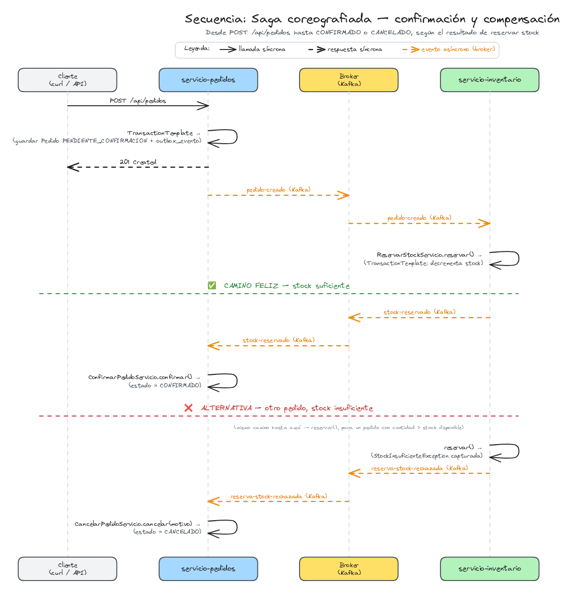

# Capítulo 13 — Patrón Saga coreografiada

Decimotercer capítulo del tutorial "De cero a pro en arquitectura de microservicios con Spring Boot" (ver el índice completo de capítulos en la rama `main`). Parte directamente de `capitulo-12-outbox-transaccional`.

## Índice

1. [Motivación y arquitectura general del capítulo](#1-motivación-y-arquitectura-general-del-capítulo)
2. [Los eventos de resultado y la compensación](#2-los-eventos-de-resultado-y-la-compensación)
3. [Cómo probarlo](#3-cómo-probarlo)
4. [Registro de archivos del capítulo](#4-registro-de-archivos-del-capítulo)
5. [Referencias](#5-referencias)

---

## 1. Motivación y arquitectura general del capítulo

Desde el capítulo 12, crear un pedido dispara una cadena de pasos que cruza dos microservicios: `servicio-pedidos` guarda el `Pedido` y, vía Outbox transaccional, publica `PedidoCreadoEvento` en Kafka; `servicio-inventario` lo consume y `ReservarStockServicio` decrementa el stock de cada línea. Esa cadena funciona bien mientras todo sale bien. La pregunta que este capítulo responde es la contraria: **¿qué pasa si `reservar(...)` falla?**

`Stock.decrementar(...)` lanza `StockInsuficienteException` si la cantidad pedida supera la disponible, y `ReservarStockServicio` puede lanzar también `StockNoEncontradoException` si el producto no tiene fila de stock. Ahora mismo, ese fallo se pierde. `PedidoCreadoConsumidorConfiguracion` no captura la excepción, así que sube hasta el contenedor de Kafka que gestiona por debajo Spring Cloud Stream. Sin ninguna configuración de reintentos propia, ese contenedor aplica su comportamiento por defecto: **10 reintentos** sobre el mismo mensaje (`spring.cloud.stream...consumer.max-attempts` no se ha fijado, así que no manda — sin DLQ activa, el binder de Kafka cae al valor por defecto del contenedor de Spring for Apache Kafka, no al 3 propio de Spring Cloud Stream). Como la excepción es determinista — el stock sigue siendo insuficiente en el reintento 10 igual que en el 1 —, esos diez intentos no cambian nada. Agotados, el `DefaultErrorHandler` se limita a **loguear el error y confirmar el offset**: el mensaje se da por consumido, y `servicio-inventario` sigue con el siguiente sin volver a intentarlo.

Mientras tanto, `servicio-pedidos` no se entera de nada. Ya devolvió `201 Created` al cliente en cuanto `CrearPedidoServicio` guardó el `Pedido` — antes incluso de que Kafka entregara el evento. El pedido queda confirmado en su propia base de datos con un estado que dice "creado con éxito", mientras que, en la base de datos de `servicio-inventario`, el stock nunca se decrementó. Dos bases de datos autónomas, cada una consistente *por separado*, pero **inconsistentes entre sí** respecto a un mismo hecho de negocio.

> **¿Por qué no una transacción distribuida que cubra las dos bases de datos?**
>
> Porque cada microservicio es dueño exclusivo de su propia base de datos — la misma decisión que ya se tomó en el capítulo 6 (persistencia políglota: Neo4j para `servicio-catalogo`, PostgreSQL para `servicio-pedidos`/`servicio-inventario`) y que este proyecto no se plantea revertir. Un commit de dos fases (2PC) exigiría que ambas bases de datos participaran del mismo protocolo de transacción — algo que ni Neo4j y PostgreSQL comparten, ni encajaría con brokers de mensajería como Kafka o RabbitMQ de por medio. La alternativa no es *evitar* la inconsistencia, sino aceptarla como transitoria y *repararla* con un paso más una vez se detecta — que es exactamente lo que resuelve una **Saga**.

Una **Saga** parte una transacción de negocio que cruza varios microservicios en una secuencia de pasos locales, cada uno con su propia acción de compensación: si un paso falla, los pasos anteriores ya confirmados se deshacen uno a uno, en orden inverso, mediante una operación de negocio nueva — no un *rollback* de base de datos, porque cada paso ya hizo su propio commit local e irreversible por esa vía. En este capítulo la Saga tiene dos pasos: **crear el pedido** (ya existente, capítulo 6) y **reservar el stock** (ya existente, capítulo 12). Si el segundo falla, la **acción de compensación** es cancelar el pedido del primero.

Hay dos formas de implementar una Saga. En la **coreografía** — la que cubre este capítulo — no hay ningún componente central que sepa la secuencia completa: cada microservicio reacciona a los eventos de los demás y publica los suyos propios, y el flujo entero solo existe como la suma de esas reacciones individuales. En la **orquestación** — que un capítulo posterior explorará sobre este mismo escenario — un componente dedicado sí conoce y dirige la secuencia completa, llamando a cada paso explícitamente y decidiendo cuándo compensar. Este capítulo elige coreografía porque reutiliza sin fricción la infraestructura que los capítulos 11 y 12 ya dejaron construida — eventos de dominio sobre Kafka/RabbitMQ, Outbox transaccional, consumidores idempotentes. Una acción de compensación no deja de ser, mecánicamente, un evento más y un `Consumer<T>` más.

En términos concretos, `servicio-inventario` publica un nuevo evento con el resultado de `reservar(...)` — éxito o fracaso —, y `servicio-pedidos` lo consume para confirmar el pedido o compensarlo cancelándolo. El detalle de esos eventos nuevos y su implementación se desarrolla en las secciones siguientes.

## 2. Los eventos de resultado y la compensación

### `Pedido` necesita estado

Hasta este capítulo, `Pedido` no tenía ningún concepto de estado — se creaba y ya está, no había nada más que distinguir. Eso ya no alcanza: ahora hay un momento intermedio, entre que el pedido se guarda y que se sabe si la reserva de stock salió bien, y hace falta poder "confirmarlo" o "cancelarlo" según el resultado.

```java
// dominio/modelo/objetovalor/EstadoPedido.java
public enum EstadoPedido {
	PENDIENTE_CONFIRMACION,
	CONFIRMADO,
	CANCELADO
}
```

`Pedido.crear(...)` arranca en `PENDIENTE_CONFIRMACION` — guardar el pedido ya no equivale a confirmarlo. Los dos métodos nuevos hacen la transición:

```java
// dominio/modelo/agregado/Pedido.java
public void confirmar() {
	if (estado == EstadoPedido.CONFIRMADO) {
		return;
	}
	this.estado = EstadoPedido.CONFIRMADO;
}

public void cancelar(String motivo) {
	if (estado == EstadoPedido.CANCELADO) {
		return;
	}
	this.estado = EstadoPedido.CANCELADO;
	this.motivoCancelacion = motivo;
}
```

Ambos comprueban el estado actual antes de tocar nada — no por una regla de negocio elaborada, sino porque un evento de Kafka reentregado tiene que poder llegar dos veces sin romper nada. La comprobación es idempotencia, la misma preocupación del capítulo 12, resuelta aquí sin ninguna tabla aparte. El propio `estado` del agregado ya es el marcador de "esto ya se procesó" — a diferencia de `servicio-inventario`, que necesitó `pedidos_procesados` porque `Stock` no tiene ningún campo que sirva de por sí para esa pregunta.

### Los dos eventos de resultado, en `servicio-inventario`

`servicio-inventario` gana un paquete `dominio.evento` que hasta ahora no necesitaba — consumía eventos ajenos, pero nunca había publicado uno propio.

```java
// dominio/evento/StockReservadoEvento.java
public record StockReservadoEvento(String pedidoId, Instant ocurridoEn) {
}
```

```java
// dominio/evento/ReservaStockRechazadaEvento.java
public record ReservaStockRechazadaEvento(String pedidoId, String motivo, Instant ocurridoEn) {
}
```

`motivo` lleva directamente el mensaje de `StockInsuficienteException`/`StockNoEncontradoException` — legible, sin que `servicio-pedidos` necesite conocer esas dos excepciones concretas ni distinguir entre ellas. Le basta con saber que la reserva se rechazó y por qué, en una frase.

### El Outbox transaccional de `servicio-inventario`

Publicar cualquiera de los dos eventos es un efecto secundario de una escritura en base de datos — decrementar el stock, o simplemente registrar el resultado. Es el mismo problema de doble escritura que el capítulo 12 ya resolvió con Outbox transaccional, solo que ahora en el otro extremo de la conversación. La solución es la misma pieza, reutilizada tal cual: una tabla `outbox_evento` propia de `servicio-inventario`,

```sql
-- db/migration/V2__crear_tabla_outbox.sql
CREATE TABLE outbox_evento (
    id           BIGSERIAL PRIMARY KEY,
    tipo_evento  VARCHAR(255)             NOT NULL,
    payload      TEXT                     NOT NULL,
    ocurrido_en  TIMESTAMP WITH TIME ZONE NOT NULL,
    publicado    BOOLEAN                  NOT NULL DEFAULT FALSE
);
```

y su propio poller. La única diferencia real con el de `servicio-pedidos` es que aquél solo tenía un tipo de evento posible y publicaba siempre en el mismo *binding*; aquí hay dos, así que el poller tiene que decidir a cuál de los dos enviar cada fila según su `tipoEvento`:

```java
// infraestructura/adaptador/salida/mensajeria/OutboxPollerScheduler.java
private static final Map<String, String> BINDING_POR_TIPO_EVENTO = Map.of(
		StockReservadoEvento.class.getSimpleName(), "stockReservado-out-0",
		ReservaStockRechazadaEvento.class.getSimpleName(), "reservaStockRechazada-out-0");

@Scheduled(fixedDelay = 2000)
@Transactional
public void publicarEventosPendientes() {
	for (OutboxEventoEntidad evento : outboxEventoRepositorioJpa.findByPublicadoFalseOrderByIdAsc()) {
		String binding = BINDING_POR_TIPO_EVENTO.get(evento.getTipoEvento());
		streamBridge.send(binding, MessageBuilder.withPayload(evento.getPayload())
				.setHeader(MessageHeaders.CONTENT_TYPE, MimeTypeUtils.APPLICATION_JSON)
				.build());
		evento.marcarPublicado();
	}
}
```

Los dos *bindings* de salida van sobre Kafka, igual que `pedido-creado` — es la continuación de la misma conversación asíncrona, así que tiene sentido que viaje por el mismo *broker*.

### `ReservarStockServicio`: por qué vuelve `TransactionTemplate`

Desde el capítulo 12, `reservar(...)` dejaba subir `StockInsuficienteException`/`StockNoEncontradoException` sin más — el consumidor de Kafka las capturaba (mal, [según vimos en la sección 1](#1-motivación-y-arquitectura-general-del-capítulo)) y ahí moría el fallo. Ahora la excepción tiene que convertirse en un evento en vez de propagarse:

```java
// aplicacion/servicio/ReservarStockServicio.java
public void reservar(String pedidoId, List<LineaReservaDTO> lineas) {
	if (pedidoProcesadoPuertoSalida.yaProcesado(pedidoId)) {
		log.info("Pedido {} ya procesado, se descarta el duplicado", pedidoId);
		return;
	}
	try {
		transactionTemplate.executeWithoutResult(status -> {
			lineas.forEach(linea -> {
				ProductoId productoId = ProductoId.de(linea.productoId());
				Stock stock = stockRepositorioPuertoSalida.buscarPorProductoId(productoId)
						.orElseThrow(() -> new StockNoEncontradoException(productoId));
				stock.decrementar(linea.cantidad());
				stockRepositorioPuertoSalida.guardar(stock);
			});
			pedidoProcesadoPuertoSalida.marcarProcesado(pedidoId);
			outboxPuertoSalida.guardar(new StockReservadoEvento(pedidoId, Instant.now()));
		});
	} catch (StockInsuficienteException | StockNoEncontradoException e) {
		transactionTemplate.executeWithoutResult(status -> {
			pedidoProcesadoPuertoSalida.marcarProcesado(pedidoId);
			outboxPuertoSalida.guardar(new ReservaStockRechazadaEvento(pedidoId, e.getMessage(), Instant.now()));
		});
	}
}
```

Nótese que ya no lleva `@Transactional` en la firma del método, y no es un descuido — no puede llevarlo. Hacen falta **dos** transacciones separadas, no una. Si el intento de reservar falla a mitad de un pedido con varias líneas, las líneas ya decrementadas antes de la que falló tienen que deshacerse (`transactionTemplate.executeWithoutResult(...)` hace *rollback* de todo su bloque al escapar una excepción), pero el registro del resultado — marcar el pedido como procesado y guardar `ReservaStockRechazadaEvento` — tiene que sobrevivir a ese *rollback*, no formar parte de él. Un único `@Transactional` envolviendo todo el método no puede tener dos desenlaces distintos para dos partes de sí mismo; `TransactionTemplate`, invocado dos veces, sí — la misma regla práctica del capítulo 12 ("¿hay trabajo que no debe formar parte de la misma transacción que el resto?"), aplicada aquí no a una llamada HTTP sino a la propia posibilidad de fallo.

### `servicio-pedidos` confirma o cancela

Del lado de `servicio-pedidos`, cada evento tiene su propia traducción (Capa Anticorrupción) y su propio `Consumer<T>`:

```java
// infraestructura/adaptador/entrada/mensajeria/StockReservadoConsumidorConfiguracion.java
@Bean
public Consumer<StockReservadoEventoDTO> stockReservadoConsumidor() {
	return evento -> confirmarPedidoPuertoEntrada.confirmar(evento.pedidoId());
}
```

`ReservaStockRechazadaConsumidorConfiguracion` es igual, solo que llama a `cancelarPedidoPuertoEntrada.cancelar(evento.pedidoId(), evento.motivo())`. Los dos servicios de aplicación detrás siguen el mismo patrón: cargar el `Pedido`, aplicar la transición (`confirmar()`/`cancelar(motivo)`, ya idempotentes por sí solas) y guardar.

```java
// aplicacion/servicio/CancelarPedidoServicio.java
@Override
@Transactional
public void cancelar(String pedidoId, String motivo) {
	Pedido pedido = pedidoRepositorioPuertoSalida.buscarPorId(PedidoId.de(pedidoId))
			.orElseThrow(() -> new PedidoNoEncontradoException(pedidoId));
	pedido.cancelar(motivo);
	pedidoRepositorioPuertoSalida.guardar(pedido);
}
```

`cancelar(...)` es la acción de compensación de la Saga. Es lo que deshace, en términos de negocio, el efecto de haber creado el pedido — no un *rollback*, porque el `INSERT` original ya hizo *commit* hace rato; es un `UPDATE` nuevo que dice "esto ya no vale".

## 3. Cómo probarlo



*Secuencia completa de los pasos que siguen a continuación, con los dos caminos de la Saga a partir de `reservar stock` — confirmación (arriba) y compensación (abajo).*
<br>

```bash
# Todos los tests del reactor (los tres microservicios)
./mvnw test
```

Igual que en el capítulo 12, hace falta el Kafka compartido de la raíz arrancado antes que cualquier microservicio:

```bash
docker compose up -d
```

```bash
./mvnw -pl servicio-catalogo spring-boot:run &
```

```bash
./mvnw -pl servicio-pedidos spring-boot:run &
```

```bash
./mvnw -pl servicio-inventario spring-boot:run &
```

Categoría y producto en el catálogo — el alta del producto dispara, de fondo, la creación de su stock en `servicio-inventario` (100 unidades):

```bash
curl -X POST http://localhost:8080/api/categorias \
  -H "Content-Type: application/json" \
  -d '{"nombre":"Deportes"}'
# => {"id":"<categoriaId>","nombre":"Deportes"}
```

```bash
curl -X POST http://localhost:8080/api/productos \
  -H "Content-Type: application/json" \
  -d '{"nombre":"Balón","descripcion":"Balón de fútbol","precio":25.0,"categoriaId":"<categoriaId>"}'
# => {"id":"<productoId>","nombre":"Balón", ...}
```

**Camino feliz**: un pedido que el stock puede cubrir de sobra.

```bash
curl -X POST http://localhost:8081/api/pedidos \
  -H "Content-Type: application/json" \
  -d '{"clienteId":"3fa85f64-5717-4562-b3fc-2c963f66afa6","lineas":[{"productoId":"<productoId>","cantidad":5}]}'
# => {"id":"<pedidoId>", ...} — 201 Created, igual que siempre
```

A los pocos segundos (Outbox + poller, cada 2 s, ida y vuelta):

```bash
docker exec -it servicio-pedidos-postgres-1 psql -U pedidos -d pedidos \
  -c "SELECT id, estado, motivo_cancelacion FROM pedidos WHERE id = '<pedidoId>';"
# => estado = CONFIRMADO, motivo_cancelacion = NULL
```

```bash
docker exec -it servicio-inventario-postgres-1 psql -U inventario -d inventario \
  -c "SELECT * FROM stock WHERE producto_id = '<productoId>';"
# => cantidad = 95
```

**Camino de compensación**: un segundo pedido que pide más unidades de las que quedan (95).

```bash
curl -X POST http://localhost:8081/api/pedidos \
  -H "Content-Type: application/json" \
  -d '{"clienteId":"3fa85f64-5717-4562-b3fc-2c963f66afa6","lineas":[{"productoId":"<productoId>","cantidad":150}]}'
# => {"id":"<otroPedidoId>", ...} — sigue devolviendo 201 Created: el fallo se detecta después,
# de forma asíncrona, no en esta respuesta HTTP
```

```bash
docker exec -it servicio-pedidos-postgres-1 psql -U pedidos -d pedidos \
  -c "SELECT id, estado, motivo_cancelacion FROM pedidos WHERE id = '<otroPedidoId>';"
# => estado = CANCELADO, motivo_cancelacion = 'Stock insuficiente para el producto <productoId>: disponible 95, solicitado 150'
```

```bash
docker exec -it servicio-inventario-postgres-1 psql -U inventario -d inventario \
  -c "SELECT * FROM stock WHERE producto_id = '<productoId>';"
# => cantidad = 95 — sin cambios: la reserva fallida no decrementa nada
```

El resultado también se ve en **Kafbat UI** (`http://localhost:8090`): dos *topics* nuevos, `stock-reservado` y `reserva-stock-rechazada`, cada uno con el `pedidoId` correspondiente en su *payload*.

Para parar los tres procesos y la infraestructura:

```bash
pkill -f "spring-boot:run"
```

```bash
docker compose down
```

## 4. Registro de archivos del capítulo

Leyenda: 🌱 Creado · ✏️ Actualizado · 🗑️ Eliminado.

### Build y configuración

|  | Archivo | Descripción funcional | Descripción del cambio |
|:---:|---|---|---|
| 🌱 | [`V2__crear_tabla_outbox.sql`](servicio-inventario/src/main/resources/db/migration/V2__crear_tabla_outbox.sql) (servicio-inventario) | Migración Flyway: tabla `outbox_evento` | --- |
| ✏️ | [`application.yml`](servicio-inventario/src/main/resources/application.yml) (servicio-inventario) | Configuración de Spring Boot del microservicio | Añade los *bindings* de salida `stockReservado-out-0`/`reservaStockRechazada-out-0`, sobre Kafka |
| 🌱 | [`V3__anadir_estado_pedido.sql`](servicio-pedidos/src/main/resources/db/migration/V3__anadir_estado_pedido.sql) (servicio-pedidos) | Migración Flyway: columnas `estado` y `motivo_cancelacion` en `pedidos` | --- |
| ✏️ | [`application.yml`](servicio-pedidos/src/main/resources/application.yml) (servicio-pedidos) | Configuración de Spring Boot del microservicio | Añade `spring.cloud.function.definition` y los *bindings* de entrada `stockReservadoConsumidor-in-0`/`reservaStockRechazadaConsumidor-in-0` |

### Dominio (servicio-inventario)

|  | Archivo | Descripción funcional | Descripción del cambio |
|:---:|---|---|---|
| 🌱 | [`StockReservadoEvento.java`](servicio-inventario/src/main/java/com/javacadabra/tienda/inventario/dominio/evento/StockReservadoEvento.java) | Evento de Dominio: la reserva de stock de un pedido se completó | --- |
| 🌱 | [`ReservaStockRechazadaEvento.java`](servicio-inventario/src/main/java/com/javacadabra/tienda/inventario/dominio/evento/ReservaStockRechazadaEvento.java) | Evento de Dominio: la reserva de stock de un pedido se rechazó, con el motivo | --- |

### Dominio (servicio-pedidos)

|  | Archivo | Descripción funcional | Descripción del cambio |
|:---:|---|---|---|
| 🌱 | [`EstadoPedido.java`](servicio-pedidos/src/main/java/com/javacadabra/tienda/pedidos/dominio/modelo/objetovalor/EstadoPedido.java) | Objeto de Valor: estado del pedido (`PENDIENTE_CONFIRMACION`/`CONFIRMADO`/`CANCELADO`) | --- |
| ✏️ | [`Pedido.java`](servicio-pedidos/src/main/java/com/javacadabra/tienda/pedidos/dominio/modelo/agregado/Pedido.java) | Agregado raíz | Añade `estado`/`motivoCancelacion` y los métodos `confirmar()`/`cancelar(motivo)`, ambos idempotentes |
| 🌱 | [`PedidoNoEncontradoException.java`](servicio-pedidos/src/main/java/com/javacadabra/tienda/pedidos/dominio/excepcion/PedidoNoEncontradoException.java) | Excepción de dominio: no existe un pedido con el id dado | --- |

### Aplicación (servicio-inventario)

|  | Archivo | Descripción funcional | Descripción del cambio |
|:---:|---|---|---|
| 🌱 | [`OutboxPuertoSalida.java`](servicio-inventario/src/main/java/com/javacadabra/tienda/inventario/aplicacion/puerto/salida/OutboxPuertoSalida.java) | Puerto de salida: guardar `StockReservadoEvento`/`ReservaStockRechazadaEvento` en la tabla outbox | --- |
| ✏️ | [`ReservarStockServicio.java`](servicio-inventario/src/main/java/com/javacadabra/tienda/inventario/aplicacion/servicio/ReservarStockServicio.java) | Servicio de aplicación, caso de uso reservar stock | Ya no propaga `StockInsuficienteException`/`StockNoEncontradoException`: las captura y publica el evento de resultado correspondiente; vuelve a `TransactionTemplate` (dos transacciones separadas) en vez de `@Transactional` |

### Aplicación (servicio-pedidos)

|  | Archivo | Descripción funcional | Descripción del cambio |
|:---:|---|---|---|
| 🌱 | [`ConfirmarPedidoPuertoEntrada.java`](servicio-pedidos/src/main/java/com/javacadabra/tienda/pedidos/aplicacion/puerto/entrada/ConfirmarPedidoPuertoEntrada.java) | Puerto de entrada, caso de uso confirmar un pedido | --- |
| 🌱 | [`CancelarPedidoPuertoEntrada.java`](servicio-pedidos/src/main/java/com/javacadabra/tienda/pedidos/aplicacion/puerto/entrada/CancelarPedidoPuertoEntrada.java) | Puerto de entrada, caso de uso cancelar un pedido (acción de compensación) | --- |
| ✏️ | [`PedidoRepositorioPuertoSalida.java`](servicio-pedidos/src/main/java/com/javacadabra/tienda/pedidos/aplicacion/puerto/salida/PedidoRepositorioPuertoSalida.java) | Puerto de salida de persistencia de pedidos | Añade `buscarPorId(PedidoId)` |
| 🌱 | [`ConfirmarPedidoServicio.java`](servicio-pedidos/src/main/java/com/javacadabra/tienda/pedidos/aplicacion/servicio/ConfirmarPedidoServicio.java) | Confirma un pedido tras una reserva de stock exitosa | --- |
| 🌱 | [`CancelarPedidoServicio.java`](servicio-pedidos/src/main/java/com/javacadabra/tienda/pedidos/aplicacion/servicio/CancelarPedidoServicio.java) | Cancela un pedido tras una reserva de stock rechazada | --- |

### Infraestructura de entrada (servicio-pedidos)

|  | Archivo | Descripción funcional | Descripción del cambio |
|:---:|---|---|---|
| 🌱 | [`StockReservadoEventoDTO.java`](servicio-pedidos/src/main/java/com/javacadabra/tienda/pedidos/infraestructura/adaptador/entrada/mensajeria/StockReservadoEventoDTO.java) | Traducción propia (Capa Anticorrupción) del `StockReservadoEvento` ajeno | --- |
| 🌱 | [`ReservaStockRechazadaEventoDTO.java`](servicio-pedidos/src/main/java/com/javacadabra/tienda/pedidos/infraestructura/adaptador/entrada/mensajeria/ReservaStockRechazadaEventoDTO.java) | Traducción propia (Capa Anticorrupción) del `ReservaStockRechazadaEvento` ajeno | --- |
| 🌱 | [`StockReservadoConsumidorConfiguracion.java`](servicio-pedidos/src/main/java/com/javacadabra/tienda/pedidos/infraestructura/adaptador/entrada/mensajeria/StockReservadoConsumidorConfiguracion.java) | Consumidor de `stock-reservado` sobre Kafka | --- |
| 🌱 | [`ReservaStockRechazadaConsumidorConfiguracion.java`](servicio-pedidos/src/main/java/com/javacadabra/tienda/pedidos/infraestructura/adaptador/entrada/mensajeria/ReservaStockRechazadaConsumidorConfiguracion.java) | Consumidor de `reserva-stock-rechazada` sobre Kafka | --- |

### Infraestructura de salida (servicio-inventario)

|  | Archivo | Descripción funcional | Descripción del cambio |
|:---:|---|---|---|
| 🌱 | [`OutboxEventoEntidad.java`](servicio-inventario/src/main/java/com/javacadabra/tienda/inventario/infraestructura/adaptador/salida/persistencia/entidad/OutboxEventoEntidad.java) | Entidad JPA de la tabla `outbox_evento` | --- |
| 🌱 | [`OutboxEventoRepositorioJpa.java`](servicio-inventario/src/main/java/com/javacadabra/tienda/inventario/infraestructura/adaptador/salida/persistencia/repositorio/OutboxEventoRepositorioJpa.java) | Repositorio Spring Data de `outbox_evento` | --- |
| 🌱 | [`OutboxRepositorioAdaptador.java`](servicio-inventario/src/main/java/com/javacadabra/tienda/inventario/infraestructura/adaptador/salida/persistencia/adaptador/OutboxRepositorioAdaptador.java) | Adaptador de salida: serializa el evento a JSON y lo guarda en la tabla outbox | --- |
| 🌱 | [`OutboxPollerScheduler.java`](servicio-inventario/src/main/java/com/javacadabra/tienda/inventario/infraestructura/adaptador/salida/mensajeria/OutboxPollerScheduler.java) | Sondea la tabla outbox cada 2 s y publica en Kafka, enrutando por `tipoEvento` a uno de los dos *bindings* | --- |

### Infraestructura de salida (servicio-pedidos)

|  | Archivo | Descripción funcional | Descripción del cambio |
|:---:|---|---|---|
| ✏️ | [`PedidoEntidad.java`](servicio-pedidos/src/main/java/com/javacadabra/tienda/pedidos/infraestructura/adaptador/salida/persistencia/entidad/PedidoEntidad.java) | Entidad JPA de la tabla `pedidos` | Añade las columnas `estado` y `motivoCancelacion` |
| ✏️ | [`PedidoEntidadMapper.java`](servicio-pedidos/src/main/java/com/javacadabra/tienda/pedidos/infraestructura/adaptador/salida/persistencia/mapper/PedidoEntidadMapper.java) | Mapper MapStruct dominio↔entidad de `Pedido` | Mapea `estado`/`motivoCancelacion` en ambas direcciones |
| ✏️ | [`PedidoRepositorioAdaptador.java`](servicio-pedidos/src/main/java/com/javacadabra/tienda/pedidos/infraestructura/adaptador/salida/persistencia/adaptador/PedidoRepositorioAdaptador.java) | Adaptador de salida de persistencia de pedidos | Implementa `buscarPorId(PedidoId)` |

### Documentación/diagramas

|  | Archivo | Descripción funcional | Descripción del cambio |
|:---:|---|---|---|
| 🌱 | [`capitulo-13-secuencia-saga.excalidraw`](docs/diagramas/capitulo-13-secuencia-saga.excalidraw) | Diagrama de secuencia de la Saga coreografiada, con los dos caminos (confirmación/compensación) | --- |
| 🌱 | [`secuencia-saga.png`](docs/images/capitulo-13/secuencia-saga.png) | Render PNG del diagrama anterior | --- |

### Tests

|  | Archivo | Descripción funcional | Descripción del cambio |
|:---:|---|---|---|
| ✏️ | [`ReservarStockServicioTest.java`](servicio-inventario/src/test/java/com/javacadabra/tienda/inventario/aplicacion/servicio/ReservarStockServicioTest.java) | Test unitario de `ReservarStockServicio` | Añade los mocks de `OutboxPuertoSalida` y `TransactionTemplate`; el caso de stock insuficiente ya no espera una excepción, verifica que se publica `ReservaStockRechazadaEvento` |
| ✏️ | [`PedidoTest.java`](servicio-pedidos/src/test/java/com/javacadabra/tienda/pedidos/dominio/modelo/agregado/PedidoTest.java) | Test unitario del agregado `Pedido` | Añade casos de `confirmar()`/`cancelar(motivo)`, incluida la idempotencia del motivo de cancelación |
| 🌱 | [`ConfirmarPedidoServicioTest.java`](servicio-pedidos/src/test/java/com/javacadabra/tienda/pedidos/aplicacion/servicio/ConfirmarPedidoServicioTest.java) | Test unitario de `ConfirmarPedidoServicio` (Mockito) | --- |
| 🌱 | [`CancelarPedidoServicioTest.java`](servicio-pedidos/src/test/java/com/javacadabra/tienda/pedidos/aplicacion/servicio/CancelarPedidoServicioTest.java) | Test unitario de `CancelarPedidoServicio` (Mockito) | --- |
| ✏️ | [`CatalogoAdaptadorResilienciaTest.java`](servicio-pedidos/src/test/java/com/javacadabra/tienda/pedidos/infraestructura/adaptador/salida/http/adaptador/CatalogoAdaptadorResilienciaTest.java) | Test del *circuit breaker* hacia catálogo | Añade `spring.cloud.function.definition=` vacío, para no intentar levantar *bindings* de consumidor Kafka reales |
| ✏️ | [`PedidoControllerRestTestClientIntegrationTest.java`](servicio-pedidos/src/test/java/com/javacadabra/tienda/pedidos/infraestructura/adaptador/entrada/rest/PedidoControllerRestTestClientIntegrationTest.java) | Test extremo a extremo del controlador de pedidos | Mismo ajuste que el anterior |

## 5. Referencias

- [microservices.io — Pattern: Saga](https://microservices.io/patterns/data/saga.html)
- [microservices.io — Implementing a choreography-based saga](https://microservices.io/post/sagas/2019/08/15/developing-sagas-part-3.html)
- [Spring Cloud Stream — Reference Documentation](https://docs.spring.io/spring-cloud-stream/reference/)
