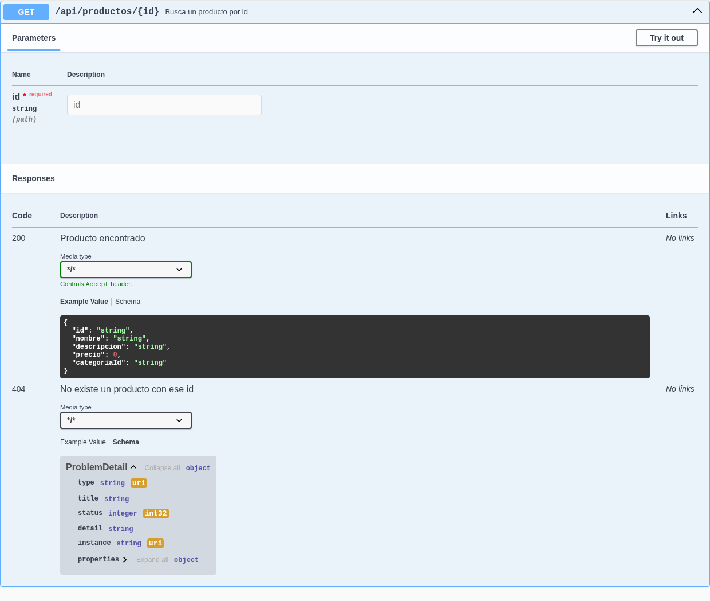

# Capítulo 05 — ProblemDetail (RFC 7807)

Quinto capítulo del tutorial "De cero a pro en arquitectura de microservicios con Spring Boot" (ver el índice completo de capítulos en la rama `main`). Parte directamente de `capitulo-04-eventos-dominio`. Este capítulo no introduce un microservicio nuevo — sigue trabajando sobre `servicio-catalogo`.

## Índice

1. [Introducción](#1-introducción)
2. [Detalles del Problema (Problem Details): la RFC detrás de `ProblemDetail`](#2-detalles-del-problema-problem-details-la-rfc-detrás-de-problemdetail)
3. [`ControladorErroresGlobal`: de texto plano a `ProblemDetail`](#3-controladorerroresglobal-de-texto-plano-a-problemdetail)
4. [Actualizar las anotaciones Swagger del capítulo 3](#4-actualizar-las-anotaciones-swagger-del-capítulo-3)
5. [Cómo probarlo](#5-cómo-probarlo)
6. [Registro de archivos del capítulo](#6-registro-de-archivos-del-capítulo)
7. [Referencias](#7-referencias)

---

## 1. Introducción

`ControladorErroresGlobal` (capítulo 1) resuelve el problema de centralizar el manejo de excepciones — un único `@RestControllerAdvice` en vez de un `try/catch` repetido en cada controller — pero lo que envía al cliente es solo el mensaje de la excepción como texto plano: `ResponseEntity<String>` con `excepcion.getMessage()` en el cuerpo. Funciona mientras el único consumidor sea un humano leyendo Swagger UI, pero un texto libre no le sirve de mucho a un cliente programático: no hay forma fiable de distinguir "categoría no encontrada" de "producto no encontrado" sin analizar el propio texto del mensaje, ni de extraer el id que causó el error sin *parsear* una frase pensada para leerse, no para procesarse.

Este capítulo sustituye ese texto plano por [Detalles del Problema (Problem Details)](#2-detalles-del-problema-problem-details-la-rfc-detrás-de-problemdetail): un formato estándar y estructurado para modelar errores HTTP, con soporte nativo en Spring desde la versión 6 vía la clase `ProblemDetail`. De paso, las anotaciones Swagger del capítulo 3 que documentaban ese texto plano (`@Schema(implementation = String.class)`) se actualizan para reflejar el nuevo esquema — ver [sección 4](#4-actualizar-las-anotaciones-swagger-del-capítulo-3).

---

## 2. Detalles del Problema (Problem Details): la RFC detrás de `ProblemDetail`

Detalles del Problema (Problem Details) es un formato JSON estandarizado para representar errores en APIs HTTP, definido originalmente en la [RFC 7807](https://www.rfc-editor.org/rfc/rfc7807) (2016) y sustituido desde 2023 por la [RFC 9457](https://www.rfc-editor.org/rfc/rfc9457), que la obsoleta formalmente sin cambiar su forma básica — de ahí que RFC 7807 siga siendo el nombre con el que se identifica al patrón en la práctica, aunque la documentación oficial de Spring ya referencia la 9457. Define cinco campos:

| Campo | Significado |
|---|---|
| `type` | URI que identifica el tipo de problema. No hace falta que resuelva a una página real — es un identificador, aunque la RFC recomienda que si se resuelve, devuelva documentación legible para humanos. Por defecto, `"about:blank"`. |
| `title` | Resumen corto y legible del tipo de problema, constante para todas las instancias del mismo `type` (a diferencia de `detail`, que sí varía). |
| `status` | El código de estado HTTP, repetido aquí para que un cliente que solo mira el cuerpo (y no la cabecera HTTP) también lo tenga. |
| `detail` | Explicación específica de esta instancia del problema — aquí es donde antes iba todo el mensaje de la excepción. |
| `instance` | URI que identifica esta ocurrencia concreta del problema (típicamente, la ruta de la petición que falló). |

La RFC permite además **extensiones**: propiedades adicionales, específicas de cada `type`, que viajan al mismo nivel que los cinco campos anteriores (no anidadas). Es el mecanismo que este capítulo usa para incluir, por ejemplo, el id del producto que no se encontró.

Spring Framework modela este formato con la clase `org.springframework.http.ProblemDetail` (desde Spring 6 / Spring Boot 3), con soporte directo en Spring MVC: un método anotado con `@ExceptionHandler` puede devolver un `ProblemDetail` igual que devolvería cualquier otro tipo, y Spring se encarga de serializarlo con `Content-Type: application/problem+json` y de rellenar `instance` automáticamente con la ruta de la petición.

> **¿Por qué no lanzar directamente `ErrorResponseException` en el dominio?**
>
> Spring también ofrece `ErrorResponseException`, una excepción que ya implementa la interfaz `ErrorResponse` y lleva su propio `ProblemDetail` incorporado — lanzarla evitaría el `@ExceptionHandler` por completo, porque `ResponseEntityExceptionHandler` (otra clase de Spring) ya sabe convertirla en la respuesta HTTP. Pero eso obligaría a las excepciones del paquete `dominio.excepcion` a extender una clase de `org.springframework.web`, exactamente el acoplamiento a un framework que la capa de dominio de este proyecto evita en cualquier otra circunstancia. Mantener `CategoriaNoEncontradaException`/`ProductoNoEncontradoException` como `RuntimeException` planas y traducirlas a `ProblemDetail` en `ControladorErroresGlobal` — que ya vive en `infraestructura`, la capa que sí conoce Spring — deja esa traducción donde corresponde.

---

## 3. `ControladorErroresGlobal`: de texto plano a `ProblemDetail`

Cada `@ExceptionHandler` pasa de devolver `ResponseEntity<String>` a devolver `ProblemDetail`, construido con el factory estático `ProblemDetail.forStatusAndDetail(HttpStatus, String)` y completado con `setType(...)`/`setTitle(...)`/`setProperty(...)`:

```java
@RestControllerAdvice
public class ControladorErroresGlobal {

	private static final URI TIPO_PRODUCTO_NO_ENCONTRADO = URI.create("https://tienda.javacadabra.com/problemas/producto-no-encontrado");
	private static final URI TIPO_CATEGORIA_NO_ENCONTRADA = URI.create("https://tienda.javacadabra.com/problemas/categoria-no-encontrada");
	private static final URI TIPO_ARGUMENTO_INVALIDO = URI.create("https://tienda.javacadabra.com/problemas/argumento-invalido");

	@ExceptionHandler(ProductoNoEncontradoException.class)
	public ProblemDetail manejarProductoNoEncontrado(ProductoNoEncontradoException excepcion) {
		ProblemDetail problema = ProblemDetail.forStatusAndDetail(HttpStatus.NOT_FOUND, excepcion.getMessage());
		problema.setType(TIPO_PRODUCTO_NO_ENCONTRADO);
		problema.setTitle("Producto no encontrado");
		problema.setProperty("productoId", excepcion.getId());
		return problema;
	}

	@ExceptionHandler(CategoriaNoEncontradaException.class)
	public ProblemDetail manejarCategoriaNoEncontrada(CategoriaNoEncontradaException excepcion) {
		ProblemDetail problema = ProblemDetail.forStatusAndDetail(HttpStatus.NOT_FOUND, excepcion.getMessage());
		problema.setType(TIPO_CATEGORIA_NO_ENCONTRADA);
		problema.setTitle("Categoría no encontrada");
		problema.setProperty("categoriaId", excepcion.getId());
		return problema;
	}

	@ExceptionHandler(IllegalArgumentException.class)
	public ProblemDetail manejarArgumentoInvalido(IllegalArgumentException excepcion) {
		ProblemDetail problema = ProblemDetail.forStatusAndDetail(HttpStatus.BAD_REQUEST, excepcion.getMessage());
		problema.setType(TIPO_ARGUMENTO_INVALIDO);
		problema.setTitle("Argumento inválido");
		return problema;
	}
}
```

Dos decisiones de diseño:

- **`productoId`/`categoriaId` como extensión, no en `detail`**: antes, el id solo existía dentro del texto del mensaje (`"No se ha encontrado el producto con id: " + id`). Para exponerlo como campo estructurado, `ProductoNoEncontradoException`/`CategoriaNoEncontradaException` ganan un campo `id` (con `@Getter` de Lombok) que antes no almacenaban — solo lo usaban para construir el mensaje y lo descartaban.
- **`manejarArgumentoInvalido` no lleva extensión propia**: a diferencia de los dos anteriores, `IllegalArgumentException` la lanzan varios sitios distintos del dominio (`Precio`, `CategoriaId`, `ProductoId`, `Categoria`, `Producto`) por motivos distintos cada vez — un precio negativo, un nombre vacío, un producto que se recomienda a sí mismo. No hay un campo único y consistente que extraer de todas esas causas, así que este handler se queda con `type`/`title`/`detail`/`status`, sin extensión. Las extensiones son opcionales precisamente por esto: se añaden cuando aportan algo estructurable, no en todos los `type` por sistema.

`instance` no aparece en ningún handler porque Spring lo rellena automáticamente con la ruta de la petición que falló — no hace falta construirlo a mano.

---

## 4. Actualizar las anotaciones Swagger del capítulo 3

El capítulo 3 documentó las respuestas `400`/`404` con `@Schema(implementation = String.class)`, porque eso era, literalmente, lo que devolvía `ControladorErroresGlobal`. Con el cambio de la [sección anterior](#3-controladorerroresglobal-de-texto-plano-a-problemdetail), ese esquema ya no es cierto — hay que actualizarlo a `ProblemDetail`, en los dos controllers que documentan ramas de error:

```java
// ProductoController — antes
@ApiResponse(responseCode = "404", description = "No existe un producto con ese id",
		content = @Content(schema = @Schema(implementation = String.class)))

// ProductoController — después
@ApiResponse(responseCode = "404", description = "No existe un producto con ese id",
		content = @Content(schema = @Schema(implementation = ProblemDetail.class)))
```

El mismo cambio aplica a las cinco apariciones repartidas entre `ProductoController` (`crear`, `buscarPorId`, `recomendar`) y `CategoriaController` (`buscarPorId`).

> **¿Por qué el esquema generado muestra `properties` como un objeto anidado, si `categoriaId` viaja al mismo nivel que `detail` en la respuesta real?**
>
> Es una discrepancia real entre lo que dice el esquema OpenAPI y lo que realmente devuelve el endpoint — vale la pena señalarla para no confundirse leyendo Swagger UI. `ProblemDetail` guarda sus extensiones internamente en un campo `Map<String, Object> properties`, y springdoc-openapi genera el esquema reflejando esa forma interna: `properties` aparece como un objeto anidado más, con `additionalProperties` sin tipar. Pero en tiempo de ejecución, Jackson serializa `ProblemDetail` con un método anotado `@JsonAnyGetter` que "aplana" ese mapa: cada entrada (`categoriaId`, `productoId`) sale como un campo suelto al mismo nivel que `type`/`title`/`detail`, no anidada bajo `"properties": {...}`. La [sección 5](#5-cómo-probarlo) lo muestra con una respuesta real para comparar.

---

## 5. Cómo probarlo

```bash
./mvnw -pl servicio-catalogo spring-boot:run
```

Con el servicio arrancado, una petición a un recurso que no existe ya no devuelve texto plano:

```bash
curl -i http://localhost:8080/api/categorias/00000000-0000-0000-0000-000000000000
```

```http
HTTP/1.1 404
Content-Type: application/problem+json

{
  "type": "https://tienda.javacadabra.com/problemas/categoria-no-encontrada",
  "title": "Categoría no encontrada",
  "status": 404,
  "detail": "No se ha encontrado la categoría con id: 00000000-0000-0000-0000-000000000000",
  "instance": "/api/categorias/00000000-0000-0000-0000-000000000000",
  "categoriaId": "00000000-0000-0000-0000-000000000000"
}
```

Nótese `categoriaId` al mismo nivel que el resto de campos — no anidado bajo `properties`, tal como adelanta la nota de la [sección 4](#4-actualizar-las-anotaciones-swagger-del-capítulo-3) — y `Content-Type: application/problem+json`, distinto del `application/json` de una respuesta normal, que le permite a un cliente HTTP detectar que está ante un error estructurado sin necesidad de mirar siquiera el código de estado.

Un id con formato inválido, en cambio, dispara la rama de `IllegalArgumentException` — sin extensión, como se explicó en la [sección 3](#3-controladorerroresglobal-de-texto-plano-a-problemdetail):

```bash
curl -i http://localhost:8080/api/categorias/no-es-un-uuid
```

```http
HTTP/1.1 400
Content-Type: application/problem+json

{
  "type": "https://tienda.javacadabra.com/problemas/argumento-invalido",
  "title": "Argumento inválido",
  "status": 400,
  "detail": "El id de la categoría debe ser un UUID válido: no-es-un-uuid",
  "instance": "/api/categorias/no-es-un-uuid"
}
```

Desde Swagger UI (`http://localhost:8080/swagger-ui.html`, capítulo 3), el esquema `ProblemDetail` ya aparece documentado en las respuestas `400`/`404` de cada endpoint, en vez del `string` del capítulo 3.



*Swagger UI mostrando el esquema `ProblemDetail` (`type`, `title`, `status`, `detail`, `instance`, `properties`) en la respuesta `404` de `GET /api/productos/{id}`.*

<br>

Los tests automatizados existentes (`CrearProductoServicioTest`, `RecomendarProductoServicioTest`, tests de dominio) no verifican el cuerpo de la respuesta HTTP — trabajan a nivel de servicio de aplicación y de dominio, por debajo de `ControladorErroresGlobal` — así que siguen en verde sin cambios:

```bash
./mvnw -pl servicio-catalogo test
```

---

## 6. Registro de archivos del capítulo

Tabla de control de los archivos que forman el contenido de este capítulo.

**Leyenda:** 🌱 Creado · ✏️ Actualizado · 🗑️ Eliminado

### Documentación e imágenes

| | Archivo | Descripción funcional | Descripción del cambio |
|:---:|---|---|:---:|
| 🌱 | [`docs/images/capitulo-05/swagger-ui-problemdetail.png`](docs/images/capitulo-05/swagger-ui-problemdetail.png) | Captura del esquema `ProblemDetail` en Swagger UI, embebida en la [sección 5](#5-cómo-probarlo). | --- |

### Dominio

| | Archivo | Descripción funcional | Descripción del cambio |
|:---:|---|---|:---:|
| ✏️ | [`ProductoNoEncontradoException.java`](servicio-catalogo/src/main/java/com/javacadabra/tienda/catalogo/dominio/excepcion/ProductoNoEncontradoException.java) | Excepción de dominio: no existe un producto con el id indicado. | Añade el campo `id` (con `@Getter` de Lombok) para exponerlo como extensión del `ProblemDetail`. |
| ✏️ | [`CategoriaNoEncontradaException.java`](servicio-catalogo/src/main/java/com/javacadabra/tienda/catalogo/dominio/excepcion/CategoriaNoEncontradaException.java) | Excepción de dominio: no existe una categoría con el id indicado. | Añade el campo `id` (con `@Getter` de Lombok) para exponerlo como extensión del `ProblemDetail`. |

### Infraestructura de entrada

| | Archivo | Descripción funcional | Descripción del cambio |
|:---:|---|---|:---:|
| ✏️ | [`ControladorErroresGlobal.java`](servicio-catalogo/src/main/java/com/javacadabra/tienda/catalogo/infraestructura/adaptador/entrada/rest/ControladorErroresGlobal.java) | `@RestControllerAdvice` centralizado que traduce las excepciones de dominio a respuestas HTTP. | Los tres `@ExceptionHandler` pasan de `ResponseEntity<String>` a `ProblemDetail` (RFC 7807/9457), con `type`/`title` propios por excepción y `productoId`/`categoriaId` como extensión donde aplica. |
| ✏️ | [`ProductoController.java`](servicio-catalogo/src/main/java/com/javacadabra/tienda/catalogo/infraestructura/adaptador/entrada/rest/ProductoController.java) | Adaptador de entrada REST: endpoints de productos. | Las anotaciones `@Schema` de las respuestas `400`/`404` pasan de `implementation = String.class` a `implementation = ProblemDetail.class`. |
| ✏️ | [`CategoriaController.java`](servicio-catalogo/src/main/java/com/javacadabra/tienda/catalogo/infraestructura/adaptador/entrada/rest/CategoriaController.java) | Adaptador de entrada REST: endpoints de categorías. | La anotación `@Schema` de la respuesta `404` pasa de `implementation = String.class` a `implementation = ProblemDetail.class`. |

---

## 7. Referencias

- [RFC 9457 — Problem Details for HTTP APIs](https://www.rfc-editor.org/rfc/rfc9457) (obsoleta la RFC 7807, sin cambiar su forma básica)
- [RFC 7807 — Problem Details for HTTP APIs](https://www.rfc-editor.org/rfc/rfc7807) (RFC original; sigue siendo el nombre por el que se conoce al patrón en la práctica)
- [Spring Framework — Error Responses (Spring MVC)](https://docs.spring.io/spring-framework/reference/web/webmvc/mvc-ann-rest-exceptions.html)
