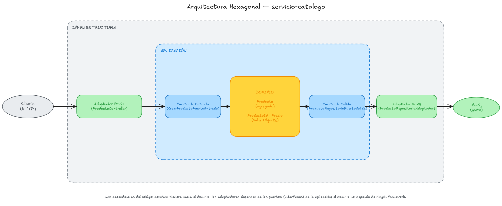
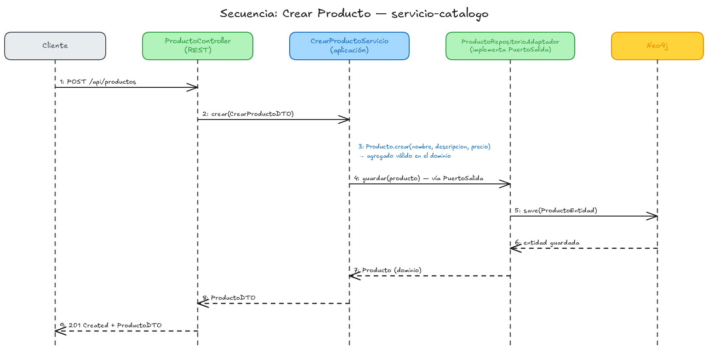

# Capítulo 1 — Fundamentos DDD + Arquitectura Hexagonal

Primer capítulo del libro de aprendizaje "De cero a pro en arquitectura de microservicios con Spring Boot" (ver el índice completo de capítulos en la rama `main`).

## Índice

1. [Introducción](#1-introducción)
2. [Domain-Driven Design: los conceptos que usamos](#2-domain-driven-design-los-conceptos-que-usamos)
3. [Arquitectura Hexagonal (Ports & Adapters)](#3-arquitectura-hexagonal-ports--adapters)
4. [El monorepo Maven multi-módulo](#4-el-monorepo-maven-multi-módulo)
5. [El dominio: el agregado `Producto`](#5-el-dominio-el-agregado-producto)
6. [La aplicación: puertos y casos de uso](#6-la-aplicación-puertos-y-casos-de-uso)
7. [La infraestructura de entrada: el adaptador REST](#7-la-infraestructura-de-entrada-el-adaptador-rest)
8. [Acceso a la base de datos con Spring Data Neo4j](#8-acceso-a-la-base-de-datos-con-spring-data-neo4j)
9. [Testing: de los tests unitarios a Testcontainers](#9-testing-de-los-tests-unitarios-a-testcontainers)
10. [Diagramas](#10-diagramas)
11. [Cómo probarlo de extremo a extremo](#11-cómo-probarlo-de-extremo-a-extremo)
12. [Qué se deja para el capítulo 2](#12-qué-se-deja-para-el-capítulo-2)
13. [Referencias](#13-referencias)

---

## 1. Introducción

Este capítulo construye el primer microservicio de la tienda online: **`servicio-catalogo`** (gestión de productos). No es solo código que "funciona": es la referencia arquitectónica que copiaremos para el resto de microservicios del libro, así que cada decisión de diseño está explicada, no solo aplicada.

Al terminar este capítulo entenderás:

- Por qué el dominio se modela con **agregados** y **value objects**, y qué problema resuelve el **lenguaje ubicuo**.
- Cómo se traduce la **Arquitectura Hexagonal** (puertos y adaptadores) a paquetes y clases Java concretas.
- Cómo **Spring Data Neo4j** conecta ese dominio con una base de datos de grafos real.
- Cómo **Testcontainers** nos permite testear contra un Neo4j real (no un mock) sin instalar nada a mano.

El repositorio pasa a ser un **monorepo multi-módulo Maven**: el `pom.xml` raíz es ahora el parent (`packaging=pom`) y `servicio-catalogo` es el primer módulo hijo. Cada microservicio futuro será un módulo nuevo siguiendo el mismo patrón.

---

## 2. Domain-Driven Design: los conceptos que usamos

DDD (Domain-Driven Design) es, en esencia, una forma de asegurarse de que el código dice lo mismo que dicen los expertos del negocio. Este capítulo usa tres piezas de su caja de herramientas:

### Lenguaje ubicuo

Si un experto de negocio habla de "el precio de un producto", el código no debería llamarlo `amount` ni `value` dentro de una clase `Item`. Por eso el modelo de dominio de este proyecto está en español: `Producto`, `Precio`, `ProductoId`. No es una cuestión estética — es que el nombre de la clase y el nombre que usaría alguien de negocio deben ser el mismo nombre, para que no haga falta "traducir" mentalmente el código al hablar del negocio (y viceversa).

### Value Object (Objeto de Valor)

Un Value Object es un dato que se define por su **valor**, no por su identidad — dos Value Objects con el mismo valor son intercambiables. Además, debe ser **inmutable** y **auto-validarse**: no debería poder existir un `Precio` negativo en ningún punto del programa.

```java
// dominio/modelo/objetovalor/Precio.java
public record Precio(BigDecimal valor) {

	public Precio {
		if (valor == null) {
			throw new IllegalArgumentException("El precio no puede ser nulo");
		}
		if (valor.compareTo(BigDecimal.ZERO) < 0) {
			throw new IllegalArgumentException("El precio no puede ser negativo: " + valor);
		}
	}

	public static Precio de(BigDecimal valor) {
		return new Precio(valor);
	}
}
```

Usamos `record` de Java a propósito: el constructor canónico (el bloque `public Precio { ... }`) se ejecuta en **cada** construcción del objeto, así que es imposible crear un `Precio` inválido — no hay setters, no hay forma de "colar" un valor incorrecto después de construido. `ProductoId` sigue el mismo patrón, pero además garantiza que su valor es siempre un UUID válido:

```java
// dominio/modelo/objetovalor/ProductoId.java
public record ProductoId(String valor) {

	public ProductoId {
		if (valor == null || valor.isBlank()) {
			throw new IllegalArgumentException("El id del producto no puede estar vacío");
		}
		try {
			UUID.fromString(valor);
		} catch (IllegalArgumentException e) {
			throw new IllegalArgumentException("El id del producto debe ser un UUID válido: " + valor, e);
		}
	}

	public static ProductoId generar() {
		return new ProductoId(UUID.randomUUID().toString());
	}

	public static ProductoId de(String valor) {
		return new ProductoId(valor);
	}
}
```

Dos factories estáticas, dos intenciones distintas: `generar()` para cuando el dominio crea una identidad nueva, `de(String)` para cuando reconstruimos una identidad que ya existía (por ejemplo, al leerla de la base de datos o de una URL).

### Agregado

Un Agregado es el límite de consistencia de un conjunto de objetos: se guarda y se recupera como una unidad, y solo se accede a él a través de su raíz (aquí, `Producto`). Las invariantes del negocio (las reglas que siempre deben cumplirse) viven dentro del agregado, no en un service externo:

```java
// dominio/modelo/agregado/Producto.java
public class Producto {

	private final ProductoId id;
	private String nombre;
	private String descripcion;
	private Precio precio;
	private final Instant fechaCreacion;

	private Producto(ProductoId id, String nombre, String descripcion, Precio precio, Instant fechaCreacion) {
		this.id = id;
		this.nombre = nombre;
		this.descripcion = descripcion;
		this.precio = precio;
		this.fechaCreacion = fechaCreacion;
	}

	public static Producto crear(String nombre, String descripcion, Precio precio) {
		validarNombre(nombre);
		Objects.requireNonNull(precio, "El precio no puede ser nulo");
		return new Producto(ProductoId.generar(), nombre, descripcion, precio, Instant.now());
	}

	public static Producto reconstruir(ProductoId id, String nombre, String descripcion, Precio precio, Instant fechaCreacion) {
		return new Producto(id, nombre, descripcion, precio, fechaCreacion);
	}

	private static void validarNombre(String nombre) {
		if (nombre == null || nombre.isBlank()) {
			throw new IllegalArgumentException("El nombre del producto no puede estar vacío");
		}
	}

	// getters de solo lectura: id(), nombre(), descripcion(), precio(), fechaCreacion()

	@Override
	public boolean equals(Object o) {
		if (this == o) return true;
		if (!(o instanceof Producto producto)) return false;
		return Objects.equals(id, producto.id);
	}

	@Override
	public int hashCode() {
		return Objects.hash(id);
	}
}
```

Tres decisiones deliberadas aquí:

1. **Constructor privado + factories estáticas nombradas** (`crear`, `reconstruir`): un agregado nuevo (creado por el negocio, con validación completa) y un agregado reconstruido (leído desde la base de datos, donde ya confiamos en que es válido) son conceptos distintos, aunque produzcan el mismo tipo de objeto. Nombrar la diferencia evita confundirlas.
2. **`equals`/`hashCode` basados solo en `id`**: dos productos con el mismo id son el mismo producto, aunque su nombre o precio hayan cambiado — es la semántica de identidad de un agregado, distinta de la semántica de valor de un Value Object.
3. **Sin getters estilo JavaBean** (`getNombre()`), sino accesores estilo record (`nombre()`): esto es intencional y tiene una consecuencia directa en cómo escribimos los mappers (lo verás en la [sección 8](#8-acceso-a-la-base-de-datos-con-spring-data-neo4j)).

---

## 3. Arquitectura Hexagonal (Ports & Adapters)

La idea central de la Arquitectura Hexagonal es una sola regla de dependencia: **el código de negocio no debe saber nada sobre los detalles técnicos que lo rodean** (frameworks web, bases de datos, colas de mensajes...). Todo lo técnico depende del negocio; el negocio no depende de nada técnico.

Esto se traduce en tres capas y una regla de sentido único:

| Capa | Responsabilidad | Depende de |
|---|---|---|
| `dominio` | Agregados, Value Objects, reglas de negocio | Nada (Java puro) |
| `aplicacion` | Casos de uso, orquesta el dominio | Solo de `dominio` |
| `infraestructura` | Detalles técnicos: REST, Neo4j, frameworks | De `aplicacion` y `dominio` |

`aplicacion` no conoce Spring Data Neo4j ni Spring MVC directamente: define **puertos** (interfaces) que expresan lo que necesita, y dos tipos de adaptador los conectan con el mundo real:

- **Puerto de entrada** (`...PuertoEntrada`): la forma en que el mundo exterior invoca un caso de uso. Lo implementa un **servicio de aplicación** (`CrearProductoServicio`).
- **Puerto de salida** (`...PuertoSalida`): lo que el caso de uso necesita del mundo exterior (aquí, persistencia). Lo implementa un **adaptador de infraestructura** (`ProductoRepositorioAdaptador`).

```
infraestructura/entrada (REST) → aplicacion (puerto entrada → servicio) → dominio
                                              ↓
infraestructura/salida (Neo4j) ← aplicacion (puerto salida) ←────────────┘
```

Fíjate en el sentido de las flechas del puerto de salida: la **llamada** va de `aplicacion` hacia `infraestructura` (el servicio invoca al repositorio), pero la **dependencia de código** (el `implements`) va de `infraestructura` hacia `aplicacion` — el adaptador Neo4j depende de la interfaz que define `aplicacion`, nunca al revés. Esta inversión es la que permite sustituir Neo4j por otra base de datos sin tocar una sola línea de `aplicacion` o `dominio`. El [diagrama de arquitectura hexagonal](#10-diagramas) de este capítulo lo muestra visualmente.

---

## 4. El monorepo Maven multi-módulo

El `pom.xml` raíz ya no compila código: es solo un `pom` que centraliza versiones y configuración compartida:

```xml
<packaging>pom</packaging>
<modules>
    <module>servicio-catalogo</module>
</modules>
```

Lo que vive en el parent y por qué:

- **`dependencyManagement`**: versiones de `spring-cloud-dependencies`, `mapstruct` y `testcontainers-bom`, para que todos los módulos futuros usen la misma versión sin repetirla.
- **`build/pluginManagement`**: la configuración de `maven-compiler-plugin` (con los *annotation processors* de Lombok y MapStruct encadenados) y de `spring-boot-maven-plugin`, para que cada módulo solo tenga que declarar el plugin, sin repetir su configuración.

`servicio-catalogo/pom.xml` hereda de ese parent y declara únicamente lo que le es propio: Spring Web, Spring Data Neo4j, MapStruct y las dependencias de test (incluidas las de Testcontainers).

---

## 5. El dominio: el agregado `Producto`

Ya lo vimos entero en la [sección 2](#2-domain-driven-design-los-conceptos-que-usamos). Lo único que falta es la excepción de dominio, que expresa un caso de negocio (no encontrar un producto) con su propio tipo, en vez de dejar que se propague una excepción técnica:

```java
// dominio/excepcion/ProductoNoEncontradoExcepcion.java
public class ProductoNoEncontradoExcepcion extends RuntimeException {

	public ProductoNoEncontradoExcepcion(String id) {
		super("No se ha encontrado el producto con id: " + id);
	}
}
```

Nota que este paquete (`dominio`) no importa nada de Spring, Neo4j ni `jakarta.*`. Puedes compilarlo como una librería Java aislada — esa es precisamente la garantía que da la Arquitectura Hexagonal.

---

## 6. La aplicación: puertos y casos de uso

Cada caso de uso es **un puerto de entrada + un servicio que lo implementa**, no una única clase con muchos métodos. Esto mantiene cada caso de uso testeable e independiente:

```java
// aplicacion/puerto/entrada/CrearProductoPuertoEntrada.java
public interface CrearProductoPuertoEntrada {
	ProductoDTO crear(CrearProductoDTO dto);
}
```

```java
// aplicacion/servicio/CrearProductoServicio.java
@Service
public class CrearProductoServicio implements CrearProductoPuertoEntrada {

	private final ProductoRepositorioPuertoSalida productoRepositorioPuertoSalida;
	private final ProductoMapper productoMapper;

	// constructor con inyección de dependencias...

	@Override
	public ProductoDTO crear(CrearProductoDTO dto) {
		Producto producto = Producto.crear(dto.nombre(), dto.descripcion(), Precio.de(dto.precio()));
		Producto guardado = productoRepositorioPuertoSalida.guardar(producto);
		return productoMapper.aDTO(guardado);
	}
}
```

El servicio de aplicación **orquesta**: construye el agregado con las reglas del dominio (`Producto.crear(...)`), delega la persistencia en el puerto de salida (que no sabe que existe Neo4j) y convierte el resultado a un DTO para no filtrar el modelo de dominio fuera de la aplicación. Esa conversión la hace `ProductoMapper`, y aquí aparece el primer efecto práctico de que `Producto` no tenga getters JavaBean:

```java
// aplicacion/mapper/ProductoMapper.java
@Mapper(componentModel = MappingConstants.ComponentModel.SPRING)
public interface ProductoMapper {

	default ProductoDTO aDTO(Producto producto) {
		if (producto == null) {
			return null;
		}
		return new ProductoDTO(
				producto.id().valor(),
				producto.nombre(),
				producto.descripcion(),
				producto.precio().valor());
	}
}
```

MapStruct genera automáticamente el mapeo cuando puede inferir las propiedades por convención de nombres (`getX()`/`isX()`); como nuestro dominio expone `id()` y no `getId()`, se lo indicamos explícitamente con un método `default` en la propia interfaz del mapper. MapStruct sigue generando una clase `ProductoMapperImpl` anotada como `@Component` de Spring, así que se inyecta igual que cualquier otro bean — solo que este método en concreto lo escribimos nosotros en vez de dejar que lo genere.

`BuscarProductoServicio` sigue el mismo patrón y es quien lanza `ProductoNoEncontradoExcepcion` cuando el puerto de salida devuelve un `Optional` vacío.

---

## 7. La infraestructura de entrada: el adaptador REST

`ProductoController` es un adaptador: su única responsabilidad es traducir HTTP a llamadas de puertos de entrada, y viceversa.

```java
@RestController
@RequestMapping("/api/productos")
public class ProductoController {

	private final CrearProductoPuertoEntrada crearProductoPuertoEntrada;
	private final BuscarProductoPuertoEntrada buscarProductoPuertoEntrada;

	// constructor...

	@PostMapping
	public ResponseEntity<ProductoDTO> crear(@RequestBody CrearProductoDTO dto) {
		ProductoDTO creado = crearProductoPuertoEntrada.crear(dto);
		return ResponseEntity.status(HttpStatus.CREATED).body(creado);
	}

	@GetMapping("/{id}")
	public ResponseEntity<ProductoDTO> buscarPorId(@PathVariable String id) {
		return ResponseEntity.ok(buscarProductoPuertoEntrada.buscarPorId(id));
	}
}
```

El controlador depende de las **interfaces** de los puertos de entrada, no de las clases `CrearProductoServicio`/`BuscarProductoServicio` directamente — Spring resuelve la implementación concreta por inyección. `ControladorErroresGlobal` (un `@RestControllerAdvice`) traduce las excepciones de dominio a códigos HTTP: `ProductoNoEncontradoExcepcion` → 404, `IllegalArgumentException` (las invariantes violadas en los Value Objects/agregado) → 400. Así el controlador no necesita ningún `try/catch`.

---

## 8. Acceso a la base de datos con Spring Data Neo4j

Esta es la sección donde el dominio "toca" una base de datos real. Vamos a verla de fuera hacia dentro: primero cómo se configura la conexión, después cómo se modelan los datos, y por último cómo se accede a ellos, tanto desde el código como manualmente.

### 8.1. Cómo se configura la conexión

Según la [documentación oficial de Spring Boot](https://docs.spring.io/spring-boot/4.1.0/reference/data/nosql.html#data.nosql.neo4j), añadir `spring-boot-starter-data-neo4j` habilita el soporte de repositorios y de gestión de transacciones para Neo4j, y Spring Boot auto-configura un bean `Driver` que **por defecto intenta conectar a `localhost:7687`** usando el protocolo Bolt. Se puede reconfigurar con propiedades `spring.neo4j.*`:

```yaml
spring:
  neo4j:
    uri: "bolt://my-server:7687"
    authentication:
      username: "neo4j"
      password: "secret"
```

En este capítulo no fijamos esas propiedades a mano en `application.properties` — y es a propósito. Cuando ejecutas `./mvnw -pl servicio-catalogo spring-boot:run`, `spring-boot-docker-compose` (que ya está en el `pom.xml`) detecta `compose.yaml`, levanta un contenedor Neo4j y **crea automáticamente el bean de conexión** (`Neo4jConnectionDetails`) apuntando al puerto real que Docker asignó — no hace falta escribir ni una propiedad `spring.neo4j.uri`. Es el mismo mecanismo de "service connection" que usamos en los tests con Testcontainers (sección 9.2): en desarrollo lo activa Docker Compose, en tests lo activa Testcontainers.

Según la documentación oficial: *"cuando se incluye el módulo `spring-boot-docker-compose`, Spring Boot busca ficheros `compose.yml`, ejecuta `docker compose up`, crea los beans de conexión para los contenedores soportados y ejecuta `docker compose stop` al apagar la aplicación"* — es decir, ni siquiera tienes que acordarte de pararlo.

### 8.2. Cómo se modela `Producto` como nodo del grafo

`ProductoEntidad` es la representación de persistencia — deliberadamente distinta del agregado `Producto` del dominio (así el dominio no depende de anotaciones de Spring Data):

```java
// infraestructura/adaptador/salida/persistencia/entidad/ProductoEntidad.java
@Node("Producto")
public class ProductoEntidad {

	@Id
	private String id;
	private String nombre;
	private String descripcion;
	private BigDecimal precio;
	private Instant fechaCreacion;

	// constructor vacío (lo exige Spring Data), constructor completo y getters
}
```

`@Node("Producto")` le dice a Spring Data Neo4j que cada instancia es un nodo con la etiqueta `:Producto` en el grafo. `@Id` marca `id` como su identificador — y como nosotros mismos generamos el `ProductoId` (un UUID) en el dominio antes de persistir, **no** usamos `@GeneratedValue`: el id ya viene fijado por el agregado. Si guardas un producto con id `bb8001ab-...`, en el grafo queda literalmente:

```cypher
CREATE (:Producto {
  id: "bb8001ab-8135-4029-b6a8-60dbd6f5d856",
  nombre: "Camiseta",
  descripcion: "100% algodón",
  precio: 19.99,
  fechaCreacion: "2026-07-04T18:47:...Z"
})
```

### 8.3. El repositorio: `Neo4jRepository`

```java
// infraestructura/adaptador/salida/persistencia/repositorio/ProductoRepositorioNeo4j.java
public interface ProductoRepositorioNeo4j extends Neo4jRepository<ProductoEntidad, String> {
}
```

Solo con extender `Neo4jRepository<ProductoEntidad, String>` (entidad + tipo del id) ya tenemos `save(...)`, `findById(...)`, `findAll()`, `deleteById(...)`, etc., implementados por Spring Data sin escribir Cypher a mano. Como dice la documentación oficial, *"Spring Data incluye soporte de repositorios para Neo4j, compartiendo la infraestructura común con otros módulos de Spring Data"* — es el mismo patrón `interface extends XxxRepository` que verás en Spring Data JPA o MongoDB en capítulos futuros con otras bases de datos. Si en el capítulo 2 necesitamos una consulta más compleja (por ejemplo, "productos de una categoría"), se añade como método derivado (`findByCategoriaNombre(String nombre)`) o con `@Query("MATCH ... RETURN ...")` para Cypher explícito — este capítulo no lo necesita todavía.

### 8.4. El adaptador que conecta el puerto de salida con Neo4j

```java
// infraestructura/adaptador/salida/persistencia/adaptador/ProductoRepositorioAdaptador.java
@Component
public class ProductoRepositorioAdaptador implements ProductoRepositorioPuertoSalida {

	private final ProductoRepositorioNeo4j productoRepositorioNeo4j;
	private final ProductoEntidadMapper productoEntidadMapper;

	// constructor...

	@Override
	public Producto guardar(Producto producto) {
		var entidadGuardada = productoRepositorioNeo4j.save(productoEntidadMapper.aEntidad(producto));
		return productoEntidadMapper.aDominio(entidadGuardada);
	}

	@Override
	public Optional<Producto> buscarPorId(ProductoId id) {
		return productoRepositorioNeo4j.findById(id.valor()).map(productoEntidadMapper::aDominio);
	}
}
```

Este es el `implements` que "invierte" la dependencia de la que hablamos en la sección 3: la interfaz (`ProductoRepositorioPuertoSalida`) vive en `aplicacion`, pero quien la implementa vive en `infraestructura` y es el único punto del proyecto que sabe que la persistencia es Neo4j. `ProductoEntidadMapper` hace la traducción en ambas direcciones, y — igual que `ProductoMapper` — usa métodos `default` porque `Producto` no tiene un constructor público ni getters JavaBean; en la dirección entidad→dominio, usa la factory `Producto.reconstruir(...)` en vez de `Producto.crear(...)`, precisamente para no re-disparar la generación de un nuevo id ni de una nueva fecha de creación.

### 8.5. Acceder a los datos manualmente (fuera del código)

A veces quieres mirar el grafo con tus propios ojos, no solo a través de un test. `compose.yaml` solo publica el puerto Bolt (`7687`), y sin mapeo fijo Docker le asigna un puerto de host aleatorio:

```bash
# Con el servicio arrancado (spring-boot:run), averigua el puerto real
docker compose -f servicio-catalogo/compose.yaml ps

# Conéctate con cypher-shell dentro del propio contenedor (no hace falta instalar nada)
docker compose -f servicio-catalogo/compose.yaml exec neo4j cypher-shell -u neo4j -p notverysecret

# Dentro de cypher-shell:
MATCH (p:Producto) RETURN p;
```

Si prefieres la interfaz web de **Neo4j Browser**, tendrías que exponer también el puerto HTTP (`7474`) en `compose.yaml` — no lo hicimos en este capítulo para mantenerlo mínimo, pero es un cambio de una línea (`- '7474:7474'`) si te resulta más cómodo para explorar el grafo visualmente.

---

## 9. Testing: de los tests unitarios a Testcontainers

### 9.1. Tests unitarios de dominio

`ProductoTest` y `PrecioTest` no arrancan Spring, ni Neo4j, ni nada: son JUnit 5 + AssertJ puro contra clases Java normales, porque el dominio no depende de ningún framework (sección 3). Verifican las invariantes: que un `Precio` negativo lanza excepción, que dos `Producto` con el mismo id son iguales, etc. Corren en milisegundos — son la base de la pirámide de tests.

### 9.2. Testcontainers: qué es y cómo funciona

[Testcontainers](https://testcontainers.com) es una librería que, durante la ejecución de tus tests, **levanta contenedores Docker reales** (una base de datos, un broker, lo que sea) y los destruye al terminar. La alternativa habitual —mockear el repositorio— no te dice nada sobre si tu *query* Cypher, tu mapeo `@Node`/`@Id` o tu configuración de conexión son correctos; un test contra un Neo4j real, sí.

Requisitos y mecánica, según la documentación oficial de Testcontainers:

- **Necesita un daemon Docker accesible** (el mismo Docker que usa `spring-boot-docker-compose` en desarrollo).
- Al arrancar el primer contenedor, Testcontainers también arranca **Ryuk**, el *resource reaper*: un contenedor auxiliar cuyo trabajo es garantizar que ningún contenedor de test quede huérfano — *"Ryuk es responsable de eliminar contenedores y de la limpieza automática de contenedores muertos al apagar la JVM"*. Lo viste en los logs de nuestros tests: `Ryuk started - will monitor and terminate Testcontainers containers on JVM exit`.
- El módulo `org.testcontainers:neo4j` aporta `Neo4jContainer<?>`, que usa la imagen oficial de Neo4j y sabe esperar a que el proceso esté realmente listo antes de devolver el control al test.

Nuestro test de integración:

```java
// test/.../ProductoRepositorioAdaptadorIntegrationTest.java
@DataNeo4jTest
@Testcontainers
@Import({ProductoRepositorioAdaptador.class, ProductoEntidadMapperImpl.class})
class ProductoRepositorioAdaptadorIntegrationTest {

	@ServiceConnection
	static final Neo4jContainer<?> neo4jContainer = new Neo4jContainer<>("neo4j:latest");

	@BeforeAll
	static void iniciar() {
		neo4jContainer.start();
	}

	@AfterAll
	static void detener() {
		neo4jContainer.stop();
	}

	@Autowired
	private ProductoRepositorioAdaptador productoRepositorioAdaptador;

	@Test
	void guardaYRecuperaUnProductoPorId() {
		Producto producto = Producto.crear("Camiseta", "100% algodón", Precio.de(new BigDecimal("19.99")));
		productoRepositorioAdaptador.guardar(producto);

		var recuperado = productoRepositorioAdaptador.buscarPorId(producto.id());

		assertThat(recuperado).isPresent();
	}
}
```

Pieza por pieza, apoyándonos en la documentación oficial de Spring Boot:

- **`@Container` como campo `static`**: cuando declaras el contenedor como campo estático (como hacemos aquí, en vez de un `@Bean`), *"Spring Boot puede determinar automáticamente el nombre de la imagen Docker... esto funciona para contenedores tipados como `Neo4jContainer`"* — no hace falta decirle a Spring qué tipo de servicio es, lo infiere del tipo Java.
- **`@ServiceConnection`**: *"permite que los detalles de conexión de un servicio en contenedor se generen automáticamente anotando el campo del contenedor en la clase de test"*. Es exactamente el mismo mecanismo que vimos en desarrollo con `spring-boot-docker-compose` (sección 8.1) — por eso no hay ningún `@DynamicPropertySource` manual registrando `spring.neo4j.uri`: Spring Boot lo hace por nosotros en cuanto ve el campo anotado.
- **`@DataNeo4jTest`**: es un *test slice* — *"escanea las clases `@Node` y configura los repositorios de Spring Data Neo4j"*, sin levantar toda la aplicación (controladores, etc.). Además, *"los tests de Data Neo4j son transaccionales y hacen rollback al final de cada test por defecto"*, así que cada método de test empieza con el grafo limpio sin que tengamos que borrar nada manualmente.
- **`@Import({...})`**: `@DataNeo4jTest` no escanea `@Component`/`@Service` por defecto (solo lo estrictamente relacionado con Neo4j), así que importamos explícitamente el adaptador y el mapper generado por MapStruct para poder inyectarlos en el test.

El resultado: un test que se ejecuta en cualquier máquina con Docker, sin un Neo4j instalado a mano, sin mocks, y que se limpia solo — tanto el grafo (rollback por test) como el propio contenedor (Ryuk, al terminar la JVM).

---

## 10. Diagramas

Fuentes editables en `docs/diagramas/` (formato `.excalidraw`, abrir en [excalidraw.com](https://excalidraw.com) o con la extensión de VS Code):

- `docs/diagramas/capitulo-01-arquitectura-hexagonal.excalidraw` — capas dominio/aplicación/infraestructura y dirección de las dependencias.
- `docs/diagramas/capitulo-01-secuencia-crear-producto.excalidraw` — secuencia completa del caso de uso "Crear Producto".





---

## 11. Cómo probarlo de extremo a extremo

```bash
# Tests (unitarios de dominio + integración con Neo4j vía Testcontainers)
./mvnw -pl servicio-catalogo test

# Levantar el servicio (arranca Neo4j vía docker-compose automáticamente)
./mvnw -pl servicio-catalogo spring-boot:run
```

Con el servicio arrancado en `http://localhost:8080`:

```bash
# Crear un producto
curl -X POST http://localhost:8080/api/productos \
  -H "Content-Type: application/json" \
  -d '{"nombre":"Camiseta","descripcion":"100% algodón","precio":19.99}'
# -> 201 Created con el ProductoDTO creado (incluye el id generado)

# Buscar un producto por id
curl http://localhost:8080/api/productos/{id}
# -> 200 OK, o 404 si no existe
```

Y, como vimos en la [sección 8.5](#85-acceder-a-los-datos-manualmente-fuera-del-código), puedes confirmar que el dato quedó realmente en el grafo con `cypher-shell` en paralelo.

---

## 12. Qué se deja para el capítulo 2

A propósito, este capítulo **no** cubre:

- `Categoria` como agregado propio y las relaciones de grafo (`Producto` ↔ `Categoria`, recomendaciones producto↔producto) — es el candidato natural del capítulo 2, y es lo que realmente justificará usar Neo4j en vez de una base de datos relacional.
- Consultas Cypher explícitas (`@Query`) — no las necesitamos hasta que haya relaciones que recorrer.
- Resiliencia (`spring-cloud-starter-circuitbreaker-resilience4j` ya está en el `pom.xml`, pero sin usar todavía) — tiene sentido cuando haya más de un microservicio llamándose entre sí.

Consulta `CHECKLIST.md` para el resto del roadmap tecnológico.

---

## 13. Referencias

- [Spring Boot Reference — NoSQL Data Access (Neo4j)](https://docs.spring.io/spring-boot/4.1.0/reference/data/nosql.html#data.nosql.neo4j)
- [Spring Boot Reference — Docker Compose Support](https://docs.spring.io/spring-boot/4.1.0/reference/features/dev-services.html#features.dev-services.docker-compose)
- [Spring Boot Reference — Testcontainers en tests](https://docs.spring.io/spring-boot/4.1.0/reference/testing/testcontainers.html)
- [Testcontainers for Java — módulo Neo4j](https://java.testcontainers.org/modules/databases/neo4j/)
- [Testcontainers for Java — Ryuk / limpieza de recursos](https://java.testcontainers.org/features/configuration/)

Ver también [CLAUDE.md](CLAUDE.md) para la convención arquitectónica completa y el modelo de ramas del proyecto, y [CHECKLIST.md](CHECKLIST.md) para el estado de tecnologías cubiertas.
