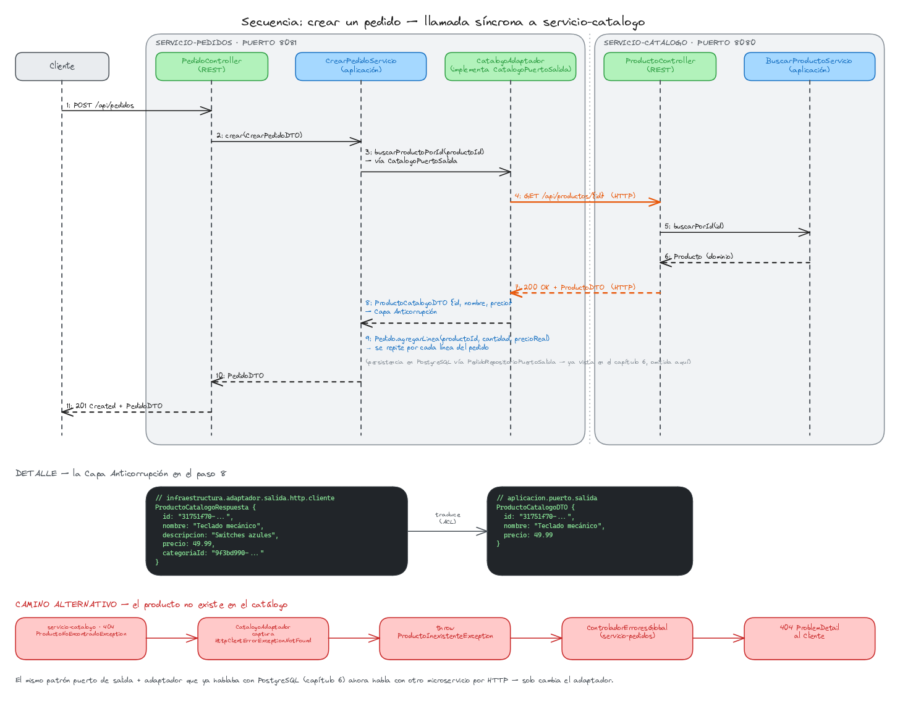
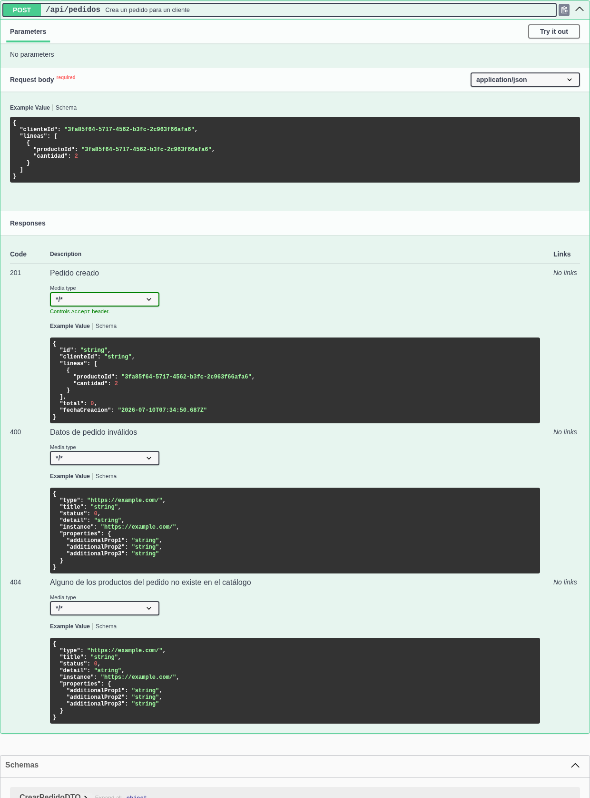

# Capítulo 07 — Comunicación entre microservicios: Spring HTTP Service Client

Séptimo capítulo del tutorial "De cero a pro en arquitectura de microservicios con Spring Boot" (ver el índice completo de capítulos en la rama `main`). Parte directamente de `capitulo-06-servicio-pedidos`.

## Índice

1. [Introducción](#1-introducción)
2. [El problema: `servicio-pedidos` confía en el precio que le envían](#2-el-problema-servicio-pedidos-confía-en-el-precio-que-le-envían)
3. [El puerto de salida `CatalogoPuertoSalida` y la Capa Anticorrupción (Anti-Corruption Layer)](#3-el-puerto-de-salida-catalogopuertosalida-y-la-capa-anticorrupción-anti-corruption-layer)
4. [El cliente HTTP declarativo: `@HttpExchange`](#4-el-cliente-http-declarativo-httpexchange)
5. [El adaptador: mapear la respuesta y traducir el error 404](#5-el-adaptador-mapear-la-respuesta-y-traducir-el-error-404)
6. [Registrar el cliente: `@ImportHttpServices` y la URL base por configuración](#6-registrar-el-cliente-importhttpservices-y-la-url-base-por-configuración)
7. [Extraer las anotaciones Swagger a una interfaz propia](#7-extraer-las-anotaciones-swagger-a-una-interfaz-propia)
8. [Cómo probarlo](#8-cómo-probarlo)
9. [Registro de archivos del capítulo](#9-registro-de-archivos-del-capítulo)
10. [Referencias](#10-referencias)

---

## 1. Introducción

El capítulo anterior dejó `servicio-pedidos` funcionando de forma aislada: crea un `Pedido` con sus líneas y lo persiste en PostgreSQL, sin hablar nunca con `servicio-catalogo`. Este capítulo conecta ambos microservicios por primera vez con una llamada síncrona real — al crear un pedido, `servicio-pedidos` le pregunta a `servicio-catalogo` el precio real de cada producto en vez de aceptar el que le envíe quien llama a la API.

La pieza central es el **HTTP Service Client** de Spring: una interfaz Java anotada con `@HttpExchange` que Spring convierte en un cliente HTTP funcional sin escribir una sola línea de implementación — el mismo estilo declarativo que ya conocemos de los repositorios de Spring Data. Es la alternativa nativa de Spring Framework a OpenFeign, que el propio proyecto Spring Cloud OpenFeign da por "feature-complete" (solo recibe corrección de errores) y para el que recomienda esta migración en su documentación oficial.

De paso, con dos microservicios ya repitiendo el mismo patrón de anotaciones Swagger en sus controllers, aprovechamos para extraerlas a una interfaz propia que el controller se limita a implementar — una limpieza pequeña, pero que vale la pena hacer ahora que el patrón se repite por segunda vez.

El siguiente diagrama resume todo el capítulo de un vistazo: la secuencia completa de la llamada entre los dos microservicios, el punto exacto donde actúa la Capa Anticorrupción (paso 8) y el camino alternativo cuando el producto no existe.



*Secuencia completa: `servicio-pedidos` (puerto 8081) llama a `servicio-catalogo` (puerto 8080) para resolver el precio real de cada línea antes de guardar el pedido; abajo, el detalle de la traducción de tipos en la Capa Anticorrupción y el camino alternativo cuando el producto no existe.*

<br>

---

## 2. El problema: `servicio-pedidos` confía en el precio que le envían

El `CrearPedidoDTO` del capítulo 6 pedía, por cada línea de pedido, un `precioUnitario` puesto por quien llama a la API:

```java
public record LineaPedidoDTO(
		@Schema(description = "Id de un producto ya existente en el catálogo", example = "...") String productoId,
		@Schema(example = "2") int cantidad,
		@Schema(example = "19.99") BigDecimal precioUnitario) {
}
```

Y `CrearPedidoServicio` lo usaba tal cual, sin comprobar nada:

```java
dto.lineas().forEach(linea -> pedido.agregarLinea(
		ProductoId.de(linea.productoId()),
		Cantidad.de(linea.cantidad()),
		Precio.de(linea.precioUnitario())));
```

Nada impedía pedir dos teclados a 0,01 € cada uno aunque el catálogo diga que valen 49,99 €: el precio final de un pedido no puede depender de lo que decida escribir quien hace la petición HTTP, tiene que salir de una fuente de verdad — el catálogo de productos, que es quien de verdad conoce ese precio.

La solución no es validar el precio recibido contra el real (seguiría exigiéndole al cliente que lo adivine y solo cambiaría el error de "aceptar cualquier precio" a "rechazar el que no coincida"): la solución es que `servicio-pedidos` deje de pedir el precio y lo obtenga él mismo de `servicio-catalogo` en el momento de crear el pedido. Eso significa cruzar la frontera entre dos Contextos Delimitados (Bounded Contexts) por primera vez en este monorepo, y esa frontera necesita su propio diseño — no basta con hacer un `RestClient.get()` desde dentro del servicio de aplicación.

---

## 3. El puerto de salida `CatalogoPuertoSalida` y la Capa Anticorrupción (Anti-Corruption Layer)

Hasta ahora, los puertos de salida de este monorepo (`PedidoRepositorioPuertoSalida`, `ProductoRepositorioPuertoSalida` en `servicio-catalogo`) devuelven agregados de dominio, porque hablan con la propia base de datos del microservicio: no hay ningún contrato ajeno de por medio, solo persistencia. Una llamada a otro microservicio es distinta — al otro lado hay un contrato HTTP que `servicio-catalogo` puede cambiar en cualquier momento sin avisar a `servicio-pedidos`, y ese contrato ajeno no puede filtrarse tal cual hasta el dominio de Pedidos. Esa traducción en la frontera es la **Capa Anticorrupción**: un tipo propio de `servicio-pedidos`, `ProductoCatalogoDTO`, que es lo único que el resto del código conoce — nunca la forma JSON exacta que expone `servicio-catalogo`.

```java
// servicio-pedidos/.../aplicacion/puerto/salida/CatalogoPuertoSalida.java
public interface CatalogoPuertoSalida {

	ProductoCatalogoDTO buscarProductoPorId(ProductoId productoId);
}
```

```java
// servicio-pedidos/.../aplicacion/puerto/salida/ProductoCatalogoDTO.java
public record ProductoCatalogoDTO(String id, String nombre, BigDecimal precio) {
}
```

`ProductoCatalogoDTO` vive junto al puerto, en `aplicacion.puerto.salida`, no en `aplicacion.dto.salida` — esa carpeta ya tiene un significado fijado en este monorepo (la respuesta que un controller devuelve a quien llama desde fuera) y `ProductoCatalogoDTO` es algo distinto: es el tipo que la propia capa de aplicación recibe de un puerto de salida, no el que un adaptador de entrada envía hacia fuera. Solo trae los tres campos que `CrearPedidoServicio` necesita (id, nombre y precio) — ignora deliberadamente `descripcion` y `categoriaId`, que `servicio-catalogo` sí expone pero que a Pedidos no le interesan.

---

## 4. El cliente HTTP declarativo: `@HttpExchange`

La implementación técnica de ese puerto empieza por una interfaz que describe la llamada HTTP, sin ningún código de por medio:

```java
// servicio-pedidos/.../infraestructura/adaptador/salida/http/cliente/CatalogoHttpExchange.java
public interface CatalogoHttpExchange {

	@GetExchange("/api/productos/{id}")
	ProductoCatalogoRespuesta buscarProductoPorId(@PathVariable String id);
}
```

`@GetExchange` es una especialización de `@HttpExchange` para `GET` (existen equivalentes `@PostExchange`, `@PutExchange`, etc.), y funciona sobre la misma familia de anotaciones (`@PathVariable`, `@RequestParam`, `@RequestBody`) que ya conocemos de los controllers `@RestController` — pero aquí describen una petición saliente, no una entrante. Spring genera en tiempo de ejecución una implementación de esta interfaz que hace la petición HTTP real y deserializa la respuesta.

`ProductoCatalogoRespuesta` es un segundo record, distinto de `ProductoCatalogoDTO`, que refleja el JSON exacto que expone `GET /api/productos/{id}` de `servicio-catalogo`:

```java
// servicio-pedidos/.../infraestructura/adaptador/salida/http/cliente/ProductoCatalogoRespuesta.java
public record ProductoCatalogoRespuesta(String id, String nombre, String descripcion, BigDecimal precio, String categoriaId) {
}
```

Son dos tipos separados a propósito: `ProductoCatalogoRespuesta` es un detalle de infraestructura (vive en `infraestructura.adaptador.salida.http.cliente`, junto a `CatalogoHttpExchange`) y cambia si cambia el contrato JSON de `servicio-catalogo`; `ProductoCatalogoDTO` es el tipo que ve la capa de aplicación y no debería cambiar solo porque `servicio-catalogo` añada un campo nuevo a su respuesta. El adaptador de la siguiente sección es quien traduce uno en el otro.

---

## 5. El adaptador: mapear la respuesta y traducir el error 404

El adaptador implementa `CatalogoPuertoSalida` delegando en `CatalogoHttpExchange`, con la misma forma que ya tienen los adaptadores de persistencia de este monorepo (`PedidoRepositorioAdaptador` delegando en `PedidoRepositorioJpa`):

```java
// servicio-pedidos/.../infraestructura/adaptador/salida/http/adaptador/CatalogoAdaptador.java
@Component
@RequiredArgsConstructor
public class CatalogoAdaptador implements CatalogoPuertoSalida {

	private final CatalogoHttpExchange catalogoHttpExchange;

	@Override
	public ProductoCatalogoDTO buscarProductoPorId(ProductoId productoId) {
		try {
			ProductoCatalogoRespuesta respuesta = catalogoHttpExchange.buscarProductoPorId(productoId.valor());
			return new ProductoCatalogoDTO(respuesta.id(), respuesta.nombre(), respuesta.precio());
		} catch (HttpClientErrorException.NotFound excepcion) {
			throw new ProductoInexistenteException(productoId.valor());
		}
	}
}
```

Cuando el producto no existe, `servicio-catalogo` ya responde con un `404` (`ProductoNoEncontradoException` del capítulo 5). El cliente HTTP de Spring convierte cualquier respuesta 4xx en una `HttpClientErrorException` — capturamos específicamente la variante `NotFound` y la traducimos a una excepción propia de `servicio-pedidos`, `ProductoInexistenteException`, que seguirá el mismo patrón que ya usa `servicio-catalogo` desde el capítulo 5:

```java
// servicio-pedidos/.../dominio/excepcion/ProductoInexistenteException.java
@Getter
public class ProductoInexistenteException extends RuntimeException {

	private final String id;

	public ProductoInexistenteException(String id) {
		super("No existe un producto en el catálogo con id: " + id);
		this.id = id;
	}
}
```

Y el `ControladorErroresGlobal` de `servicio-pedidos` gana su primer `@ExceptionHandler` de dominio, con el mismo formato `ProblemDetail` que ya conocemos:

```java
// servicio-pedidos/.../infraestructura/adaptador/entrada/rest/ControladorErroresGlobal.java
@ExceptionHandler(ProductoInexistenteException.class)
public ProblemDetail manejarProductoInexistente(ProductoInexistenteException excepcion) {
	ProblemDetail problema = ProblemDetail.forStatusAndDetail(HttpStatus.NOT_FOUND, excepcion.getMessage());
	problema.setType(TIPO_PRODUCTO_INEXISTENTE);
	problema.setTitle("Producto inexistente");
	problema.setProperty("productoId", excepcion.getId());
	return problema;
}
```

`CrearPedidoServicio` queda así, resolviendo el precio real antes de añadir cada línea:

```java
// servicio-pedidos/.../aplicacion/servicio/CrearPedidoServicio.java
dto.lineas().forEach(linea -> {
	ProductoId productoId = ProductoId.de(linea.productoId());
	ProductoCatalogoDTO producto = catalogoPuertoSalida.buscarProductoPorId(productoId);
	pedido.agregarLinea(productoId, Cantidad.de(linea.cantidad()), Precio.de(producto.precio()));
});
```

---

## 6. Registrar el cliente: `@ImportHttpServices` y la URL base por configuración

Falta registrar `CatalogoHttpExchange` como bean y decirle a Spring contra qué URL resolver sus rutas relativas (`/api/productos/{id}`). La anotación `@ImportHttpServices` hace ambas cosas a la vez, agrupando clientes HTTP relacionados bajo un nombre de grupo:

```java
// servicio-pedidos/.../infraestructura/configuracion/ClientesHttpConfig.java
@Configuration
@ImportHttpServices(group = "catalogo", types = CatalogoHttpExchange.class)
public class ClientesHttpConfig {
}
```

Y la URL base del grupo `catalogo` se fija por configuración, no en el código:

```yaml
# servicio-pedidos/src/main/resources/application.yml
spring:
  http:
    serviceclient:
      catalogo:
        base-url: "http://localhost:8080"
```

El puerto `8080` aquí es el mismo que fijamos para `servicio-catalogo` en el capítulo anterior, cuando `servicio-pedidos` pasó a escuchar en el `8081` para no chocar con él — ahora esa URL vive en configuración en vez de estar repartida a mano por el código, que es justo el punto de externalizarla: en otro entorno (Docker, Kubernetes) bastaría con cambiar esta propiedad, sin tocar `CatalogoHttpExchange` ni `CatalogoAdaptador`.

Falta una pieza más para que todo esto funcione: una dependencia de Maven que hasta ahora no hacía falta.

```xml
<!-- servicio-pedidos/pom.xml -->
<dependency>
	<groupId>org.springframework.boot</groupId>
	<artifactId>spring-boot-starter-restclient</artifactId>
</dependency>
```

`servicio-pedidos` ya declaraba `spring-boot-starter-webmvc`, pero en Spring Boot 4 ese starter es solo el lado *servidor* (recibir peticiones). La autoconfiguración que lee `spring.http.serviceclient.*` y construye el `RestClient` con esa URL base vive en un módulo aparte, `spring-boot-restclient` — el lado *cliente* —, que no se arrastra automáticamente por declarar el starter de servidor. Es un efecto directo de que Spring Boot 4 modularizó mucho más fino que las versiones anteriores: antes existía un único `spring-boot-starter-web` que traía cliente y servidor a la vez; ahora cada mitad es su propio starter (`-webmvc` para servidor, `-restclient` para cliente síncrono, `-webclient` para el reactivo), y un microservicio que solo expone API pero también consume otras API por HTTP necesita declarar los dos.

Sin esta dependencia, `CatalogoHttpExchange` sigue registrándose como bean sin ningún error en el arranque — pero en la primera petición real, la URL base de `spring.http.serviceclient.catalogo.base-url` no se aplica, como si la propiedad no existiera, y la llamada falla con `IllegalArgumentException: URI with undefined scheme`.

> **¿Se puede añadir esta dependencia desde Spring Initializr?**
>
> Sí — aparece en el grupo "Web" con el nombre "HTTP Client" (id `spring-restclient`), disponible desde Spring Boot 4.0. Si el microservicio se genera desde cero sabiendo ya que va a consumir otra API por HTTP, se puede marcar esa casilla junto a "Spring Web" desde el principio, en vez de añadirla más tarde a mano en el `pom.xml` como se ha hecho aquí.

---

## 7. Extraer las anotaciones Swagger a una interfaz propia

Desde el capítulo 3, cada `@RestController` acumula anotaciones de OpenAPI (`@Operation`, `@ApiResponses`) junto a las de Spring MVC (`@GetMapping`, `@PostMapping`, `@RequestBody`) en la misma clase. Con `servicio-catalogo` y ahora `servicio-pedidos` repitiendo el mismo patrón, esa mezcla empieza a estorbar: cuesta ver de un vistazo qué hace el método y qué es documentación para Swagger UI.

La solución es extraer **solo** las anotaciones de OpenAPI a una interfaz — `ProductoApiDoc`, `CategoriaApiDoc`, `PedidoApiDoc` — dejando en el `@RestController` toda la mecánica HTTP (`@RequestMapping`, `@GetMapping`/`@PostMapping`, `@RequestBody`/`@PathVariable`/`@RequestParam`):

```java
// servicio-pedidos/.../infraestructura/adaptador/entrada/rest/PedidoApiDoc.java
public interface PedidoApiDoc {

	@Operation(operationId = "crearPedido", summary = "Crea un pedido para un cliente")
	@ApiResponses({
			@ApiResponse(responseCode = "201", description = "Pedido creado"),
			@ApiResponse(responseCode = "400", description = "Datos de pedido inválidos",
					content = @Content(schema = @Schema(implementation = ProblemDetail.class))),
			@ApiResponse(responseCode = "404", description = "Alguno de los productos del pedido no existe en el catálogo",
					content = @Content(schema = @Schema(implementation = ProblemDetail.class)))
	})
	ResponseEntity<PedidoDTO> crear(CrearPedidoDTO dto);
}
```

```java
// servicio-pedidos/.../infraestructura/adaptador/entrada/rest/PedidoController.java
@RestController
@RequestMapping("/api/pedidos")
@RequiredArgsConstructor
public class PedidoController implements PedidoApiDoc {

	private final CrearPedidoPuertoEntrada crearPedidoPuertoEntrada;

	@Override
	@PostMapping
	public ResponseEntity<PedidoDTO> crear(@RequestBody CrearPedidoDTO dto) {
		PedidoDTO creado = crearPedidoPuertoEntrada.crear(dto);
		return ResponseEntity.status(HttpStatus.CREATED).body(creado);
	}
}
```

Funciona porque tanto Spring MVC como springdoc-openapi resuelven sus anotaciones recorriendo toda la jerarquía de tipos del bean (la clase y las interfaces que implementa), no solo el método concreto invocado — springdoc-openapi lo confirma explícitamente en su FAQ oficial ("sí, la librería soporta anotaciones de interfaces"), y Spring MVC hace lo mismo para `@RequestMapping`/`@GetMapping`/`@PostMapping` y para las anotaciones de parámetro (`@RequestBody`, `@PathVariable`, `@RequestParam`).

> **¿Por qué el mapeo HTTP se queda en el controller y no en la interfaz?**
>
> Spring MVC y springdoc-openapi resuelven sus anotaciones recorriendo la clase y las interfaces que implementa, no solo el método concreto, así que hay varias combinaciones válidas: todas las anotaciones (Spring MVC + OpenAPI) en la interfaz, con el controller reducido a `@Override` + cuerpo; el mapeo HTTP en el controller y solo `@Operation`/`@ApiResponses` en la interfaz, como en este capítulo; o cualquier mezcla intermedia entre ambos sitios.
>
> Se ha elegido dejar el mapeo HTTP en el controller y reducir la interfaz a documentación pura por el nombre: en el ecosistema OpenAPI es habitual que una interfaz `XxxApi` esté *generada a partir de* un contrato OpenAPI ya existente (enfoque contract-first) — justo el sentido contrario al de este proyecto, donde las anotaciones son las que *generan* el contrato (enfoque code-first). Con solo `@Operation`/`@ApiResponses` en la interfaz, el nombre `PedidoApiDoc` deja claro que es únicamente documentación de la API, no un contrato de enrutado.
>
> La única combinación que Spring desaconseja explícitamente en su documentación es repartir el **mismo tipo** de anotación entre los dos sitios (p. ej. la mitad de los `@ApiResponse` en la interfaz y la otra mitad en la clase) cuando el bean está detrás de un proxy AOP (`@Transactional`, `@Async`, etc.) — no es el caso de estos controllers, que no llevan ese tipo de proxy, pero es buena práctica evitarlo de todos modos.

---

## 8. Cómo probarlo

Con `servicio-catalogo` (puerto `8080`) y `servicio-pedidos` (puerto `8081`) arrancados a la vez:

```bash
./mvnw -pl servicio-catalogo spring-boot:run &
./mvnw -pl servicio-pedidos spring-boot:run &
```

El `&` al final de cada línea manda ese comando a segundo plano en vez de bloquear la terminal esperando a que termine — necesario aquí porque `spring-boot:run` no termina nunca por sí solo (se queda arrancado sirviendo peticiones) y hay que lanzar dos, uno detrás del otro, desde la misma terminal.

Primero, una categoría y un producto en el catálogo:

```bash
curl -X POST http://localhost:8080/api/categorias \
  -H "Content-Type: application/json" \
  -d '{"nombre":"Electrónica"}'
# => {"id":"<categoriaId>","nombre":"Electrónica"}

curl -X POST http://localhost:8080/api/productos \
  -H "Content-Type: application/json" \
  -d '{"nombre":"Teclado mecánico","descripcion":"Switches azules","precio":49.99,"categoriaId":"<categoriaId>"}'
# => {"id":"<productoId>","nombre":"Teclado mecánico", ...,"precio":49.99, ...}
```

Ahora un pedido que referencia ese producto — nótese que ya no se envía `precioUnitario`, solo `productoId` y `cantidad`:

```bash
curl -X POST http://localhost:8081/api/pedidos \
  -H "Content-Type: application/json" \
  -d '{"clienteId":"3fa85f64-5717-4562-b3fc-2c963f66afa6","lineas":[{"productoId":"<productoId>","cantidad":2}]}'
```

```json
{
  "id": "8b630a81-1162-40d7-95fa-59c2df9ddbe2",
  "clienteId": "3fa85f64-5717-4562-b3fc-2c963f66afa6",
  "lineas": [
    { "productoId": "<productoId>", "cantidad": 2, "precioUnitario": 49.99, "subtotal": 99.98 }
  ],
  "total": 99.98,
  "fechaCreacion": "2026-07-10T07:28:53.822054253Z"
}
```

El `precioUnitario` de la respuesta (`49.99`) es el que devolvió `servicio-catalogo`, no uno inventado por quien llamó a la API — la comprobación real de que la Capa Anticorrupción funciona.

Y con un `productoId` que no existe en el catálogo:

```bash
curl -X POST http://localhost:8081/api/pedidos \
  -H "Content-Type: application/json" \
  -d '{"clienteId":"3fa85f64-5717-4562-b3fc-2c963f66afa6","lineas":[{"productoId":"3fa85f64-5717-4562-b3fc-2c963f66afaa","cantidad":1}]}'
```

```json
{
  "type": "https://tienda.javacadabra.com/problemas/producto-inexistente",
  "title": "Producto inexistente",
  "status": 404,
  "detail": "No existe un producto en el catálogo con id: 3fa85f64-5717-4562-b3fc-2c963f66afaa",
  "instance": "/api/pedidos",
  "productoId": "3fa85f64-5717-4562-b3fc-2c963f66afaa"
}
```



*Swagger UI de `servicio-pedidos`, endpoint `POST /api/pedidos`: la respuesta `404` añadida en este capítulo, junto a las ya existentes `201`/`400`.*

<br>

Para parar ambos procesos, al haberlos lanzado en segundo plano con `&`, no basta con `Ctrl+C` (no hay ningún proceso en primer plano al que enviárselo):

```bash
pkill -f "spring-boot:run"
```

Localiza ambos procesos por nombre y los para de una vez, sin depender de en qué sesión de shell se lanzaron con `&`.

---

## 9. Registro de archivos del capítulo

🌱 Creado · ✏️ Actualizado · 🗑️ Eliminado

### Documentación e imágenes

| | Archivo | Descripción funcional | Descripción del cambio |
|:---:|---|---|:---:|
| 🌱 | [`docs/diagramas/capitulo-07-secuencia-crear-pedido.excalidraw`](docs/diagramas/capitulo-07-secuencia-crear-pedido.excalidraw) | Diagrama Excalidraw (fuente editable) de la secuencia de creación de un pedido | --- |
| 🌱 | [`docs/images/capitulo-07/secuencia-crear-pedido.png`](docs/images/capitulo-07/secuencia-crear-pedido.png) | Render del diagrama anterior, embebido en la [sección 1](#1-introducción) | --- |
| 🌱 | [`docs/images/capitulo-07/swagger-ui-crear-pedido-404.png`](docs/images/capitulo-07/swagger-ui-crear-pedido-404.png) | Captura de Swagger UI del endpoint `POST /api/pedidos` con la respuesta `404` documentada ([sección 8](#8-cómo-probarlo)) | --- |

### Build y configuración

| | Archivo | Descripción funcional | Descripción del cambio |
|:---:|---|---|:---:|
| ✏️ | [`servicio-pedidos/pom.xml`](servicio-pedidos/pom.xml) | Dependencias Maven de `servicio-pedidos` | Añadida `spring-boot-starter-restclient` — la autoconfiguración del cliente HTTP no la trae `-webmvc` (ver [sección 6](#6-registrar-el-cliente-importhttpservices-y-la-url-base-por-configuración)) |
| ✏️ | [`servicio-pedidos/src/main/resources/application.yml`](servicio-pedidos/src/main/resources/application.yml) | Configuración de `servicio-pedidos` | Añadida `spring.http.serviceclient.catalogo.base-url`, la URL base del cliente HTTP hacia `servicio-catalogo` |

### Aplicación

| | Archivo | Descripción funcional | Descripción del cambio |
|:---:|---|---|:---:|
| 🌱 | [`.../aplicacion/puerto/salida/CatalogoPuertoSalida.java`](servicio-pedidos/src/main/java/com/javacadabra/tienda/pedidos/aplicacion/puerto/salida/CatalogoPuertoSalida.java) | Puerto de salida hacia el Contexto Delimitado de Catálogo | --- |
| 🌱 | [`.../aplicacion/puerto/salida/ProductoCatalogoDTO.java`](servicio-pedidos/src/main/java/com/javacadabra/tienda/pedidos/aplicacion/puerto/salida/ProductoCatalogoDTO.java) | Tipo de la Capa Anticorrupción devuelto por `CatalogoPuertoSalida` | --- |
| ✏️ | [`.../aplicacion/servicio/CrearPedidoServicio.java`](servicio-pedidos/src/main/java/com/javacadabra/tienda/pedidos/aplicacion/servicio/CrearPedidoServicio.java) | Caso de uso de creación de pedidos | Ahora resuelve el precio real de cada línea vía `CatalogoPuertoSalida` en vez de confiar en el `precioUnitario` del DTO de entrada |
| ✏️ | [`.../aplicacion/dto/entrada/LineaPedidoDTO.java`](servicio-pedidos/src/main/java/com/javacadabra/tienda/pedidos/aplicacion/dto/entrada/LineaPedidoDTO.java) | DTO de entrada de una línea de pedido | Eliminado el campo `precioUnitario` — el precio ya no lo decide quien llama a la API |

### Dominio

| | Archivo | Descripción funcional | Descripción del cambio |
|:---:|---|---|:---:|
| 🌱 | [`.../dominio/excepcion/ProductoInexistenteException.java`](servicio-pedidos/src/main/java/com/javacadabra/tienda/pedidos/dominio/excepcion/ProductoInexistenteException.java) | Excepción de dominio cuando un producto referenciado no existe en el catálogo | --- |

### Infraestructura de entrada

| | Archivo | Descripción funcional | Descripción del cambio |
|:---:|---|---|:---:|
| 🌱 | [`.../infraestructura/adaptador/entrada/rest/PedidoApiDoc.java`](servicio-pedidos/src/main/java/com/javacadabra/tienda/pedidos/infraestructura/adaptador/entrada/rest/PedidoApiDoc.java) | Interfaz con las anotaciones OpenAPI de `PedidoController` | --- |
| ✏️ | [`.../infraestructura/adaptador/entrada/rest/PedidoController.java`](servicio-pedidos/src/main/java/com/javacadabra/tienda/pedidos/infraestructura/adaptador/entrada/rest/PedidoController.java) | Controller REST de Pedidos | Implementa `PedidoApiDoc`; ya no lleva anotaciones Swagger propias |
| ✏️ | [`.../infraestructura/adaptador/entrada/rest/ControladorErroresGlobal.java`](servicio-pedidos/src/main/java/com/javacadabra/tienda/pedidos/infraestructura/adaptador/entrada/rest/ControladorErroresGlobal.java) | Manejador global de excepciones de `servicio-pedidos` | Nuevo `@ExceptionHandler` para `ProductoInexistenteException` → `404` |
| 🌱 | [`.../infraestructura/adaptador/entrada/rest/ProductoApiDoc.java`](servicio-catalogo/src/main/java/com/javacadabra/tienda/catalogo/infraestructura/adaptador/entrada/rest/ProductoApiDoc.java) | Interfaz con las anotaciones OpenAPI de `ProductoController` (`servicio-catalogo`) | --- |
| ✏️ | [`.../infraestructura/adaptador/entrada/rest/ProductoController.java`](servicio-catalogo/src/main/java/com/javacadabra/tienda/catalogo/infraestructura/adaptador/entrada/rest/ProductoController.java) | Controller REST de Productos (`servicio-catalogo`) | Implementa `ProductoApiDoc`; ya no lleva anotaciones Swagger propias |
| 🌱 | [`.../infraestructura/adaptador/entrada/rest/CategoriaApiDoc.java`](servicio-catalogo/src/main/java/com/javacadabra/tienda/catalogo/infraestructura/adaptador/entrada/rest/CategoriaApiDoc.java) | Interfaz con las anotaciones OpenAPI de `CategoriaController` (`servicio-catalogo`) | --- |
| ✏️ | [`.../infraestructura/adaptador/entrada/rest/CategoriaController.java`](servicio-catalogo/src/main/java/com/javacadabra/tienda/catalogo/infraestructura/adaptador/entrada/rest/CategoriaController.java) | Controller REST de Categorías (`servicio-catalogo`) | Implementa `CategoriaApiDoc`; ya no lleva anotaciones Swagger propias |

### Infraestructura de salida

| | Archivo | Descripción funcional | Descripción del cambio |
|:---:|---|---|:---:|
| 🌱 | [`.../infraestructura/adaptador/salida/http/cliente/CatalogoHttpExchange.java`](servicio-pedidos/src/main/java/com/javacadabra/tienda/pedidos/infraestructura/adaptador/salida/http/cliente/CatalogoHttpExchange.java) | Interfaz `@HttpExchange` que describe la llamada HTTP a `servicio-catalogo` | --- |
| 🌱 | [`.../infraestructura/adaptador/salida/http/cliente/ProductoCatalogoRespuesta.java`](servicio-pedidos/src/main/java/com/javacadabra/tienda/pedidos/infraestructura/adaptador/salida/http/cliente/ProductoCatalogoRespuesta.java) | Forma exacta de la respuesta JSON de `GET /api/productos/{id}` | --- |
| 🌱 | [`.../infraestructura/adaptador/salida/http/adaptador/CatalogoAdaptador.java`](servicio-pedidos/src/main/java/com/javacadabra/tienda/pedidos/infraestructura/adaptador/salida/http/adaptador/CatalogoAdaptador.java) | Adaptador que implementa `CatalogoPuertoSalida` sobre `CatalogoHttpExchange` | --- |
| 🌱 | [`.../infraestructura/configuracion/ClientesHttpConfig.java`](servicio-pedidos/src/main/java/com/javacadabra/tienda/pedidos/infraestructura/configuracion/ClientesHttpConfig.java) | Registro del cliente HTTP vía `@ImportHttpServices` | --- |

## 10. Referencias

- [HTTP Interface Client (Spring Framework Reference)](https://docs.spring.io/spring-framework/reference/integration/rest-clients.html#rest-http-interface)
- [HTTP Service Clients (Spring Boot Reference)](https://docs.spring.io/spring-boot/reference/io/rest-client.html)
- [springdoc-openapi FAQ — anotaciones en interfaces](https://springdoc.org/faq.html)
- [Spring Cloud OpenFeign — estado "feature-complete"](https://docs.spring.io/spring-cloud-openfeign/reference/)
