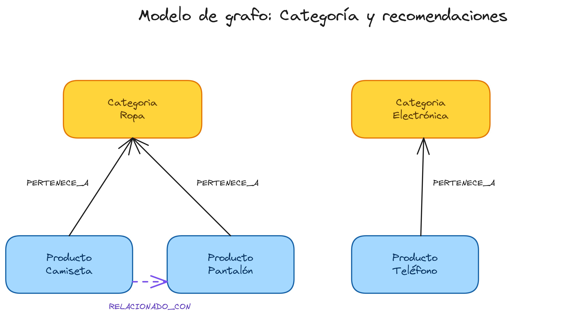
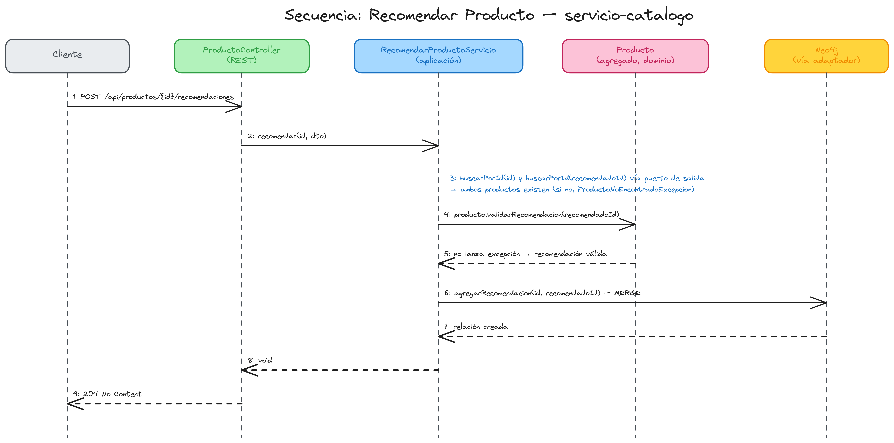
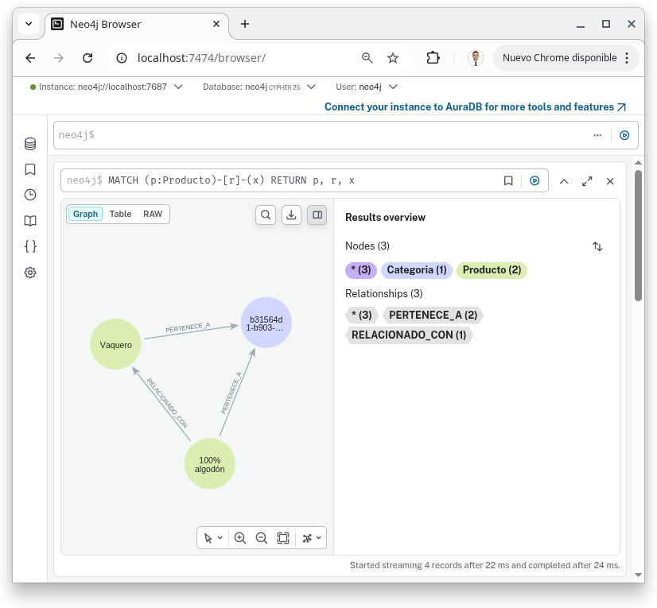

# Capítulo 2 — Relaciones de grafo (Categoría)

Segundo capítulo del tutorial "De cero a pro en arquitectura de microservicios con Spring Boot" (ver el índice completo de capítulos en la rama `main`). Parte directamente de `capitulo-01-fundamentos-ddd-hexagonal`: todo lo explicado allí (Objeto de Valor, Entidad, Agregado, Arquitectura Hexagonal, convención Lombok, Testcontainers...) sigue vigente y no se repite aquí — si algo de este capítulo no tiene sentido sin ese contexto, consulta primero el `README.md` de esa rama.

## Índice

1. [Introducción](#1-introducción)
2. [El nuevo agregado `Categoria`](#2-el-nuevo-agregado-categoria)
3. [Referenciar otro agregado: `categoriaId`, no `Categoria`](#3-referenciar-otro-agregado-categoriaid-no-categoria)
4. [Las dos relaciones de grafo](#4-las-dos-relaciones-de-grafo)
5. [Lección de Spring Data Neo4j: la trampa de la entidad fantasma](#5-lección-de-spring-data-neo4j-la-trampa-de-la-entidad-fantasma)
6. [Lección de Spring Data Neo4j: cuándo NO usar `@Relationship`](#6-lección-de-spring-data-neo4j-cuándo-no-usar-relationship)
7. [Casos de uso y endpoints REST nuevos](#7-casos-de-uso-y-endpoints-rest-nuevos)
8. [Testing: un patrón nuevo, tests de servicio con Mockito](#8-testing-un-patrón-nuevo-tests-de-servicio-con-mockito)
9. [Diagramas](#9-diagramas)
10. [Cómo probarlo de extremo a extremo](#10-cómo-probarlo-de-extremo-a-extremo)
11. [Qué se deja para el capítulo 3](#11-qué-se-deja-para-el-capítulo-3)
12. [Registro de archivos del capítulo](#12-registro-de-archivos-del-capítulo)
13. [Referencias](#13-referencias)

---

## 1. Introducción

El capítulo 1 dejó escrito explícitamente qué faltaba: `Categoria` como agregado propio y las relaciones de grafo (`Producto`↔`Categoria`, recomendaciones producto↔producto) — porque es lo que realmente justifica haber elegido Neo4j en vez de una base de datos relacional. Sin relaciones que recorrer, un grafo no aporta nada frente a una tabla.

Este capítulo añade:

- El agregado `Categoria`, con la misma convención Lombok que `Producto` (capítulo 1, sección 5).
- Una relación **muchos-a-uno obligatoria**: `Producto -[:PERTENECE_A]-> Categoria`.
- Una relación **muchos-a-muchos autorreferente**: `Producto -[:RELACIONADO_CON]-> Producto` (recomendaciones).
- Dos lecciones de Spring Data Neo4j con valor didáctico propio: una trampa real sobre cómo NO enlazar una relación, y un criterio para decidir cuándo gestionar una relación con Cypher explícito en vez de como campo del agregado.

Al terminar este capítulo entenderás por qué un producto referencia su categoría **por id**, no por el objeto agregado completo, y por qué eso tiene consecuencias concretas al persistir en un grafo.

---

## 2. El nuevo agregado `Categoria`

```java
// dominio/modelo/agregado/Categoria.java
@Getter
@Accessors(fluent = true)
@EqualsAndHashCode(onlyExplicitlyIncluded = true)
public class Categoria {

	@EqualsAndHashCode.Include
	private final CategoriaId id;
	private String nombre;

	private Categoria(CategoriaId id, String nombre) {
		this.id = id;
		this.nombre = nombre;
	}

	public static Categoria crear(String nombre) {
		validarNombre(nombre);
		return new Categoria(CategoriaId.generar(), nombre);
	}

	public static Categoria reconstruir(CategoriaId id, String nombre) {
		return new Categoria(id, nombre);
	}
	// ...
}
```

Nada nuevo conceptualmente: es exactamente el mismo patrón que `Producto` (constructor privado + factories `crear`/`reconstruir`, `@Getter @Accessors(fluent = true)` para los getters de solo lectura, `@EqualsAndHashCode(onlyExplicitlyIncluded = true)` por id). La convención Lombok explicada en el capítulo 1, sección 5, no distingue entre "el primer agregado" y "los siguientes" — se aplica igual a cualquier agregado nuevo.

---

## 3. Referenciar otro agregado: `categoriaId`, no `Categoria`

`Producto` ahora exige una categoría:

```java
public static Producto crear(String nombre, String descripcion, Precio precio, CategoriaId categoriaId) {
	validarNombre(nombre);
	Objects.requireNonNull(precio, "El precio no puede ser nulo");
	Objects.requireNonNull(categoriaId, "La categoría del producto no puede ser nula");
	return new Producto(ProductoId.generar(), nombre, descripcion, precio, categoriaId, Instant.now());
}
```

El campo es `CategoriaId categoriaId`, **no** `Categoria categoria`. Es una regla general de DDD para relaciones entre agregados: un agregado referencia a otro por su identidad, nunca por el objeto completo. Dos motivos:

1. **Límite de consistencia**: cada agregado es su propia unidad transaccional. Si `Producto` guardara una referencia en memoria a un objeto `Categoria` completo, sería fácil (por accidente) mutar esa `Categoria` a través de un `Producto` y saltarse su propio ciclo de vida.
2. **Coste**: cargar un `Producto` no debería obligar a cargar (y mantener actualizada) toda una `Categoria` — sobre todo si, como en la [sección 6](#6-lección-de-spring-data-neo4j-2-cuándo-no-usar-relationship), ese producto también tiene una lista de recomendaciones que podría ser grande.

La validación de que esa categoría **existe de verdad** no vive en el dominio (un Objeto de Valor no puede consultar una base de datos), sino en la capa de aplicación:

```java
// aplicacion/servicio/CrearProductoServicio.java
@Override
public ProductoDTO crear(CrearProductoDTO dto) {
	CategoriaId categoriaId = CategoriaId.de(dto.categoriaId());
	categoriaRepositorioPuertoSalida.buscarPorId(categoriaId)
			.orElseThrow(() -> new CategoriaNoEncontradaException(dto.categoriaId()));

	Producto producto = Producto.crear(dto.nombre(), dto.descripcion(), Precio.de(dto.precio()), categoriaId);
	Producto guardado = productoRepositorioPuertoSalida.guardar(producto);
	return productoMapper.aDTO(guardado);
}
```

`CrearProductoServicio` orquesta dos puertos de salida (`ProductoRepositorioPuertoSalida` y `CategoriaRepositorioPuertoSalida`) precisamente porque validar una referencia cruzada entre agregados es responsabilidad de quien orquesta el caso de uso, no del agregado ni del adaptador de persistencia.

---

## 4. Las dos relaciones de grafo

| Relación | Cardinalidad | Dirección | Dueño de la relación |
|---|---|---|---|
| `PERTENECE_A` | Producto → Categoria (muchos-a-uno) | `OUTGOING` | Campo `@Relationship` en `ProductoEntidad` |
| `RELACIONADO_CON` | Producto → Producto (muchos-a-muchos, autorreferente) | `OUTGOING` | Cypher explícito (`@Query`), sin campo en la entidad |

La tabla ya adelanta la asimetría entre ambas — es el tema de las secciones 5 y 6.

---

## 5. Lección de Spring Data Neo4j: la trampa de la entidad fantasma

`ProductoEntidad` modela `PERTENECE_A` como cualquier tutorial de Spring Data Neo4j te enseñaría:

```java
// infraestructura/adaptador/salida/persistencia/entidad/ProductoEntidad.java
@Relationship(type = "PERTENECE_A", direction = Relationship.Direction.OUTGOING)
private CategoriaEntidad categoria;
```

El problema aparece al guardar. Spring Data Neo4j, según su propia documentación, guarda **todo el grafo alcanzable desde la raíz** en cada `save()`. Si construyéramos una "entidad fantasma" con solo el id relleno para enlazar la relación:

```java
// ❌ NO HACER ESTO
var categoriaFantasma = new CategoriaEntidad(producto.categoriaId().valor(), null);
productoRepositorioNeo4j.save(new ProductoEntidad(..., categoriaFantasma));
```

Spring Data Neo4j guardaría también ese nodo `Categoria` — y como su campo `nombre` es `null` en la entidad fantasma, **sobreescribiría el nombre real de la categoría con `null`** en la base de datos. No es un fallo silencioso menor: borra datos de otro agregado sin que el código lo diga en ningún sitio.

La solución, en `ProductoRepositorioAdaptador`:

```java
// infraestructura/adaptador/salida/persistencia/adaptador/ProductoRepositorioAdaptador.java
@Override
public Producto guardar(Producto producto) {
	// Se resuelve la CategoriaEntidad real (no una entidad fantasma con solo el id) para no
	// sobreescribir sus otras propiedades: Spring Data Neo4j guarda todo el grafo
	// alcanzable desde la raíz al hacer save().
	var categoriaEntidad = categoriaRepositorioNeo4j.findById(producto.categoriaId().valor())
			.orElseThrow(() -> new CategoriaNoEncontradaException(producto.categoriaId().valor()));
	var entidadGuardada = productoRepositorioNeo4j.save(productoEntidadMapper.aEntidad(producto, categoriaEntidad));
	return productoEntidadMapper.aDominio(entidadGuardada);
}
```

Se resuelve la entidad real (con todas sus propiedades) antes de enlazarla. Esto es un `findById` **técnico**, no una regla de negocio duplicada: la existencia de la categoría ya se validó en `CrearProductoServicio` ([sección 3](#3-referenciar-otro-agregado-categoriaid-no-categoria)); aquí el adaptador simplemente necesita el objeto completo porque así funciona el mapeo objeto-grafo de Spring Data Neo4j.

El test `guardarDosProductosEnLaMismaCategoriaNoSobrescribeElNombreDeLaCategoria` (en `ProductoRepositorioAdaptadorIntegrationTest`) reproduce exactamente este escenario: guarda dos productos en la misma categoría y comprueba que su nombre sigue intacto después del segundo guardado.

---

## 6. Lección de Spring Data Neo4j: cuándo NO usar `@Relationship`

`RELACIONADO_CON` (recomendaciones) **no** es un campo `@Relationship` en `ProductoEntidad`. Se gestiona con Cypher explícito en el repositorio:

```java
// infraestructura/adaptador/salida/persistencia/repositorio/ProductoRepositorioNeo4j.java
@Transactional(readOnly = true)
@Query("MATCH (:Producto {id: $productoId})-[:RELACIONADO_CON]->(rec:Producto)-[r:PERTENECE_A]->(c:Categoria) RETURN rec, collect(r), collect(c)")
List<ProductoEntidad> buscarRecomendados(@Param("productoId") String productoId);

@Query("MATCH (p:Producto {id: $productoId}), (rec:Producto {id: $recomendadoId}) MERGE (p)-[:RELACIONADO_CON]->(rec)")
void agregarRecomendacion(@Param("productoId") String productoId, @Param("recomendadoId") String recomendadoId);
```

> **¿Cómo se lee la consulta de `buscarRecomendados`?**
>
> Encadena dos saltos. Primero `(:Producto {id: $productoId})-[:RELACIONADO_CON]->(rec:Producto)`: parte del producto de origen (sin variable, no hace falta devolverlo) y llega a cada producto recomendado, nombrado `rec`. Después `(rec)-[r:PERTENECE_A]->(c:Categoria)` sigue también, desde cada `rec`, su relación con su categoría, capturando la relación en `r` y el nodo en `c`.
>
> `RETURN rec, collect(r), collect(c)` agrupa esa relación y ese nodo en listas por cada `rec` devuelto. No es un capricho de estilo: sin ese `collect`, Spring Data Neo4j no sabría reconstruir el campo `categoria` de cada `ProductoEntidad` recomendado (más detalle en el porqué, justo después de los dos motivos de esta sección).

Dos motivos para esta decisión, no solo uno:

1. **Coste de lectura**: si `productosRelacionados` fuera un campo `@Relationship` de `ProductoEntidad`, cada `findById` de un producto traería consigo (según la profundidad de fetch configurada) sus recomendaciones — y las recomendaciones de sus recomendaciones. Con una relación muchos-a-muchos potencialmente cíclica, eso es un coste que un simple "dame este producto" no debería pagar. Al gestionarla con `@Query`, solo se recorre el grafo cuando el caso de uso lo pide explícitamente (`BuscarProductosRecomendadosPuertoEntrada`).
2. **El agregado no la necesita como estado**: `Producto` no guarda en memoria el conjunto de sus recomendaciones — solo expone un método sin estado, `validarRecomendacion(ProductoId)`, que aplica la única regla de negocio real (no recomendarse a sí mismo):

   ```java
   public void validarRecomendacion(ProductoId productoRecomendadoId) {
   	if (this.id.equals(productoRecomendadoId)) {
   		throw new IllegalArgumentException("Un producto no puede recomendarse a sí mismo");
   	}
   }
   ```

Nótese que `buscarRecomendados` también trae la relación `PERTENECE_A` de cada producto recomendado (`collect(r), collect(c)`) — porque el agregado `Producto` exige un `categoriaId` no nulo ([sección 3](#3-referenciar-otro-agregado-categoriaid-no-categoria)), así que **cualquier** query Cypher que reconstruya un `Producto` tiene que traer también su relación con la categoría, o el mapeo fallaría. Es el mismo patrón `RETURN nodo, collect(relación), collect(nodoRelacionado)` que recomienda la documentación oficial de Spring Data Neo4j para poblar relaciones en consultas custom, aplicado a que la reconstrucción del agregado no rompa su propia invariante.

`agregarRecomendacion` es una escritura (`MERGE`) sin necesidad de `@Transactional` explícito: Spring Data Neo4j asume que un método de repositorio es de escritura salvo que se marque `readOnly = true` — por eso las dos consultas de lectura sí lo llevan (buena práctica, no requisito de corrección) y la de escritura no.

---

## 7. Casos de uso y endpoints REST nuevos

| Endpoint | Puerto de entrada | Descripción |
|---|---|---|
| `POST /api/categorias` | `CrearCategoriaPuertoEntrada` | Crea una categoría (201) |
| `GET /api/categorias/{id}` | `BuscarCategoriaPuertoEntrada` | Busca por id (200/404) |
| `POST /api/productos` | `CrearProductoPuertoEntrada` | Ahora exige `categoriaId` en el body (201/404 si la categoría no existe) |
| `GET /api/productos?categoriaId=` | `BuscarProductosPorCategoriaPuertoEntrada` | Lista los productos de una categoría (200, lista vacía si no hay ninguno) |
| `POST /api/productos/{id}/recomendaciones` | `RecomendarProductoPuertoEntrada` | Añade una recomendación (204/400 si es auto-recomendación/404 si algún producto no existe) |
| `GET /api/productos/{id}/recomendaciones` | `BuscarProductosRecomendadosPuertoEntrada` | Lista los productos recomendados (200) |

Un puerto de entrada por caso de uso, igual que en el capítulo 1 — la granularidad no cambia solo porque haya más casos de uso.

---

## 8. Testing: un patrón nuevo, tests de servicio con Mockito

El capítulo 1 solo tenía dos niveles de test: unitarios de dominio (sin Spring) e integración con Testcontainers (con Neo4j real). Ninguno de los dos cubre las ramas de validación que viven en la capa de **aplicación** — por ejemplo, que `CrearProductoServicio` lance `CategoriaNoEncontradaException` sin llegar a guardar nada. Para eso se añade un tercer nivel: **tests de servicio** con Mockito, mockeando los puertos de salida.

```java
// test/.../aplicacion/servicio/CrearProductoServicioTest.java
@ExtendWith(MockitoExtension.class)
class CrearProductoServicioTest {

	@Mock
	private ProductoRepositorioPuertoSalida productoRepositorioPuertoSalida;
	@Mock
	private CategoriaRepositorioPuertoSalida categoriaRepositorioPuertoSalida;

	@Test
	void crearUnProductoConUnaCategoriaInexistenteLanzaExcepcionYNoGuardaNada() {
		when(categoriaRepositorioPuertoSalida.buscarPorId(categoriaId)).thenReturn(Optional.empty());

		assertThatThrownBy(() -> servicio.crear(dto)).isInstanceOf(CategoriaNoEncontradaException.class);

		verify(productoRepositorioPuertoSalida, never()).guardar(any());
	}
}
```

`mockito-core`/`mockito-junit-jupiter` no son una dependencia nueva: ya llegaban transitivamente vía `spring-boot-starter-webmvc-test` desde el capítulo 1, sin usarse todavía. `CrearProductoServicioTest` y `RecomendarProductoServicioTest` verifican, sin arrancar Spring ni Docker, que la orquestación de puertos (buscar → validar → guardar/lanzar excepción) es correcta — quedando los tests de integración libres para verificar solo lo que de verdad necesita un Neo4j real: que las relaciones se persisten y se leen bien.

---

## 9. Diagramas

Fuentes editables en `docs/diagramas/` (formato `.excalidraw`, abrir en [excalidraw.com](https://excalidraw.com) o con la extensión de VS Code):

- `docs/diagramas/capitulo-02-modelo-grafo-categoria.excalidraw` — nodos `Producto`/`Categoria` y las relaciones `PERTENECE_A`/`RELACIONADO_CON`.
- `docs/diagramas/capitulo-02-secuencia-recomendar-producto.excalidraw` — secuencia completa del caso de uso "Recomendar Producto".



*Modelo de grafo: nodos `Producto`/`Categoria` y las relaciones `PERTENECE_A`/`RELACIONADO_CON`.*

<br>



*Diagrama de secuencia del caso de uso "Recomendar Producto".*

---

## 10. Cómo probarlo de extremo a extremo

```bash
# Ejecutar los tests (dominio, servicio con Mockito, integración con Testcontainers)
./mvnw -pl servicio-catalogo test

# Levantar el servicio (arranca Neo4j vía docker-compose automáticamente)
./mvnw -pl servicio-catalogo spring-boot:run
```

Con el servicio arrancado en `http://localhost:8080`:

```bash
BASE=http://localhost:8080/api

# 1. Crear categoría
CATEGORIA_ID=$(curl -s -X POST $BASE/categorias -H "Content-Type: application/json" \
  -d '{"nombre":"Ropa"}' | jq -r .id)

# 2. Crear dos productos en esa categoría
P1_ID=$(curl -s -X POST $BASE/productos -H "Content-Type: application/json" \
  -d "{\"nombre\":\"Camiseta\",\"descripcion\":\"100% algodón\",\"precio\":19.99,\"categoriaId\":\"$CATEGORIA_ID\"}" | jq -r .id)
P2_ID=$(curl -s -X POST $BASE/productos -H "Content-Type: application/json" \
  -d "{\"nombre\":\"Pantalón\",\"descripcion\":\"Vaquero\",\"precio\":39.99,\"categoriaId\":\"$CATEGORIA_ID\"}" | jq -r .id)

# 3. La categoría conserva su nombre tras el segundo guardado (la trampa de la sección 5)
curl -s $BASE/categorias/$CATEGORIA_ID   # {"nombre":"Ropa", ...}

# 4. Listar productos de la categoría
curl -s "$BASE/productos?categoriaId=$CATEGORIA_ID"

# 5. Recomendar el pantalón desde la camiseta
curl -s -X POST $BASE/productos/$P1_ID/recomendaciones -H "Content-Type: application/json" \
  -d "{\"productoRecomendadoId\":\"$P2_ID\"}"   # 204

# 6. Listar recomendados
curl -s $BASE/productos/$P1_ID/recomendaciones

# 7. Auto-recomendación → 400
curl -s -X POST $BASE/productos/$P1_ID/recomendaciones -H "Content-Type: application/json" \
  -d "{\"productoRecomendadoId\":\"$P1_ID\"}"

# 8. Categoría inexistente → 404
curl -s $BASE/categorias/00000000-0000-0000-0000-000000000000
```

Y, como en el capítulo 1, puedes confirmar visualmente en Neo4j Browser (`http://localhost:7474`) con `MATCH (p:Producto)-[r]-(x) RETURN p, r, x` que las relaciones `PERTENECE_A` y `RELACIONADO_CON` están ahí:



*Resultado de `MATCH (p:Producto)-[r]-(x) RETURN p, r, x` en Neo4j Browser, con las relaciones `PERTENECE_A` y `RELACIONADO_CON` ya creadas.*

<br>

---

## 11. Qué se deja para el capítulo 3

A propósito, este capítulo **no** cubre:

- Entidades internas al agregado (distintas del propio agregado raíz) — sigue sin haber un caso de uso natural que lo pida; candidato: variantes o líneas dentro de un futuro agregado `Pedido`.
- Eventos de dominio — tiene sentido cuando haya más de un microservicio reaccionando a cambios de `Producto`/`Categoria`.
- Persistencia políglota, patrón Saga, OpenAPI/Swagger, Vaadin, Prometheus/Grafana — sin fecha concreta todavía.

---

## 12. Registro de archivos del capítulo

Tabla de control de los archivos que forman el contenido de este capítulo: código del microservicio, diagramas y configuración de build. No incluye archivos internos de desarrollo (`CLAUDE.md`, `CHECKLIST.md`) ni scaffolding de herramientas (skills de Claude Code, Maven wrapper, `.gitignore`/`.gitattributes`), que no aportan valor al lector del tutorial.

**Leyenda:** 🌱 Creado · ✏️ Actualizado · 🗑️ Eliminado

### Documentación y diagramas

| | Archivo | Descripción funcional | Descripción del cambio |
|:---:|---|---|:---:|
| 🌱 | [`docs/diagramas/capitulo-02-modelo-grafo-categoria.excalidraw`](docs/diagramas/capitulo-02-modelo-grafo-categoria.excalidraw) | Fuente editable del diagrama de nodos `Producto`/`Categoria` y las relaciones `PERTENECE_A`/`RELACIONADO_CON`. | --- |
| 🌱 | [`docs/diagramas/capitulo-02-secuencia-recomendar-producto.excalidraw`](docs/diagramas/capitulo-02-secuencia-recomendar-producto.excalidraw) | Fuente editable del diagrama de secuencia del caso de uso "Recomendar Producto". | --- |
| 🌱 | [`docs/images/capitulo-02/modelo-grafo-categoria.png`](docs/images/capitulo-02/modelo-grafo-categoria.png) | Render PNG del modelo de grafo, embebido en la [sección 9](#9-diagramas). | --- |
| 🌱 | [`docs/images/capitulo-02/secuencia-recomendar-producto.png`](docs/images/capitulo-02/secuencia-recomendar-producto.png) | Render PNG del diagrama de secuencia, embebido en la [sección 9](#9-diagramas). | --- |
| 🌱 | [`docs/images/capitulo-02/neo4j-browser-grafo-relaciones.png`](docs/images/capitulo-02/neo4j-browser-grafo-relaciones.png) | Captura de Neo4j Browser con el grafo de relaciones tras el recorrido de extremo a extremo, embebida en la [sección 10](#10-cómo-probarlo-de-extremo-a-extremo). | --- |

### Dominio

| | Archivo | Descripción funcional | Descripción del cambio |
|:---:|---|---|:---:|
| 🌱 | [`Categoria.java`](servicio-catalogo/src/main/java/com/javacadabra/tienda/catalogo/dominio/modelo/agregado/Categoria.java) | Nuevo agregado raíz: encapsula el nombre de una categoría de productos. | --- |
| 🌱 | [`CategoriaId.java`](servicio-catalogo/src/main/java/com/javacadabra/tienda/catalogo/dominio/modelo/objetovalor/CategoriaId.java) | Objeto de Valor que garantiza que el identificador de la categoría es siempre un UUID válido. | --- |
| 🌱 | [`CategoriaNoEncontradaException.java`](servicio-catalogo/src/main/java/com/javacadabra/tienda/catalogo/dominio/excepcion/CategoriaNoEncontradaException.java) | Excepción de dominio lanzada cuando no existe una categoría con el id solicitado. | --- |
| ✏️ | [`Producto.java`](servicio-catalogo/src/main/java/com/javacadabra/tienda/catalogo/dominio/modelo/agregado/Producto.java) | Agregado raíz del producto. | Añade el campo obligatorio `categoriaId` (validado en `crear`) y el método `validarRecomendacion`, que impide que un producto se recomiende a sí mismo. |

### Aplicación

| | Archivo | Descripción funcional | Descripción del cambio |
|:---:|---|---|:---:|
| 🌱 | [`CrearCategoriaDTO.java`](servicio-catalogo/src/main/java/com/javacadabra/tienda/catalogo/aplicacion/dto/entrada/CrearCategoriaDTO.java) | DTO de entrada con los datos necesarios para crear una categoría. | --- |
| ✏️ | [`CrearProductoDTO.java`](servicio-catalogo/src/main/java/com/javacadabra/tienda/catalogo/aplicacion/dto/entrada/CrearProductoDTO.java) | DTO de entrada para crear un producto. | Añade el campo `categoriaId`. |
| 🌱 | [`RecomendarProductoDTO.java`](servicio-catalogo/src/main/java/com/javacadabra/tienda/catalogo/aplicacion/dto/entrada/RecomendarProductoDTO.java) | DTO de entrada con el id del producto recomendado. | --- |
| 🌱 | [`CategoriaDTO.java`](servicio-catalogo/src/main/java/com/javacadabra/tienda/catalogo/aplicacion/dto/salida/CategoriaDTO.java) | DTO de salida que expone una categoría sin filtrar el modelo de dominio. | --- |
| ✏️ | [`ProductoDTO.java`](servicio-catalogo/src/main/java/com/javacadabra/tienda/catalogo/aplicacion/dto/salida/ProductoDTO.java) | DTO de salida de un producto. | Añade el campo `categoriaId`. |
| 🌱 | [`CategoriaMapper.java`](servicio-catalogo/src/main/java/com/javacadabra/tienda/catalogo/aplicacion/mapper/CategoriaMapper.java) | Mapper MapStruct que convierte el agregado `Categoria` a `CategoriaDTO`. | --- |
| ✏️ | [`ProductoMapper.java`](servicio-catalogo/src/main/java/com/javacadabra/tienda/catalogo/aplicacion/mapper/ProductoMapper.java) | Mapper MapStruct de `Producto` a `ProductoDTO`. | Incluye `categoriaId().valor()` en el DTO de salida. |
| 🌱 | [`BuscarCategoriaPuertoEntrada.java`](servicio-catalogo/src/main/java/com/javacadabra/tienda/catalogo/aplicacion/puerto/entrada/BuscarCategoriaPuertoEntrada.java) | Puerto de entrada del caso de uso "buscar categoría por id". | --- |
| 🌱 | [`BuscarProductosPorCategoriaPuertoEntrada.java`](servicio-catalogo/src/main/java/com/javacadabra/tienda/catalogo/aplicacion/puerto/entrada/BuscarProductosPorCategoriaPuertoEntrada.java) | Puerto de entrada del caso de uso "listar productos de una categoría". | --- |
| 🌱 | [`BuscarProductosRecomendadosPuertoEntrada.java`](servicio-catalogo/src/main/java/com/javacadabra/tienda/catalogo/aplicacion/puerto/entrada/BuscarProductosRecomendadosPuertoEntrada.java) | Puerto de entrada del caso de uso "listar productos recomendados". | --- |
| 🌱 | [`CrearCategoriaPuertoEntrada.java`](servicio-catalogo/src/main/java/com/javacadabra/tienda/catalogo/aplicacion/puerto/entrada/CrearCategoriaPuertoEntrada.java) | Puerto de entrada del caso de uso "crear categoría". | --- |
| 🌱 | [`RecomendarProductoPuertoEntrada.java`](servicio-catalogo/src/main/java/com/javacadabra/tienda/catalogo/aplicacion/puerto/entrada/RecomendarProductoPuertoEntrada.java) | Puerto de entrada del caso de uso "recomendar producto". | --- |
| 🌱 | [`CategoriaRepositorioPuertoSalida.java`](servicio-catalogo/src/main/java/com/javacadabra/tienda/catalogo/aplicacion/puerto/salida/CategoriaRepositorioPuertoSalida.java) | Puerto de salida: lo que la aplicación necesita para persistir y leer categorías. | --- |
| ✏️ | [`ProductoRepositorioPuertoSalida.java`](servicio-catalogo/src/main/java/com/javacadabra/tienda/catalogo/aplicacion/puerto/salida/ProductoRepositorioPuertoSalida.java) | Puerto de salida de productos. | Añade `buscarPorCategoria`, `buscarRecomendados` y `agregarRecomendacion`. |
| 🌱 | [`BuscarCategoriaServicio.java`](servicio-catalogo/src/main/java/com/javacadabra/tienda/catalogo/aplicacion/servicio/BuscarCategoriaServicio.java) | Implementa el caso de uso de búsqueda de categoría; lanza `CategoriaNoEncontradaException` si no existe. | --- |
| 🌱 | [`BuscarProductosPorCategoriaServicio.java`](servicio-catalogo/src/main/java/com/javacadabra/tienda/catalogo/aplicacion/servicio/BuscarProductosPorCategoriaServicio.java) | Implementa el caso de uso de listado de productos por categoría. | --- |
| 🌱 | [`BuscarProductosRecomendadosServicio.java`](servicio-catalogo/src/main/java/com/javacadabra/tienda/catalogo/aplicacion/servicio/BuscarProductosRecomendadosServicio.java) | Implementa el caso de uso de listado de productos recomendados. | --- |
| 🌱 | [`CrearCategoriaServicio.java`](servicio-catalogo/src/main/java/com/javacadabra/tienda/catalogo/aplicacion/servicio/CrearCategoriaServicio.java) | Implementa el caso de uso de creación de categoría. | --- |
| ✏️ | [`CrearProductoServicio.java`](servicio-catalogo/src/main/java/com/javacadabra/tienda/catalogo/aplicacion/servicio/CrearProductoServicio.java) | Implementa el caso de uso de creación de producto. | Ahora valida que la categoría exista (`CategoriaRepositorioPuertoSalida`) antes de crear el producto; lanza `CategoriaNoEncontradaException` si no. |
| 🌱 | [`RecomendarProductoServicio.java`](servicio-catalogo/src/main/java/com/javacadabra/tienda/catalogo/aplicacion/servicio/RecomendarProductoServicio.java) | Implementa el caso de uso de recomendación de producto, delegando en `Producto.validarRecomendacion`. | --- |

### Infraestructura de entrada (REST)

| | Archivo | Descripción funcional | Descripción del cambio |
|:---:|---|---|:---:|
| 🌱 | [`CategoriaController.java`](servicio-catalogo/src/main/java/com/javacadabra/tienda/catalogo/infraestructura/adaptador/entrada/rest/CategoriaController.java) | Adaptador REST de categorías: `POST /api/categorias`, `GET /api/categorias/{id}`. | --- |
| ✏️ | [`ControladorErroresGlobal.java`](servicio-catalogo/src/main/java/com/javacadabra/tienda/catalogo/infraestructura/adaptador/entrada/rest/ControladorErroresGlobal.java) | `@RestControllerAdvice` que traduce excepciones de dominio a códigos HTTP. | Añade el manejador de `CategoriaNoEncontradaException` → 404. |
| ✏️ | [`ProductoController.java`](servicio-catalogo/src/main/java/com/javacadabra/tienda/catalogo/infraestructura/adaptador/entrada/rest/ProductoController.java) | Adaptador REST de productos. | Añade `GET /api/productos?categoriaId=`, `POST /api/productos/{id}/recomendaciones` y `GET /api/productos/{id}/recomendaciones`. |

### Infraestructura de salida (persistencia Neo4j)

| | Archivo | Descripción funcional | Descripción del cambio |
|:---:|---|---|:---:|
| 🌱 | [`CategoriaRepositorioAdaptador.java`](servicio-catalogo/src/main/java/com/javacadabra/tienda/catalogo/infraestructura/adaptador/salida/persistencia/adaptador/CategoriaRepositorioAdaptador.java) | Adaptador que implementa el puerto de salida de categorías usando `CategoriaRepositorioNeo4j`. | --- |
| ✏️ | [`ProductoRepositorioAdaptador.java`](servicio-catalogo/src/main/java/com/javacadabra/tienda/catalogo/infraestructura/adaptador/salida/persistencia/adaptador/ProductoRepositorioAdaptador.java) | Adaptador de persistencia de productos. | Resuelve la `CategoriaEntidad` real (no una entidad fantasma) antes de guardar, para no sobreescribir sus propiedades ([sección 5](#5-lección-de-spring-data-neo4j-la-trampa-de-la-entidad-fantasma)); añade `buscarPorCategoria`, `buscarRecomendados` y `agregarRecomendacion`. |
| 🌱 | [`CategoriaEntidad.java`](servicio-catalogo/src/main/java/com/javacadabra/tienda/catalogo/infraestructura/adaptador/salida/persistencia/entidad/CategoriaEntidad.java) | Entidad de persistencia (`@Node`) que representa `Categoria` como nodo del grafo Neo4j. | --- |
| ✏️ | [`ProductoEntidad.java`](servicio-catalogo/src/main/java/com/javacadabra/tienda/catalogo/infraestructura/adaptador/salida/persistencia/entidad/ProductoEntidad.java) | Entidad de persistencia de producto. | Añade el campo `categoria` con `@Relationship(type = "PERTENECE_A", direction = OUTGOING)`. |
| 🌱 | [`CategoriaEntidadMapper.java`](servicio-catalogo/src/main/java/com/javacadabra/tienda/catalogo/infraestructura/adaptador/salida/persistencia/mapper/CategoriaEntidadMapper.java) | Mapper MapStruct entre `CategoriaEntidad` y el agregado `Categoria`. | --- |
| ✏️ | [`ProductoEntidadMapper.java`](servicio-catalogo/src/main/java/com/javacadabra/tienda/catalogo/infraestructura/adaptador/salida/persistencia/mapper/ProductoEntidadMapper.java) | Mapper MapStruct entre `ProductoEntidad` y `Producto`. | `aEntidad` recibe ahora la `CategoriaEntidad` a enlazar; `aDominio` reconstruye `categoriaId` a partir de la relación. |
| 🌱 | [`CategoriaRepositorioNeo4j.java`](servicio-catalogo/src/main/java/com/javacadabra/tienda/catalogo/infraestructura/adaptador/salida/persistencia/repositorio/CategoriaRepositorioNeo4j.java) | Repositorio Spring Data (`Neo4jRepository`) con las operaciones CRUD básicas de categoría. | --- |
| ✏️ | [`ProductoRepositorioNeo4j.java`](servicio-catalogo/src/main/java/com/javacadabra/tienda/catalogo/infraestructura/adaptador/salida/persistencia/repositorio/ProductoRepositorioNeo4j.java) | Repositorio Spring Data de producto. | Añade `buscarPorCategoriaId`, `buscarRecomendados` y `agregarRecomendacion` con Cypher explícito (`@Query`), ver [sección 6](#6-lección-de-spring-data-neo4j-cuándo-no-usar-relationship). |

### Tests

| | Archivo | Descripción funcional | Descripción del cambio |
|:---:|---|---|:---:|
| 🌱 | [`CrearProductoServicioTest.java`](servicio-catalogo/src/test/java/com/javacadabra/tienda/catalogo/aplicacion/servicio/CrearProductoServicioTest.java) | Test de servicio (Mockito) que verifica la validación de categoría al crear un producto, sin Spring ni Docker. | --- |
| 🌱 | [`RecomendarProductoServicioTest.java`](servicio-catalogo/src/test/java/com/javacadabra/tienda/catalogo/aplicacion/servicio/RecomendarProductoServicioTest.java) | Test de servicio (Mockito) de la orquestación de la recomendación de producto. | --- |
| 🌱 | [`CategoriaTest.java`](servicio-catalogo/src/test/java/com/javacadabra/tienda/catalogo/dominio/modelo/agregado/CategoriaTest.java) | Tests unitarios de las invariantes del agregado `Categoria`. | --- |
| ✏️ | [`ProductoTest.java`](servicio-catalogo/src/test/java/com/javacadabra/tienda/catalogo/dominio/modelo/agregado/ProductoTest.java) | Tests unitarios de las invariantes del agregado `Producto`. | Añade casos para `categoriaId` obligatorio y para `validarRecomendacion` (un producto no puede recomendarse a sí mismo). |
| 🌱 | [`CategoriaRepositorioAdaptadorIntegrationTest.java`](servicio-catalogo/src/test/java/com/javacadabra/tienda/catalogo/infraestructura/adaptador/salida/persistencia/CategoriaRepositorioAdaptadorIntegrationTest.java) | Test de integración con Neo4j real (Testcontainers) del adaptador de categoría. | --- |
| ✏️ | [`ProductoRepositorioAdaptadorIntegrationTest.java`](servicio-catalogo/src/test/java/com/javacadabra/tienda/catalogo/infraestructura/adaptador/salida/persistencia/ProductoRepositorioAdaptadorIntegrationTest.java) | Test de integración con Neo4j real del adaptador de producto. | Añade el caso `guardarDosProductosEnLaMismaCategoriaNoSobrescribeElNombreDeLaCategoria`, que reproduce la trampa de la entidad fantasma ([sección 5](#5-lección-de-spring-data-neo4j-la-trampa-de-la-entidad-fantasma)). |

---

## 13. Referencias

- [Spring Data Neo4j — Custom Queries (Appendix)](https://docs.spring.io/spring-data/neo4j/reference/appendix/custom-queries.html)
- [Spring Data Neo4j — FAQ (transacciones de escritura por defecto)](https://docs.spring.io/spring-data/neo4j/reference/faq.html)
- [Spring Boot Reference — NoSQL Data Access (Neo4j)](https://docs.spring.io/spring-boot/4.1.0/reference/data/nosql.html#data.nosql.neo4j)

Ver también el `README.md` de `capitulo-01-fundamentos-ddd-hexagonal` para los fundamentos DDD/Hexagonal que este capítulo da por conocidos.
